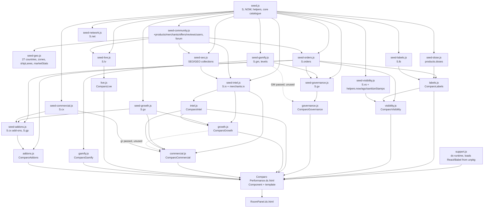

# Current prototype map: Comparo Performance

This map describes the browser prototype as it runs today. It is the baseline for migrating to the Laravel 13 + Inertia/React modular monolith.

- **Scope:** the routes and surfaces, the seed data, the mutable state, the scoring engines, background mechanisms, external integrations, seeded analytics, incomplete features, module dependencies, and where each prototype function should go in Laravel.
- **Method:** everything here comes from the running code, not from the markdown specs. The route dispatch, state constructor, persistence layer and each builder were read directly. The seed files were loaded in load order in a Node sandbox (with a stubbed `window` and `localStorage`) to measure the real collection sizes after every in-place extension.
- **Source-of-truth order used:** (1) working prototype code, (2) the newest seed extension files, (3) `AUDIT.md`, (4) `BACKEND-READINESS.md`, (5) domain docs, (6) `DATABASE.md` / `API-ENDPOINTS.md`, (7) `ARCHITECTURE.md`, (8) `BACKEND-MIGRATION.md`. Where a doc contradicts the code, the code wins, and section 11 lists the contradictions.
- **Companion documents** (written by other agents):
  - Field-level entities: [`entity-inventory.md`](./entity-inventory.md)
  - Scoring formulas: [`scoring-engines-map.md`](./scoring-engines-map.md)

**Conventions**

- `HTML` means `Comparo Performance.dc.html` at the repository root, which has 20,494 lines. Line numbers are approximate (±5) and name the start of a method.
- `S` means `window.SEED`, the object every seed file extends in place.
- `state.X` means a key of the root component's React-style state.
- "Unverified" marks anything not confirmed by reading or running the code.

---

## 0. Runtime anatomy (read this first)

| Layer | Where | What it is |
|---|---|---|
| DC runtime | `support.js` (1,911 lines, generated from `dc-runtime/src/*.ts`) | A home-grown template runtime (`DCLogic`, `<x-dc>`, `sc-if`/`sc-for`, `dc-import`, `helmet`). It loads React 18.3.1, ReactDOM and Babel standalone 7.29 from **unpkg** with SRI (support.js ~1143). It posts `__dc_booted` / `__dc_design_mode` messages to a parent frame. It is **not** a business engine. |
| Template | HTML lines ~41–11677 | One large template. Every view is an `sc-if` block toggled by `isX` flags that `renderVals()` sets. |
| Component logic | HTML lines 11678–20494: `class Component extends DCLogic` | A single root component with about 330 methods, about 230 top-level state keys, and every page builder. |
| Router | `parseHash()` HTML 11929; `hashchange` listener 11921–11922; `nav()` 11937 | Parses `#/<name>/<a>/<b>?query` into `{name, a, b, query}`. There is no route table. Dispatch is a chain of `if (r.name === …)` statements in `renderVals()` (15477; dispatch at 15580–15693). |
| Persistence | `load()` 11735, `migrateState()` 11757, `persist()`/`persistNow()` 11828–11842 | One JSON blob in localStorage holds 113 whitelisted state keys, written 220 ms after the last change (debounced). |
| Seed graph | `seed*.js` (17 files) | Deterministic PRNG (mulberry32-style `mk(seed)`) plus typed constants. The frozen clock is `S.NOW = 2026-09-06T09:00:00Z` (seed.js:13). |
| Engines | `labels.js`, `visibility.js`, `governance.js`, `intel.js`, `growth.js`, `commercial.js`, `live.js`, `gamify.js`, `addons.js` | Factory functions `window.ComparoX(S, …)`. They are created lazily and cached on the component (`ix()` … `cm()`, HTML 12988–13023). |
| Sub-component | `RoomPanel.dc.html` | The live-room chat panel, embedded through `<dc-import name="RoomPanel">` at template lines ~3872 (forum topic), ~4331 (live), ~4428 (group) and ~4505 (event). |

**Data overlay pattern used everywhere.** A "read model" is the seed record, merged with a per-id override map in state (`ovOffers`, `ovMerch`, `ovRev`, `ovComp`, `ovFeed`, `ovApps`, `ovThreads`, `ovDeals`, `ovGuides`, `gx*`, `cx*` status maps), plus user-created rows in state (`newOffers`, `extraCoupons`, `addedReviews`, `threads`, `cxInvoices`, …). Examples: `M()` 12835, `allOffers()` 12854, `allReviews()` 12868, `cxInvoices()` 13043, `gProspects()` 13061. **The engines read `S` directly and never see these overlays.** The one exception is `ComparoCommercial`, which receives an `invoices()` context. Section 11 covers the consequences.

---

## 1. Routes and surfaces

Route names come from `parseHash()`. A trailing `/:x` is `r.a`, and a second segment is `r.b`.

About the "Role" column:

- **public** means no gate.
- **session** means `requireAuth()` (13354) opens the login modal at the call site. It is client-side only.
- **admin** / **merchant** means `session.role` is checked inside the builder, which returns a `*Gate` flag and demo-login rows instead of the view.
- **perm:x** means a granular check through `requirePerm()` (13279, `S.ix.roles` × `state.staffRole`) or `comRequire()` (13054, `S.cx.roles` × `state.comRole`).
- **shop-profile gate** means `shopProfile().published` (19357). It is satisfied either by a merchant session or by `state.shopApp.status === 'published'`, and a user can set that themselves (see section 8).

**Counts:** 52 consumer route patterns, 11 public commercial / merchant-acquisition patterns, 1 merchant console, 3 staff consoles, 1 Growth OS, 1 Commercial OS and 1 utility page, for **70 patterns** in total.

- The 52 consumer patterns split into 36 buyer/catalogue, 13 community and 3 account patterns.
- Index and detail views are counted separately. The alias `#/country/:iso` is counted as its own pattern.
- `#/lists/:slug` is linked but has no builder. It is listed under account but not counted.

### 1.1 Global shell (every route)

| Concern | Function (HTML line) | Reads | Mutates |
|---|---|---|---|
| Header, search suggestions, country/currency, theme, language, notifications, consent banner, compare/basket trays | `renderVals()` 15477 | `S.countries`, `S.currencies`, `searchAll()` 13491, `notifRows()` 12735, `searchLog` | `country`, `currency`, `theme`, `lang`, `consent`, `notifs[].read`, `searchLog` (clear), `compare` |
| Mega-nav / mobile nav / user menu | `navItems()` 12591, `mobileNavItems()` 12724, `userMenuGroups()` 12553, `topPickers()` 12497 | `state.flags` (hides community features), `session.role` | `navOpen`, `userMenu`, `picker` |
| Command palette (Ctrl/Cmd+K, `/`, `g d/f/s/c/h/r` shortcuts at 11906) | `buildPalette()` 19768 | products, merchants and routes | navigation only |
| Modals: auth, review, reply, alert, reportoffer, report, thread, deal, guide, list, listshop, why, whyrank, trust, delete, compliance | `buildModals()` 20345 | `form`, `modal` | See 1.2–1.4 |
| Head, SEO, JSON-LD, hreflang | `applyHead()` 12338, `jsonLd()` 12313, `currentUrl()` 12305, `breadcrumbFor()` 12291, `hreflangFor()` 12288, `buildSeoCommon()` 19824 | `S.metaTemplates`, `S.localeMarkets`, `metaOverrides` | `document.title` and meta tags |
| Unknown route | none | none | No 404 view. No `isX` flag is set, so only the chrome renders. The empty `<main>` is unverified visually. |

### 1.2 Consumer (buyer, public catalogue)

| Route pattern | Builder (HTML line) | Role | Key data read | Key mutations |
|---|---|---|---|---|
| `#/` | `buildHome` 15699 | public | products, merchants (plus `ovMerch`), `allOffers()` → `offerRow()` 12928 → `enrichRow()` 13124 (`ix.rank`/`trust`/`risk`/…), coupons, reviews, articles, users | Copy coupon code (clipboard) and a toast |
| `#/search?q=` | `buildSearch` 15781; `searchAll` 13491; `resultRow` 13529 | public | products, brands, merchants, categories, `ingredientEntities`, synonyms (`helpers.synonyms`, `S.synonymSets`) | `logSearch()` 12135 → `searchLog`; `logEvent('search')` → `events` |
| `#/products` | `buildProductIndex` 16627 | public | `canonicalProducts()` 13322 | UI only (`idxQ`, `idxSort`, `idxChip`, not persisted) |
| `#/products/:slug` | `buildProduct` 15843 and `productLabels` 19111 | public; writes need **session** | offers (merged with `ovOffers`, `newOffers`, `merges`), merchant zones, coupons, reviews (weighted by `reviewWeight` 12886 in `ratingOf` 12897), `p.hist`, `p.doses` (`doseRows` 16777, `costPerActiveG` 16804), compliance (`comp()` 12877 plus `ovComp`), `ix.histStats`/`priceBadge`/`timing`/`forecast`/`productCoverage`/`related`, `lbE().forProduct`, `deliveryStats()` 16873 | `trackView` 15836 → `events`; `toggleSaved`/`Watch`/`Compare`/`Basket`/`Follow`; `vote`; `report` → `ovRev`; modals: review → `addedReviews`, alert → `alerts` + `notifs`, reportoffer → `reports`, proof → `proofs`, list → `lists` |
| `#/compare?ids=` | `buildCompare` 16141 | public | `compare` ids, offers, doses | `toggleCompare` |
| `#/compare/shops` | `buildShopCompare` 16302; `shopCompareRows` 16278 | public | merchants, `ix.trust`, `deliveryStats` | `shopCompare` (not persisted) |
| `#/deals` | `buildDeals` 16238; `dealItems` 16205; `dealRow` 17960 | public | offers, `allCoupons()` (seed plus `extraCoupons`), `dealsAll()` (communityDeals plus `userDeals` plus `ovDeals`), `countdown()` 17948 | `voteDeal` 17751 → `votesUp`; deal modal → `userDeals` |
| `#/shops` | `buildShops` 16366 | public | merchants, `ix.trust` | none |
| `#/shops/:slug` | `buildShop` 16455 and `shopLabels` 19120 | public; writes need session | merchant, offers, coupons, reviews, `shopQA`, announcements, `ix.trust`/`trustHistory`/`deliveryReliability`/`shippingIntel`/`similarShops`, `deliveryStats` (orders) | follow, vote, voteUp, report, `trackView`; **Claim shop = toast only** (16533); Q&A is display-only |
| `#/brands`, `#/brands/:slug` | `buildBrands` 16663 | public | brands, products, categories, `ix.trust` | none |
| `#/categories`, `#/categories/:slug` | `buildCategory` 19917 | public | categories, products, `ingredientEntities` | none |
| `#/ingredients`, `#/ingredients/:slug` | `buildIngredient` 19834 | public | `ingredientEntities`, products, doses, `doseLimits` 16818 | `toggleFollow` |
| `#/countries/:slug` and alias `#/country/:iso` | `buildCountryHub` 18254 via `isoFromSlug` 19817 | public | countries, merchants, products, `complianceRules`, `marketNotes` | none |
| `#/markets` | `buildMarkets` 19068 | public | `marketStats`, countries, `shipLanes`, currencies, regions | none |
| `#/basket` | `buildBasket` 13593; `basketResult` 13197 → `ix.basket` | public | `basket`, offers, zones | `toggleBasket`; `basketMode` |
| `#/go/:merchant/:product` | `buildGo` 17026 | public | `m.affiliate`, offer row | **Render-time side effect:** `logClick()` 13479 → `extraClicks` and `events`, plus a 3-second `setInterval` countdown. No real redirect happens; it shows a toast saying "In production this is a 302". Unknown slugs fall back to merchant 1 or product 1. |
| `#/methodology` | `buildMethodology` 20057 | public | feeds, products, `complianceRules`, `historyDays` | none |
| `#/trust` | `buildTrust` 18164 | public | merchants, `auditLog` plus `extraAudit`, `complianceRules` | none |
| `#/reviews` | `buildReviewsHub` 18113 | public | `allReviews()`, countries | UI only |
| `#/research`, `#/research/:slug` | `buildResearch` 19977 | public | `S.research`, `p.hist`, merchants, feeds | CSV download (Blob) |
| `#/blog`, `#/blog/:slug` | `buildBlog` 16733 | public | articles | none |
| `#/ask` | `buildAsk` 20085; `ask()` 12035; `parseNL()` 12013 | public | products, offers, doses (a deterministic parser, not an LLM) | `askQ`, `askAnswer` (transient) |
| `#/labels` | `buildLabels` 19126 | public | `S.lb.*`, products, brands, merchants; `lbE().coverage`/`forMerchant`/`forProduct`/`forBrand` | none |
| `#/juries` | `buildJuries` 19600; `juryVote` 19589 | public; vote needs session plus eligibility | `gv.cases`, users (rep); `gvE().caseRows`/`myEligibility`/`poolSize`/`seatCount` | `juryVotes` |
| `#/wiki` | `buildWiki` 19680; `wikiPropose` 19658 | public; propose needs session plus level | `gv.wikiFields`, `wikiProposals`, products | `wikiMine`; **"Review" = toast only** (19717) |
| `#/returns` | `buildReturns` 19733 | public | `gv.returnsIndex` (derived from orders at seed time) | none |
| `#/delivery-guarantee` | `buildGuarantee` 18801; `gpLateOrders` 18783; `fileClaim` 18791 | public; claim needs session | `S.gp.*`, orders, `adE().claimStats` | `gpClaims` |
| `#/plus` | `buildPlus` 18732; `setTier` 18724 | public; change tier needs session | `cx.userTiers`/`userFeatures` via `adE().userRows`/`tierMatrix` | `userTier`, `userPeriod`, `tierLog`. **No payment step.** |
| `#/rewards` | `buildRewards` 18489; `awardXp` 18458; `redeem` 18470 | public; actions need session | `S.gm.*` via `gmE()`; ledger = `gm.myLedger` plus `xpExtra` | `xpExtra`, `redeemed` |
| `#/demand` | `buildDemand` 19297; `pledge` 19288 | public; pledge needs session | `net.demand` | `pledges` |
| **Community** | | | | |
| `#/community` | `buildCommunity` 17846 and `buildCommunityPlus` 18650 | public | `threadsAll()` 12779, `activityAll()` 12789, users, `lv.*`, `gmE().leaderboard`/`season` | Opens thread/deal/guide modals |
| `#/forum`, `#/forum/:category`, `#/forum/topic/:slug` | `buildForum` 17995 | public; writes need session | `forumCategories`, threads (seed plus `threads` plus `ovThreads`), replies (seed plus `replies`), `votesUp`, live room (`fmRoom`) | `newThread` 17703, `newReply` 17718, `acceptAnswer` 17727, `voteUp`, `reportThing` 17774, follow, room messages |
| `#/guides`, `#/guides/:slug` | `buildGuides` 18086 | public; writes need session | guides (seed plus `guides`) | voteUp, `reportThing`, `submitGuide` 17759 |
| `#/users/:handle` | `buildProfile` 18190; `userByName` 12797 | public | users, levels, repRules, activity, reviews | follow, `muteUser` 17777, report. Unknown handles (including the menu's `#/users/me`) **fall back to `S.users[0]`**. |
| `#/live`, `#/live/:room` | `buildLive` 18415; `liveRoomView` 18357; `lvOpen` 18302; `lvSend` 18320; `lvPromote` 18337 | public; send/promote need session | `lv.rooms`, `lv.messages`, `lv.script` via `live.js` | `comparo.live.v1` (localStorage) plus BroadcastChannel; promote → thread modal plus `awardXp` |
| `#/groups`, `#/groups/:slug` | inline 15648 (`groupRow` 18616); `buildGroup` 18697 | public; join needs session | `lv.groups` | `joinGroup` 18567 → `groupJoin` |
| `#/events`, `#/events/:slug` | inline 15650 (`eventRow` 18633); `buildEvent` 18711 | public; RSVP needs session | `lv.events` | `rsvp` 18578 → `eventRsvp`; `votePoll` 18586 → `pollVotes` |
| **Account** | | | | |
| `#/account` (tabs: saved, orders, watch, alerts, reviews, notifs, privacy) | `buildAccount` 16937 | **session** (any role) | `saved`, `allOrders()` 16869 filtered by `sessionUserId()` (defaults to user 1), `watch`, `alerts`, `addedReviews`, `notifs`, `consent` | remove saved/watch, consent, GDPR export (Blob download), delete-account modal (`doDelete` 20420, partial, see section 8) |
| `#/saved` (tabs: products, shops, brands, topics, lists) | `buildSaved` 18228 | no gate (local state) | `saved`, `follow`, `lists` | `toggleSaved`, `toggleFollow`, `createList` 17782 |
| `#/for-you` | `buildForYou` 13642 | **session** | `personalSignals()` 13184 → `ix.personal`, `ix.trends` | none |
| `#/lists/:slug` | **none** | none | none | **Broken link.** The share URL is built at HTML 18246, but no builder exists. |

### 1.3 Public commercial and merchant-acquisition pages

`buildCommercialGate()` 19446 runs last in `renderVals()` (15684–15693). For the routes `advertising`, `promote`, `partners`, `developers`, `for-merchants/pricing`, `for-merchants/addons` and `visibility`, it switches the page off and renders the gate unless a shop profile is published.

| Route pattern | Builder (HTML line) | Role | Key data read | Key mutations |
|---|---|---|---|---|
| `#/for-merchants` | `buildLanding('merchants')` 13874 | public | `S.gx`, merchants, `ix.med`, `ix.affiliateMetrics` | `lpSubmit` (~13955) → **`gxProspects`** (enters the Growth OS pipeline, dedupes by domain) plus audit `merchant.application.submitted` |
| `#/creators` | `buildLanding('creators')` | public | `gx.creators` | creator application → `gxCreators` |
| `#/newsletter` | `buildLanding('newsletter')` | public | `gx.newsletters`, `gr.referralCode` | subscribe toggle → `targets['nl:*']`; referral invites → `referralInvites` |
| `#/for-merchants/pricing` | `buildPublicCommercial('pricing')` 13755 | shop-profile gate | `cx.plans`, `cm.planMatrix()` | none |
| `#/for-merchants/addons` | `buildAddonStore` 18919 | shop-profile gate | `cx.addons`, `addonGroups`, `marketPacks`, `S.gp`; `adE().addonCost`/`available`/`upgradeAdvice`/`entRows` | `toggleAddon` 18899, `addonQty` 18910 → `myAddons`; **Upgrade = toast only** (18939) |
| `#/developers` | `buildPublicCommercial('developers')` | shop-profile gate | `cx.apiPlans`, `cx.dataProducts` | none |
| `#/advertising` | `buildPublicCommercial('advertising')` and `buildAdsExtra` 19009 | shop-profile gate | `cx.placements`, `adFormats`, `adPackages`; `adE().adEstimate`/`inventoryRows` | `adSet` 19008 → `adDraft` (not persisted); **Book = toast only** (19061) |
| `#/promote` | `buildPromote` 19188 | shop-profile gate | `net.ladder`, `ladderCannotEver` | none |
| `#/partners` | `buildPartners` 19233 | shop-profile gate | `net.partners`, `partnerTypes`, `tiers`, merchants | none (unverified: only UI tab state) |
| `#/visibility` | `buildVisibility` 19479; `bookSlot` 19469 | shop-profile gate | `S.vs.*`; `vsE().summary`/`rateCard`/`assemble`/`canBook`/`priceFor` | `visBookings`, `visMarket`, `visMonths`, `visOrganicOnly`; per-format "request" = toast only (19540) |
| `#/shop-setup` | `buildShopSetup` 19399; `shopAppNext` 19368; `submitShopApp` 19377; `approveShopApp` 19388; `resetShopApp` 19398 | public (sign-in hinted) | `vs.appSteps`, `vs.appChecks` | `shopApp` (status none → submitted → in_review after a 1.4 s `setTimeout` → published). **The applicant can press "approve" themselves** (demo shortcut). |

### 1.4 Merchant

| Route | Builder | Role | Tabs | Key data read | Key mutations |
|---|---|---|---|---|---|
| `#/merchant` | `buildMerchant` 17120 | **merchant** (otherwise gate plus onboarding form, which only writes an audit entry, 17132) | overview, offers, feed, match, compete, automations, support, deals, reviews, plan | merchant = `session.merchantId`; `S.affiliate.daily`, feeds, feedItems, `ix.newProductCandidates`/`feedRuns`/`feedDiff`/`merchantAutomations`/`tickets`/`disputes`/`exclusives`, coupons, `cx.marketplaceProducts`/`placements`, invoices; `ix.trust`/`performance`/`benchmarks`/`competitiveness`/`merchantRecs`/`opportunities`/`affiliateMetrics`/`match`; `cm.entitlement`/`apiUsageFor`/`mrrOf`/`campaignEligibility` | `setOffer` 17063 → `ovOffers`; feed confirm/create → `ovFeed`; paste feed → `parseFeed` 17084 plus `matchItem` 17109 → `newFeed` (**not persisted**); create deal → `extraCoupons`; submit campaign → `cxCampaigns`; automation toggles → `mRuleOff`; merchant reply modal → `ovRev[].reply`; "Run import" = audit plus toast only (17421); ticket reply = toast only (17385) |

### 1.5 Staff (platform administration)

| Route | Builder | Role | Tabs | Key mutations (state keys, audit actions) |
|---|---|---|---|---|
| `#/admin` | `buildAdmin` 17487 | **admin** (no granular permissions) | dashboard, merchants, compliance, moderation, community, deals, affiliate, audit | `ovApps` (verify/reject applications from `S.merchantApplications` only), `ovMerch`, `ovRev` via `setReviewStatus` 17064, `ovDeals`/`userDeals`, `ovGuides`/`guides`, `ovThreads`, `flags` (feature flags), exclusive coupons → `extraCoupons`, proofs via `resolveProof` 12420, compliance modal → `ovComp`. Audit: `merchant.verified`/`rejected`, `community.*`, `forum.thread.hidden`, `user.warned`/`suspended`/`banned`, `reputation.adjusted`, `settings.flag.toggled`, `offer.exclusive.created` |
| `#/intel` | `buildIntel` 15029 | **admin** plus **perm** via `requirePerm` (`risk.act`, `review.moderate`, `matching.resolve`, `merchant.suspend`, `automation.edit`, `support.handle`, `audit.export`) | command, ranking, risk, reviews, matching, pricing, automations, tasks, market, affiliate, support, data, experiments, roles | `rankW` (the slider changes **live public ranking** for this browser at once, 15085), `ruleOff`, `anomalyState`, `linkState`, `leadState`, `ovMerch`, `ovRev`, `merges`, `expAssign`, `reports`, `staffRole` (role switcher 15450, **not persisted**). "Publish weights" is audit plus toast only, with **no `ranking.publish` check** (15095). "Create product from candidate" is audit plus toast only (15203). |
| `#/seo` | `buildSeoConsole` 20108 | **admin** | overview, pages, metadata, indexation, sitemaps, links, programmatic, gaps, ai, technical | `seoOverrides`, `metaOverrides`, `crawlerOverrides`, `redirectsExtra` (including "fix from 404 log", 20285), `merges`, `seoThresholds`; sitemap.xml Blob download (20223); `sitemapRun`, `labAnswer`, `inspectorUrl` (transient) |

### 1.6 Growth OS

| Route | Builder | Role | Tabs | Key data read | Key mutations |
|---|---|---|---|---|---|
| `#/growth` | `buildGrowth` 14487 | **admin only. No permission checks at all** (no `requirePerm`/`comRequire` inside) | overview, opportunities, acquisition, pipeline, affiliate, creators, referrals, content, seo, community, newsletter, campaigns, research, markets, experiments, analytics, briefs (17) | `S.gx.*`, merchants, forum threads/replies, reviews, communityDeals, products; `gr.*` (overview, insights, opportunities, `acquisitionFunnel`/`ByMarket`, `qualify`, `nextBestAction`, `affiliateOpportunity`, `nonMonetised`, `lowEpc`, `creatorScore`/`Perf`, `referralFunnel`, `contentQueue`, `brief`, `campaignConflicts`, `marketScores`, `ltvProxy`, `revenueByMarket`, `automationRuns`, `daily`/`market`/`acquisition`/`affiliateBrief`), `ix.trust` | `gxStage` (`moveStage` 13095), `gxOwner`, `gxOppStatus`, `gxTasks` (`addGrowthTask` 13080), `gxProspects`, `gxCreators`, `gxCampaigns`, `gxContent`, `gxNewsletters` (Draft → Scheduled → Sent, **no send happens**, 14800–14814), `gxNlCopies`, `gxResearch`, `gxExperiments`, `gxAuto`, `gxLinks`, `gxSocial`. Creator coupon = audit plus toast only (14674). |

### 1.7 Commercial OS

| Route | Builder | Role | Tabs | Key data read | Key mutations |
|---|---|---|---|---|---|
| `#/commercial` | `buildCommercial` 14104 | **admin** plus **perm** via `comRequire` (`plan.manage`, `subscription.manage`, `invoice.edit`/`void`, `credit.create`, `discount.apply`, `campaign.approve`/`manage`, `opportunity.manage`, `renewal.manage`, `commercial.export`); role switcher `comRole` (**not persisted**) | overview, accounts, subscriptions, plans, invoices, affiliate, sponsored, pipeline, renewals, api, analytics, forecast, governance, settings (14) | `S.cx.*`, merchants, countries; `cm.*` (overview, `revenueMix`, `mrr`, `affiliateRevenue`, `sponsoredRevenue`, `apiRevenue`, alerts, `commercialRisks`, `goalProgress`, `accountHealth`, `merchantRevenue`, `upsell`, `nextBestCommercialAction`, `proration`, `planMatrix`, `receivables`, `affiliateHealth`/`Forecast`, `epcBreakdown`, `campaignMetrics`/`Eligibility`, `inventoryFor`, `weightedPipeline`, `renewalRisk`, `churnAnalytics`, `apiUsageAll`, `revenueByCountry`/`ByPlan`, `concentration`, `mrrBridge`, `cohorts`, `forecast`, `governance`), `ix.trust`, `ix.affiliateMetrics` | `cxPlan`, `cxSubStatus`, `cxInvStatus` (mark paid stamps `paidAt: Date.now()`, the real clock, 13043), `cxInvoices`, `cxCredits`, `cxDiscounts`, `cxCampStatus`, `cxCampaigns`, `cxOpps`, `cxOppStage`, `cxRenewal`, `cxKeys`, `cxRevoked`, `cxAuto`, `cxOwner`, growth tasks via `addGrowthTask`; invoice CSV export (Blob, 14445); "Buy report" = audit plus toast, "No payment is collected" (14429) |

### 1.8 Utility

| Route | Builder | Role | Purpose / mutations |
|---|---|---|---|
| `#/design-system` | `buildDesignSystem` 13682 | public (no gate) | Component gallery; toast demo buttons (13707, 13730–13733); storage size (`storageSize` 11776); state version; route and role readout; `debug` toggle; **`resetDemoData(scope)` 11783** clears whole or scoped state groups from localStorage and reloads |

---

## 2. Entity inventory (summary)

The detailed field-level inventory is in [`entity-inventory.md`](./entity-inventory.md).

Row counts below were **measured after all seed files ran** in load order. Several base collections are grown in place by later files, as the "Grown by" column shows.

### 2.1 Top-level `S.*` collections

| Collection | Defined in | Final rows | Grown by | Purpose |
|---|---|---|---|---|
| `NOW` / `DAY` / `historyDays` | seed.js:13 | 2026-09-06T09:00Z / 86,400,000 / 365 | none | Frozen catalogue clock and history length |
| `currencies` | seed.js | 12 | seed-geo (6→12) | Display currencies (prices stored in EUR) |
| `countries` | seed.js | 27 | seed-geo (12→27), seed-seo (+field) | Delivery markets |
| `brands` | seed.js | 13 | seed-community (9→13), seed-labels and seed-seo (+fields) | Brands |
| `categories` | seed.js | 9 | seed-seo (+fields) | Product categories |
| `ingredients` | seed.js | 28 | none | Ingredient dictionary |
| `products` | seed.js | 46 | seed-community (28→46), seed-dose (+`doses`), seed-seo (+field) | Canonical products with `hist` price history |
| `merchants` | seed.js | 13 | seed-community (8→13), seed-geo (+`zones`), seed-seo, seed-intel (+`ix` signals) | Shops, including shipping zones and affiliate programme |
| `merchantApplications` | seed.js | 3 | none | Admin verification queue |
| `offers` | seed.js | 267 | seed-community (126→267), seed-seo (+field) | Product × merchant offers |
| `coupons` | seed.js | 28 | seed-community (20→28), seed-intel (+`ix`) | Coupons and exclusives |
| `reviews` | seed.js | 410 | seed-community (108→367), seed-intel (→410) | Product and shop reviews |
| `users` | seed.js | 41 | seed-community (15→35), seed-intel (→41) | Community users (no roles; roles are the demo accounts) |
| `articles` | seed.js | 6 | seed-seo (+fields) | Blog/research articles |
| `complianceRules` | seed.js | 65 | seed-community (25→31), seed-geo (→65) | Product × country legal status |
| `affiliate.daily` / `affiliate.clicks` | seed.js:342 | 240 / 40 | none | PRNG-generated affiliate ledger (daily per merchant) and click log |
| `feeds` / `feedItems` | seed.js | 13 / 22 | seed-community, seed-intel | Merchant feeds and unmatched items |
| `sponsored` | seed.js | 5 | none | Legacy sponsored placements |
| `subscriptions` / `invoices` | seed.js | 8 / 15 | none | **Legacy** billing, superseded by `cx.subscriptions` and `cx.invoices` (merchant console still reads `S.invoices`, 17450) |
| `auditLog` | seed.js | 8 | none | Seed audit log (plus `state.extraAudit`) |
| `badges`, `levels`, `repRules` | seed-community | 9, 10, 6 | seed-gamify (levels 5→10) | Reputation |
| `tags`, `forumCategories`, `forumThreads`, `forumReplies` | seed-community | 18, 15, 20, 112 | seed-live (+1 category) | Forum |
| `guides`, `communityDeals`, `shopQA`, `announcements`, `insightTopics`, `notifTemplates`, `activity` | seed-community | 8, 15, 43, 5, 8, 10, 60 | none | Community content |
| `regions`, `shipLanes`, `marketPacks`, `marketStats`, `geoNote` | seed-geo | 8, 155, 8, 27, (string) | none | Geography; `marketStats` is computed at seed time |
| `doseMeta` | seed-dose | 1 object (46 dosed products) | none | Carriers, NRV, limits |
| `orders`, `orderMeta` | seed-orders | 408, 1 object (`minSample` = 8) | none | Order records that drive delivery, returns and verification |
| `ingredientEntities`, `searchQueries`, `synonymSets`, `locales`, `localeMarkets`, `metaTemplates`, `indexRules`, `facetRules`, `crawlerPolicy`, `robotsRules`, `redirects`, `brokenLinks`, `notFoundLog`, `cwv`, `aiCitations`, `authors`, `research`, `experiments`, `attribution`, `eventTaxonomy`, `duplicateCandidates`, `marketNotes`, `seoMeta` | seed-seo | 28, 30, 6, 7, 11, 10, 21, 8, 6, 18, 5, 4, 5, 8, 7, 4, 6, 3, 6, 20, 5, {27}, {2} | none | SEO, GEO and discovery |

### 2.2 Namespaced sub-graphs

| Namespace | File | Collections (rows) | Purpose |
|---|---|---|---|
| `S.lv` | seed-live.js | rules 5, rooms 38, groups 8, events 5, experts 4, polls 6, bounties 3, messages 323, script {38 rooms}, promotions 5, stats | Live rooms, groups, events |
| `S.gm` | seed-gamify.js | xpSources 14, reversals 4, levels 10, badgeTiers 5, streak, quests 9, season (leaderboard), rewards 10, myLedger 9, myStreak, integrity 6, stats | Contribution XP economy |
| `S.lb` | seed-labels.js | catalogue 8, rejected 4, editorialLog 9, revocations 5, verdicts 3, stats | Computed labels |
| `S.net` | seed-network.js | intrusionScale 6, ladder 11, ladderCannotEver 6, partnerTypes 10, tiers 4, pipeline 7, processes 5, partners 14, affiliateNetworks 6, commissionTiers 5, affiliateRules 6, demand 6, demandRules 5, desks 5, stats | Promotion ladder, partners, demand pledges |
| `S.vs` | seed-visibility.js | gateReason 3, gateSteps 4, appSteps 5, appChecks 7, appStatuses 7, forbidden 8, formats 8, markers 4, surfaces 12, gateDefs 11, caps 8, inventory 120, priceModel 5, bookings 10, stats, transparency 4 | Visibility inventory and rate card |
| `S.gv` | seed-governance.js | caseTypes 5, cases 6, juryEligibility 5, juryRules 7, wikiFields 7, wikiRules 7, wikiProposals 6, wikiHistory 3, returnReasonGroups 5, returnsIndex 69, returnsRules 7, returnsActions 4, three stats objects | Juries, wiki, returns index |
| `S.ix` | seed-intel.js | 37 collections: riskEvents 14, reviewFlags {43}, fraudCases 4, anomalySeeds 4, linkHealth 5, fakeDiscounts 1, exclusives 5, feedRuns 78, feedDiff 9, brandAliases 5, newProductCandidates 4, fieldConflicts 4, sourcePriority 5, lineage 8, catalogChanges 5, demand 46, zeroSupply 4, potentialMerchants 6, tickets 8, disputes 5, notices 3, status 6, errors 6, automationRules 8, merchantAutomations 5, permissions 19, roles 9, staff 7, marketFeatures 7, markets 27, experiments 5, eventTypes 11, events 193, priceReports 34, offerCorrections 3, rankWeights {7}, rankLabels 5 | Intelligence, operations, staff RBAC |
| `S.gx` | seed-growth.js | 75 keys, including prospects 22, creators 13, campaigns 9, content 26, newsletters 6, tasks 10, affiliateDeals 13, experiments 7, channels 9, lifecycle 7, cohorts 5, retention {3}, pageTypeRevenue 6, assists 5, dropoff 4, marketGoals 7, alerts 8, growthAutomations 7, and pipeline/stage vocabularies | Growth OS |
| `S.cx` | seed-commercial.js plus seed-addons.js | 48 plus 21 keys: plans 4, features 18, entitlements 72, accounts 13, subscriptions 8, subscriptionChanges 5, invoices 19, creditNotes 2, payments 15, paymentMethods 4, discounts 4, placements 8, campaigns 8, opportunities 17, renewals 7, apiPlans 3, dataProducts 7, apiKeys 4, apiUsage, webhooks 3, webhookLog 5, reports 4, affiliateContracts 13, reconciliation 8, goals 4, automations 6, roles 7, permissions 14; add-ons: addonGroups 6, addons 14, merchantAddons 23, userTiers 3, userFeatures 15, userSubs 3, adFormats 8, adPackages 3, revenueMix 6, surfaceSessions {13} | Billing, plans, sponsorship, API, affiliate finance |
| `S.gp` | seed-addons.js | tiers 3, eligibility 6, measured 69, enrolments 10, deposits 8, claims 1, stats, process 4, buyerSide 4 | Delivery-promise (guarantee) programme |
| `S.helpers` | seed.js (plus seed-visibility overrides) | `norm`, `lev`, `fuzzyScore`, `fmt`, `num`, `dateLong`, `dateShort`, `ago`, `isoDate`, `slug`, `synonyms`, `levelFor`, `trending`, `shipBand`, `regionOf`, `now`, `sanitizeStamps` | Formatting, search and clock utilities |

---

## 3. Mutable prototype state inventory

### 3.1 Browser storage keys

| Key | Store | Shape | Written by | Read by | Server-side target |
|---|---|---|---|---|---|
| `comparo.proto.v2` | localStorage | JSON object with the 113 whitelisted state keys (3.2) | `persistNow()` 11832 (220 ms debounce after every `componentDidUpdate`); `resetDemoData()` 11783; `seed-visibility.js:104` (rewrites future timestamps on every load) | `load()` 11735 → `migrateState()` 11757; `seed-visibility.js:101` | Split into DB tables, the session and user preferences (see 3.2). Must not survive as a blob. |
| `comparo.state.version` | localStorage | `"3"` | `load()` | `load()`, `buildDesignSystem` (13737) | Laravel migrations. Drop. |
| `comparo.proto.v2.corrupt` | localStorage | Raw string copy of an unreadable blob | `load()` catch | nobody (inspection only) | Drop |
| `comparo.proto.writer` | localStorage | Instance id `inst-…` | `persistNow()` | `storage` listener 11881 (multi-tab echo suppression) | Drop. Use server state plus Inertia reloads or broadcasting. |
| `comparo.clock.v2` | localStorage | ms offset (integer string) | `seed-visibility.js:108` every 5 s, and on `pagehide`/`beforeunload` | `seed-visibility.js:55` | Drop. Use the server clock (`now()`), with a `Carbon::setTestNow()` equivalent for demo/test fixtures. |
| `comparo.clock.offset`, `comparo.clock.migrated.v2` | localStorage | legacy | removed on load | none | Drop |
| `comparo.live.v1` | localStorage | `{msgs[], read{room:ts}, pins{id:bool}, hidden{id:bool}, reports{id:{reason,at}}}` | `live.js` `save()` (send, markRead, pin, hide, report) | `live.js` `load()` plus `storage` event | `room_messages`, `room_reads`, `room_message_pins`, `room_message_moderation`, `reports` tables |
| `comparo.live.presence` | localStorage | `{tabId:{ts, room, nick}}` with a 45 s TTL | `live.js` `heartbeat()` every 12 s | `live.js` `liveTabs()` | Transient: Reverb/Pusher presence channels (or a Redis TTL key) |
| `comparo.sid` | sessionStorage | `anon-<base36>` | `sessionId()` 13177 | `logEvent()` | Laravel session id, or a hashed anonymous visitor id |
| `comparo.live` | BroadcastChannel | `{type: msg, typing or sync, tab, …}` | `live.js` `post()` | `live.js` `bc.onmessage` | Broadcast events (`RoomMessageSent`, `UserTyping`) over WebSockets |

### 3.2 Persisted state keys (inside `comparo.proto.v2`, whitelist at HTML 11833–11834)

"Writers" and "Readers" name component methods (builders own their inline handlers). Target types:

- **T** = database table
- **S** = session
- **P** = user preference (column or JSON on users)
- **C** = config / feature flag
- **X** = drop or transient

| Group | Key | Shape | Writers | Readers | Target |
|---|---|---|---|---|---|
| Shell | `country`, `currency` | ISO string | `renderVals` (`onCountry`/`onCurrency`), `topPickers` | everywhere (`offerRow`, `fmt`, `comp`) | S plus P (`users.country`, `users.currency`) |
| Shell | `theme`, `lang` | string | `renderVals`, `buildPalette`, `topPickers` | `applyTheme`; `lang` is read by **nobody** | P (`lang` is decorative; see section 8) |
| Shell | `consent` | `null`, `'all'` or `'essential'` | consent banner; `buildAccount` | `logEvent` (skips logging when `'essential'`) | T `consents` (auditable) plus cookie |
| Auth | `session` | `{email, role, nick, merchantId, label, initials, country, twoFa}` | `signIn` 13450, `logout` 13478, `doDelete` | everywhere | Laravel auth session (`users`, roles and permissions) |
| Auth | `accounts` | `[{email, hash:'sha256$demo$<djb2>', role, nick, verifiedEmail}]` | `register` 13467 | `login` 13442, `buildAdmin`, `buildCommunity` | T `users` (bcrypt/argon). **Never** keep client-side hashes. |
| Buyer | `saved` | `productId[]` | `toggleSaved` 13364 | `buildSaved`, `buildAccount`, `buildForYou`, `createList` | T `saved_products` |
| Buyer | `watch` | `productId[]` | `toggleWatch` 13372 | `buildProduct`, `buildAccount` | T `watchlist_items` |
| Buyer | `alerts` | `[{id, productId, target, created, status, channel:'email', types[], priority, digest}]` | `addAlert` 13380 | `buildAccount`, `buildPlus` | T `price_alerts` plus `alert_triggers` |
| Buyer | `notifs` | `[{id, kind, text, ts, read, href}]` | `pushNotif` 12745, `addAlert`, `signIn` (seeds two), mark-all-read | `notifRows` 12735, `buildAccount` | T `notifications` (the Laravel notifications table) |
| Buyer | `targets`, `alertPriority`, `digest` | map / string / string (`'weekly'`) | alert modal, newsletter landing (`targets['nl:*']`) | `addAlert` | T `notification_preferences`, `newsletter_subscriptions` |
| Buyer | `compare`, `basket`, `shopCompare`* | id arrays (*`shopCompare` is **not** persisted) | `toggleCompare` 13358, `toggleBasket` 13205 | `buildCompare`, `buildBasket` | S (guest) or T `baskets` (optional) |
| Buyer | `follow` | `{'merchant:1':true, 'thread:5':true, 'brand:2':true, 'ingredient:x':true}` | `toggleFollow` 12763 | `buildSaved`, `buildForYou`, `isFollowing` | T `follows` (polymorphic) |
| Buyer | `lists` | `[{id, slug, name, visibility, items}]` | `createList` 17782 | `buildSaved` | T `lists`, `list_items` |
| Buyer | `searchLog` | `[{q, results, ts}]` | `logSearch` 12135 | header suggestions, `buildSearch`, `buildForYou`, `buildSeoConsole` | T `search_logs` (anonymised) |
| Buyer | `events` | ≤120 `[{id, session, type, ts, country, …}]` | `logEvent` 13170 | `ix.funnel`, `ix.journeys` in `buildIntel` | T `analytics_events` (queued ingestion) |
| Buyer | `extraClicks` | `[{id, merchantId, productId, country, placement, campaign, network, subId, session, ts, converted}]` | `logClick` 13479 | `purchaseProofRoutes`, `buildGo`, `buildMerchant`, `buildAdmin`, `buildAccount` | T `affiliate_clicks` |
| Buyer | `proofs` | map `route:target → {status, evidence, ts}` | `submitProof` 12438, `resolveProof` 12420 | `proofFor`, `pendingProofs`, `reviewWeight` | T `purchase_proofs` |
| Buyer | `reports` | `[{offerId, kind, ts, …}]` | `reportOffer` 13256, intel/admin handlers | `confidenceOf` 13229 | T `offer_reports` |
| Buyer | `couponVotes` | map | `voteCoupon` 13213 (**never called: dead**) | nobody | T `coupon_votes`, or drop |
| Buyer | `userTier`, `userPeriod`, `tierLog` | string, string, array | `setTier` 18724 | `buildPlus`, `joinGroup`, `buildGuarantee` | T `buyer_subscriptions` (plus billing) |
| Buyer | `xpExtra`, `redeemed` | ledger rows, map | `awardXp` 18458, `redeem` 18470 | `ledger` 18456, `earnedEnt` 18723 | T `xp_ledger`, `reward_redemptions` |
| Buyer | `gpClaims` | claim rows | `fileClaim` 18791 | `buildGuarantee` | T `guarantee_claims` |
| Buyer | `pledges` | map `demandId → …` | `pledge` 19288 | `buildDemand` | T `demand_pledges` |
| Buyer | `juryVotes`, `wikiMine` | map, proposal rows | `juryVote` 19589, `wikiPropose` 19658 | `buildJuries`, `buildWiki` | T `jury_votes`, `wiki_proposals` |
| Buyer | `groupJoin`, `eventRsvp`, `pollVotes` | maps | `joinGroup` 18567, `rsvp` 18578, `votePoll` 18586 | `groupRow`, `eventRow`, `pollRow` | T `group_members`, `event_rsvps`, `poll_votes` |
| Buyer | `bountyMine`, `lvHidden`, `lvPromoted`, `addonCart`, `qna` | maps/arrays | **nobody** (persisted but never written) | nobody | X (dead keys) |
| Community | `addedReviews` | review rows (`userId: 0`, `mine: true`) | `submitReview` 13399, `setReviewStatus` | `allReviews` 12868, `buildProduct`, `buildProfile` | T `reviews` |
| Community | `votes` | map `reviewId → up/down` | `vote` 13419 | `buildProduct`, `reviewCard` | T `review_votes` |
| Community | `threads`, `replies`, `guides`, `userDeals` | content rows | `newThread`, `newReply`, `submitGuide`, `submitDeal` | `threadsAll`, `repliesAll`, `guidesAll`, `dealsAll` | T `forum_threads`, `forum_replies`, `guides`, `community_deals` |
| Community | `votesUp` | map | `voteUp` 12770, `voteDeal` 17751 | `voteCount`, `dealRow` | T `votes` (polymorphic) |
| Community | `reputation`, `badgesEarned` | number, array | `award` 12751 | `rep`, `meUser`, `buildProfile` | T `reputation_events` (derive the total), `user_badges` |
| Community | `muted` | array | `muteUser` 17777 | `buildCommunity`, `buildProfile` | T `user_mutes` |
| Admin overlays | `ovOffers`, `newOffers` | map `offerId → patch`, array (`newOffers` is **never written**) | `setOffer` 17063 | `allOffers`, `allOffersRaw`, `cheapestSourceOf` | T `offers` (real writes plus `offer_revisions`) |
| Admin overlays | `ovMerch` | map `merchantId → {status, verified, …}` | `buildAdmin`, `buildIntel` | `M()` 12835 | T `merchants` status plus `merchant_status_changes` |
| Admin overlays | `ovRev` | map `reviewId → {status, reply, flags}` | `report`, `setReviewStatus`, reply modal, `buildIntel`, `buildAdmin` | `allReviews` | T `reviews.status`, `review_replies`, `moderation_actions` |
| Admin overlays | `ovComp` | map `productId-ISO → {status, reason, source, reviewedBy, reviewedAt}` | compliance modal (`doCompliance` 20426) | `comp()` 12877 | T `compliance_rules` plus history |
| Admin overlays | `ovFeed`, `ovApps` | maps | `buildMerchant`, `buildAdmin` | inline | T `feed_items.status`, `merchant_applications.status` |
| Admin overlays | `ovThreads`, `ovDeals`, `ovGuides` | maps | `buildAdmin`, `acceptAnswer` | `threadsAll`, `dealsAll`, `guidesAll` | T moderation status columns |
| Admin overlays | `extraCoupons` | coupon rows | merchant "create deal", admin exclusive | `allCoupons` | T `coupons` |
| Admin overlays | `extraAudit` | `[{id, ts, actor, action, entity, ip:'10.4.2.19'}]` (hard-coded IP) | `audit()` 11939 | `buildIntel`, `buildAdmin`, `buildTrust` | T `audit_log` (append-only, real IP, actor id) |
| Admin overlays | `flags` | `{forum_enabled, guides_enabled, deal_submission_enabled, merchant_qna_enabled, public_profiles_enabled}` | `buildAdmin`, `buildIntel` | `navItems` | C (a feature-flag table, e.g. Pennant) |
| Admin overlays | `merges` | `[{from, into}]` | `buildIntel`, `buildSeoConsole` | `mergedInto`, `allOffers`, `allReviews` | T `product_merges` plus canonical redirect |
| Intelligence | `rankW` | partial weights object or `null` | Ranking Lab slider (15085), reset | `weights()` 13101 → `enrichRow` (**changes public ranking locally**) | T `ranking_weight_versions` (draft/published, `ranking.publish` permission) |
| Intelligence | `ruleOff`, `mRuleOff`, `anomalyState`, `linkState`, `leadState`, `expAssign` | id → status maps | `buildIntel`, `buildMerchant` | inline in builders | T `automation_rules.enabled`, `price_anomalies.status`, `link_checks.status`, `leads.status`, `experiment_assignments` |
| SEO | `seoOverrides`, `metaOverrides`, `crawlerOverrides`, `redirectsExtra`, `seoThresholds` | maps / rows / object | `buildSeoConsole` | `pages()` 12189, `tpl()` 12158 | T `seo_page_overrides`, `meta_templates`, `crawler_policies`, `redirects`; C thresholds |
| Growth | `gxStage`, `gxOwner`, `gxOppStatus`, `gxTasks`, `gxProspects`, `gxCreators`, `gxCampaigns`, `gxContent`, `gxNewsletters`, `gxNlCopies`, `gxResearch`, `gxExperiments`, `gxAuto`, `gxLinks`, `gxSocial`, `referralInvites` | status maps plus created rows | `buildGrowth`, `moveStage`, `addGrowthTask`, `buildLanding` | `gProspects`, `gCreators`, `gCampaigns`, `gTasks`, `gNewsletters` | T per entity (`merchant_prospects`, `creators`, `campaigns`, `growth_tasks`, `content_items`, `newsletters`, `research_stories`, `experiments`, `growth_automations`, `internal_link_tasks`, `social_posts`, `referral_invites`) plus a stage-history table |
| Commercial | `cxPlan`, `cxSubStatus`, `cxInvStatus`, `cxCampStatus`, `cxOppStage`, `cxRenewal`, `cxKeys`, `cxRevoked`, `cxCredits`, `cxDiscounts`, `cxOpps`, `cxCampaigns`, `cxInvoices`, `cxAuto`, `cxOwner` | status maps plus created rows | `buildCommercial` (`cxCampaigns` also from `buildMerchant`) | `cxAccountOf`, `cxSubOf`, `cxInvoices`, `cxCampaignsAll`, `cxOppsAll`, `cxKeysAll`, `cxCreditsAll`, `myPlan` | T `subscriptions`, `invoices`, `credit_notes`, `discounts`, `sponsored_campaigns`, `opportunities`, `renewals`, `api_keys` (hashed), `commercial_automations`, `account_owners` |
| Visibility / add-ons | `shopApp`, `visBookings`, `visMarket`, `visOrganicOnly`, `myAddons` | object / rows / string / bool / map | `shopAppSet`, `bookSlot`, `buildVisibility`, `toggleAddon`, `addonQty` | `shopProfile`, `buildVisibility`, `myAddonRows` | T `shop_applications`, `visibility_bookings`, `merchant_addons`; `visMarket` is S/UI |

### 3.3 Important non-persisted (in-memory) state and caches

| Store | Where | Why it matters for migration |
|---|---|---|
| `staffRole` (default `'super'`), `comRole` (default `'commercial'`) | state, 11697 / 11703 | Demo role switchers, **reset on reload**. In Laravel the role comes from the authenticated user. |
| `newFeed` | set in `mcParse` (17431), not in the whitelist | Pasted-feed parse results are lost on reload. They become `feed_import_runs` / `feed_items`. |
| `adDraft`, `lpApply`, `askAnswer`, `labAnswer`, `sitemapRun`, `form`, `modal`, `toast`, tab/filter keys (~100) | state | Transient UI state. Keep it in React component state or Inertia props. |
| Engine memo caches | `intel.js` `cache`/`memo` (23 memoised functions), `growth.js`, `commercial.js` (invoice-signature keyed) | **Never invalidated** for the life of the page. For example, `trust(m)` is keyed on `id + rating` only, so a status override in `ovMerch` does not recompute it. Server-side: cache with explicit tags and invalidate on domain events. |
| `this._mk` (`marketStats` cache, 13102) | component | Keyed by product and country. It **ignores later offer overrides** in the same session. |
| `this._logged` | component | Prevents a second `logClick` for the same `/go` key per page life. |
| `live.js` closures: `ambient`, `typing`, `lastSent`, `timers` | `live.js` | Scripted ambient messages and typing indicators. Demo-only. |
| **SEED mutation at runtime** | `live.js:40–44` | Shifts every `lv.messages[].ts` onto `Date.now()` once (`lv._shifted`), so the live module mixes the real clock with frozen `S.NOW`. |

---

## 4. Scoring engines

All engines are **deterministic** and use **no `Math.random`** at call time, with the exception of `live.js`. Formulas are in [`scoring-engines-map.md`](./scoring-engines-map.md).

| File | Factory (signature) | Exported functions | Pure? | Clock |
|---|---|---|---|---|
| `intel.js` (1,133 lines) | `ComparoIntel(S)` | trust, trustHistory, risk, trustDefs, reviewTrust, dupClusters, burst, manipulation, userTrust, abuseLimits, match, variantGuard, clusters, matchBuckets, completion, histStats, priceBadge, timing, forecast, priceConfidence, anomalies, fakeDiscount, unitEconomics, couponMeta, dealScore, stockConfidence, offerLifecycle, deliveryReliability, shippingIntel, **rank**, related, similarShops, trends, personal, coverage, productCoverage, categoryCoverage, searchSupply, affiliateMetrics, commercial, performance, benchmarks, competitiveness, merchantRecs, opportunities, basket, funnel, journeys, automationRuns, tasks, dataHealth, platformHealth, similarity, med, avg, clamp | Pure over `S` (reads globals: `S.merchants`, `offers`, `products`, `reviews`, `ix`, `affiliate`, `feeds`, `complianceRules`, `searchQueries`, `duplicateCandidates`, `users`, …). Memoised. | **Frozen `S.NOW`** |
| `growth.js` (523) | `ComparoGrowth(S, ix)` | qualify, nextBestAction, acquisitionFunnel, acquisitionByMarket, affiliateOpportunity, nonMonetised, lowEpc, marketScores, contentScore, brief, contentValue, contentQueue, creatorScore, creatorPerf, referralCode, referralFunnel, opportunityScore, opportunities, insights, automationRuns, dailyBrief, marketBrief, affiliateBrief, acquisitionBrief, overview, ltvProxy, revenueByMarket, campaignConflicts | Pure over `S` plus `S.gx`, and calls `ix.trust`/`coverage`/`affiliateMetrics`. **Ignores `state.gx*` overrides.** | Frozen `S.NOW` |
| `commercial.js` (551) | `ComparoCommercial(S, ix, gr, ctx)` | entitlement, featureMeta, requiredPlanFor, account, subscription, can, planMatrix, mrrOf, mrr, arr, arpm, proration, affiliateRevenue, sponsoredRevenue, apiRevenue, revenueMix, concentration, merchantRevenue, mrrBridge, churnAnalytics, cohorts, receivables, forecast, weightedPipeline, accountHealth, renewalRisk, upsell, nextBestCommercialAction, inventoryFor, campaignMetrics, campaignEligibility, affiliateHealth, affiliateForecast, epcBreakdown, apiUsageFor, apiUsageAll, alerts, overview, revenueByCountry, revenueByPlan, goalProgress, commercialRisks, governance, fxTo | Pure except the injected `ctx.invoices()` (host ledger with overrides). Reads `S.cx`, `S.gx.pageTypeRevenue` (epcBreakdown, 386), `S.ix`. The `gr` parameter is **accepted but unused**. Contains inline constants (`churnAnalytics` 146, `cohorts` 153, `mrrBridge` newBiz = 12 %, `apiRevenue` payers = 1). | Frozen `S.NOW` |
| `visibility.js` (169) | `ComparoVisibility(S, LB)` | quality, eligibility, gateState, inv, priceFor, rateCard, **assemble** (inserts promoted rows into reserved slots without re-sorting organic rows), bookings, canBook, summary, surface (+ constant passthroughs) | Pure over `S` plus `S.vs`, and uses `LB.forMerchant`. **Does not see `state.visBookings`.** `bookings()` (visibility.js:133) and `canBook()` (136) read `vs.bookings` and `vs.inventory[].free` from the seed only. A user can therefore book the same slot repeatedly, and inventory never decreases. | Frozen `S.NOW` |
| `governance.js` (182) | `ComparoGovernance(S, GM)` | draw (deterministic jury draw seeded from the case id), myEligibility, tally, caseRows, poolSize, seatCount, caseType, field, canEdit, proposalRows, coverage, returnsFor, returnsRows | Pure over `S.gv`, `users`, `merchants` and `products`. `GM` is **accepted but unused**. | **Moving clock** `S.helpers.now()` (governance.js:13), falling back to `S.NOW` |
| `labels.js` (216) | `ComparoLabels(S)` | forProduct, forMerchant, forBrand, coverage, chips, def, pricePerGramActive, declaredShare (+ catalogue passthroughs) | Pure over `S.lb`, products, merchants, brands, offers, reviews, orders and `complianceRules` | Frozen `S.NOW` |
| `gamify.js` (173) | `ComparoGamify(S)` | total, levelOf, streak, awardValue, capLeft, earnedToday, quests, questProgress, badgesFrom, badgeTier, leaderboard, season, rewards, earnedEntitlements, sourceRows, reversalRate, source | Pure. Takes the ledger as an argument; reads `S.gm` and `S.DAY`. | Caller-supplied timestamps |
| `addons.js` (255) | `ComparoAddons(S)` | merchantEnt, entRows, addonCost, available, upgradeAdvice, addon, planEnt, userEnt, userRows, tierMatrix, userPrice, eligibility, enrolment, promiseFor, claims, claimStats, measured, adEstimate, inventoryRows, placement, booked | Pure over `S.cx`, `S.gp`, merchants and orders | Frozen `S.DAY` / seed timestamps |
| `live.js` (270) | `ComparoLive(S)` | subscribe, open, close, destroy, room, rooms, roomRows, messages, send, unread, markRead, presence, totalOnline, typeSignal, typers, slowLeft, pin, hide, report, reported, promote, tabs, tabId, note | **Not pure.** It does localStorage I/O, BroadcastChannel, `setTimeout`/`setInterval`, `Math.random` (ids, tab id), and a sine-wave "online" drift. It **mutates `S.lv.messages`**. | **Real `Date.now()`** |
| `support.js` | dc-runtime, not an engine | React/Babel loader, template compiler, expression evaluator, helmet, registry | n/a | n/a |
| Host-side scoring inside the HTML (not in an engine file) | `priceStats` 11954, `trustScore` 11978, `pricePosition` 11998, `reviewWeight` 12886, `ratingOf` 12897, `confidenceOf` 13229 (report-adjusted price confidence), `deliveryStats` 16873 (measured from orders), `costPerActiveG` 16804, `bestValue` 17820, `spamSignals` 17073, `matchItem` 17109 (EAN, then fuzzy), `scorePage` 12163 (SEO score), `basketResult` 13197 | These are business rules that live in the view layer. **They must be extracted into services.** | Mixed: `this.now()` (moving) and `S.NOW` (frozen) |

**Clock model today.** There are three clocks:

1. Frozen `S.NOW`, used by the engines and by `enrichRow` freshness (13136, 13158).
2. The moving catalogue clock `helpers.now()` = `S.NOW + persisted offset + elapsed`, used by record stamps, `countdown`, `ago` and governance.
3. The real `Date.now()`, used by `live.js`, the `cxInvoices` `paidAt` (13043), ids, and `buildGo`'s ISO timestamp (17056).

Laravel should use one server clock, with a pinned "demo now" only in seeders and tests.

---

## 5. Background mechanisms (timers, simulated jobs, "live" features)

| Mechanism | Where | What it actually does | Real Laravel job / infrastructure |
|---|---|---|---|
| Debounced persistence | `persist()` 11828 (220 ms) | Writes the state blob | None. Every mutation becomes an HTTP request (Inertia form/visit) plus a DB transaction. |
| Catalogue clock persistence | `seed-visibility.js:108–112` (`setInterval` 5 s) | Persists the elapsed offset | None (server clock) |
| Stamp sanitiser | `seed-visibility.js:81–105` and `load()` 11746 | Rewrites "future" timestamps on every load | None. Guard with DB constraints or validation instead. |
| Expiry re-render clock | `componentDidMount` 11895 (`setInterval` 30 s on home, deals, products, shops, community) | Re-renders countdowns | Client-side only. Server: `ExpireCoupons` / `ExpireDeals` scheduled job (hourly) that flips status and emits `DealExpired`. |
| Seed readiness poll | 11923 (60 ms) | Waits for `window.SEED` | None |
| `/go` countdown | `buildGo` 17034 (1 s interval) | Visual 3-2-1 before a pretend redirect | `GET /go/{merchant}/{product}` controller: logs the click synchronously (or dispatches `RecordAffiliateClick` onto a queue) and returns a 302. |
| Live rooms: heartbeat, ambient script, typing | `live.js` 210 (12 s heartbeat), `startAmbient` (scripted `setTimeout`s), `_lvTick` 11878 (15 s re-render) | Fakes presence and chat activity. Only cross-tab sync is real. | Laravel Reverb (or Pusher) presence channels, `RoomMessageSent` broadcast, a `PruneRoomPresence` job, moderation queue. **Drop the ambient script.** |
| Shop application review | `submitShopApp` 19377 (1.4 s `setTimeout` → in_review with auto checks passed) | Simulated automated checks | `RunShopApplicationChecks` job (domain/VAT/feed checks), then a human review queue |
| Feed import "Run import" | `buildMerchant` 17421 | Audit plus toast only | `ImportFeed` (download) → `ParseFeed` → `MatchFeedItems` → `UpsertOffers` chain; `feed_runs` table |
| Feed paste parse | `mcParse` 17424 (`parseFeed` / `matchItem`, synchronous, at most 25 items) | Real parse/match, but in the browser | `ParseFeed` / `MatchFeedItems` jobs, reusing the EAN-then-fuzzy logic |
| Price alerts | `addAlert` 13380 | **Evaluated once at creation.** Nothing re-evaluates later. "channel: email" is never sent. | `EvaluatePriceAlerts` (after each `AggregatePrices` run, or hourly) → `alert_triggers` → `PriceAlertTriggered` notification (mail/database) |
| Alert digest (`digest: 'weekly'`) | stored only | None | `SendAlertDigest` scheduled weekly/daily |
| Verification email on register | `register` 13467 toast "(demo)" | None | Laravel `MustVerifyEmail` plus queued mail |
| Newsletter send | `buildGrowth` 14800–14814 (status Draft → Scheduled → Sent) | Status change only | `ScheduleNewsletter` / `SendNewsletterBatch` (queued, segment resolution, unsubscribe tokens) |
| Growth automations / commercial automations / intel automation rules | `gr.automationRuns()`, `cm` automations (toggle `cxAuto`, 14461), `ix.automationRuns()` plus "Run" (15283, audit plus toast) | Run logs are **derived views over seed data**. Toggles only flip state. | `RunAutomations` scheduled job with an `automation_runs` table; rule engine per module |
| Sitemap generation | `sitemapXml()` 12128, `soDownload` 20223 | Client Blob download | `GenerateSitemaps` scheduled job writing static files (plus `robots.txt`) |
| Price aggregation / anomalies / trust / rank | computed on every render via engines (memoised) | No jobs | `AggregatePrices`, `DetectPriceAnomalies`, `ScoreMerchantTrust`, `RecalculateComparoRank`, `SnapshotPriceHistory` (daily) |
| Delivery / returns / guarantee stats | seed-time aggregates (`gv.returnsStats`, `gp.stats`, `gp.measured`) plus `deliveryStats()` at render | Snapshot at load | `RecomputeDeliveryStats` / `RecomputeReturnsIndex` nightly; `EvaluateGuaranteeClaims` |
| Invoices / renewals / dunning | Commercial OS buttons (mark paid, void, credit, renewal secured) | State flips only; no billing run | `IssueInvoices` (monthly), `ProcessRenewals`, `ReconcileAffiliateCommissions` (monthly, from network reports), `SendDunningReminders` |
| Webhooks | `cx.webhooks` / `cx.webhookLog` (seed) plus SEO "indexing ping" rows (20229) | Display only | `DispatchWebhook` job with signing, retries and `webhook_deliveries` |
| Multi-tab sync | `storage` listener 11881 (toast "Updated in another tab") | Detection only | Not needed: the server is the single source |
| Analytics events | `logEvent` 13170 (consent-gated, ≤120 kept) | Local log | `analytics_events` insert (queued), `AggregateFunnels` nightly |

---

## 6. External integrations (real or simulated)

| Integration | Status | Where | Migration note |
|---|---|---|---|
| Google Fonts (Archivo, JetBrains Mono) | **Real** (network) | HTML lines 12–15 | Self-host through Vite (GDPR: a Google Fonts IP transfer is an EU issue) |
| unpkg CDN: React 18.3.1, ReactDOM, Babel standalone 7.29 (with SRI) | **Real** (network) | support.js 1143–1148 | Replaced by the Vite bundle. Drop runtime Babel. |
| Parent-frame `postMessage` (`__dc_booted`, `__dc_design_mode`) | Real, but only inside the design host | support.js ~1385, ~1855 | Drop |
| Clipboard API | Real | 14 call sites (`navigator.clipboard.writeText`: coupon codes, list and referral links) | Keep client-side |
| Blob downloads (CSV exports, `sitemap.xml`, GDPR export) | Real (client-generated) | 14445, 15469, 17011, 20048, 20223 | Server-generated downloads (`StreamedResponse`) or queued exports with a signed URL |
| BroadcastChannel / `storage` events | Real (same-browser only) | live.js, HTML 11881 | Laravel Reverb / Echo |
| Affiliate networks: Direct, Awin, Tradedoubler, Impact, Daisycon, Partnerize | **Simulated** (seed data only) | seed-network.js:207; `m.affiliate` `{network, commission, cookie, sub}`; `cx.affiliateContracts`, `cx.reconciliation` | Real network APIs or CSV imports for conversions/reconciliation. Outbound URLs are built with `utm_*` plus `subid` (17043). |
| Payments: Card ("Visa ···· 4242, demo"), SEPA ("demo mandate"), bank transfer, invoice terms | **Simulated**, no payment processing ("No payment is collected in the prototype", 14429) | `cx.paymentMethods`, `cx.payments` | Stripe/Mollie via Laravel Cashier (or a similar provider); invoice numbering `CMP-{YYYY}-{00000}` (`cx.invoiceNumberPattern`) |
| Email (verification, alerts, digests, newsletters, warnings, verification requests) | **Simulated** (toasts only) | `register`, `addAlert`, `buildGrowth`, `buildIntel` | Laravel Mail plus queue, an ESP (e.g. Postmark/SES), bounce/unsubscribe webhooks |
| Merchant product feeds (XML, CSV, JSON, Heureka `SHOPITEM`) | **Partially real**: pasted text is parsed with `DOMParser` / `JSON.parse` / CSV split; there is no fetch of feed URLs | `parseFeed` 17084 | `ImportFeed` job with an HTTP client, size limits, SSRF protection and a schema per format |
| Webhooks (API product) | Simulated | `cx.webhooks`, `cx.webhookLog` | Real outbound webhooks (see section 5) |
| API keys / API usage | Simulated (`cx.apiKeys`, `cx.apiUsage` constants plus PRNG series) | `buildCommercial` api tab | Sanctum tokens (hashed), a rate limiter, a `api_usage_daily` aggregate |
| AI-search citations / Core Web Vitals / search console data | Simulated (`S.aiCitations` "imported CSV" / "manual log"; `S.cwv`) | seed-seo.js 221–240 | Import jobs (CrUX API, GSC API, manual CSV) |
| Search engine indexing pings | Simulated rows ("202 accepted") | HTML ~20229 | IndexNow job (optional) |
| Maps | **None** (no map library or tiles) | none | none |
| Analytics / tag managers (GA, GTM, Plausible, etc.) | **None** (internal `logEvent` only) | none | Decide on a consent-first analytics approach |
| Schema.org JSON-LD, `comparo.example` canonical host | Generated | `jsonLd` 12313 | Server-rendered head tags (Inertia `<Head>` plus SSR) |
| `robots.txt`, `sitemap.xml`, `sitemap-content.xml`, `llms.txt` | Static files at root | repository root | Generated by `GenerateSitemaps`; `llms.txt` kept as a static/managed asset |

---

## 7. Seed-only analytics (hard-coded or demo constants vs derived)

Legend:

- **Source data** means seeded rows that would be real records in production. They are PRNG-generated or typed per entity.
- **Derived** means computed from records at call time or at seed time.
- **Demo constant** means a typed aggregate that is presented as a measurement and has no records behind it.
- **Seed-time snapshot** means derived once at load, and does not react to user or staff state.

| Figure (surface) | Location | Classification | Note |
|---|---|---|---|
| Channel users, activations, conversions, revenue (Growth → Analytics; `gr.ltvProxy`) | `gx.channels`, seed-growth.js:365 | **Demo constant** | Also feeds `ltvProxy` (growth.js:482) |
| Lifecycle (268,000 visitors, 41,200 registered, …) | `gx.lifecycle` 377 | **Demo constant** | Used by `gr.overview` (462) and the "Active contributors" KPI (HTML 14765) |
| Activation / community / review / merchant activation funnels | `gx.activationFunnel`, `communityActivation`, `reviewActivation`, `merchantActivation` 385–408 | **Demo constant** | Merchant activation says "Registered 41" while there are 13 merchants |
| Weekly cohorts and D1/D7/D30 retention (34/21/12 %) | `gx.cohorts`, `gx.retention` 392–399 | **Demo constant** | |
| Page-type revenue (entrances, clicks, conversions, revenue) | `gx.pageTypeRevenue` 412 | **Demo constant** | **Propagates** into `cx.surfaceSessions` (seed-addons.js:366–380, labelled "Measured entrances"), placement audience figures, `cm.epcBreakdown` (commercial.js:386) and ad estimates |
| Assisted conversions | `gx.assists` 420 | **Demo constant** | Used in `gr.insights` (383) |
| Drop-off points | `gx.dropoff` 427 | **Demo constant** | Used in `gr.insights` (368) |
| Market goals (current vs target per market) | `gx.marketGoals` 433 | **Demo constant** (current values were copied from counts, e.g. "offers 267", then frozen) | Current values should be derived |
| Referral cohorts / abuse | `gx.referralCohorts`, `gx.referralAbuse` | Demo constant (source-data-like rows) | Funnel derived by `gr.referralFunnel` |
| Revenue by market | `gr.revenueByMarket` growth.js:490 | **Derived, but synthetic**: total affiliate revenue allocated by `merchants × products` weight | Not attribution. Replace with click/conversion country. |
| Affiliate daily clicks, conversions, revenue, commission (30/90-day metrics) | `S.affiliate.daily` seed.js:342–350 | **Source data** (PRNG) | Real source: affiliate network reports plus own click log |
| Offer `clicks30`, product `views`/`watchers`/`change7`/`change30` | seed.js / seed-community.js | Source data (PRNG) / derived from `hist` (`change*`) | `watchers` should be derived from `watchlist_items` |
| Merchant `ix` signals (`bizVerified`, `complaintRate`, resolution, responseRate, `priceAccuracy`, `feedUptime`, `shipAccuracy`, `brokenLinkRate`, `communityReports`, **`deliveryOnTime`**, trend) | seed-intel.js:21–49 | **Demo constant per merchant** | `deliveryOnTime` feeds `ix.trust`, and through it `ix.rank`, `ix.deliveryReliability` and the offer row "x % on time" (13157). This **conflicts** with measured `deliveryStats()` from orders (16873). |
| Merchant `rating` / `reviews` population totals (e.g. 4.8 over 3,421) | seed.js | Demo constant (population), blended with weighted records in `ratingOf` | AUDIT B3 |
| `complaints30`, `verifiedOrderRate`, `responseRate`, `responseHours` on merchants | seed-community.js | Demo constant | Should derive from tickets/orders/Q&A |
| Delivery median / p90 / on-time / return / dispute per shop × market | `deliveryStats()` from `S.orders` | **Derived** (suppressed below 8 delivered orders) | Target implementation |
| Returns index and stats | `gv.returnsIndex`, `gv.returnsStats` | **Seed-time snapshot** (derived from orders) | |
| Jury stats | `gv.juryStats` | Derived snapshot, plus constants `medianHours: 41`, `serviceXp: 120` | |
| Wiki stats `withSummary` / `withAllergens` | `gv.wikiStats` | **Demo constant** (34 % / 22 % of products) | |
| Visibility stats `sponsoredClickShare: 3.8`, `refusedCreatives: 3` | `vs.stats` seed-visibility.js:299 | **Demo constant** (the rest is derived from inventory) | Published on public pages as the "monthly sponsored click share" |
| Guarantee stats | `gp.stats` | Derived snapshot from claims/enrolments/orders | |
| Buyer subscriptions and user MRR | `cx.userSubs`, `cx.userMrr` seed-addons.js:195–208 | **Demo constant formula**: `users.length × 620` members, tier shares 90.5/7.4/2.1 %, 79 % paid, churn 4.1/2.6 % | Largest revenue line in `cx.revenueMix` (AUDIT J) |
| Add-on MRR | `cx.addonMrr` | Derived from `cx.merchantAddons` | |
| Revenue mix | `cx.revenueMix` seed-addons.js:478 | Derived snapshot, but its inputs include the demo constants above | |
| MRR bridge `newBiz = 12 %` of ending MRR | commercial.js:131 | **Demo constant** inside the engine | |
| Churn reasons | `cm.churnAnalytics` commercial.js:146 | **Demo constant** (3 hard-coded rows) | |
| Merchant cohorts | `cm.cohorts` commercial.js:153 | **Synthetic formula** (`size = 2 + i`, revenue = MRR / (i + 2)) | |
| API revenue payers = 1 | commercial.js:85 | Demo constant | |
| Report revenue ×0.5 | commercial.js:89 | Demo constant | |
| API usage (94,120 used, 99.5 % success, 30-day series) | `cx.apiUsage` seed-commercial.js:324 | Demo constant plus PRNG series | |
| Affiliate reconciliation (tracked/approved/rejected/network-reported) | `cx.reconciliation` seed-commercial.js:357 | Source-data-like (PRNG plus formula) | Real source: network CSV/API |
| Goals (MRR 4,500, affiliate 300,000 per Q3 2026) | `cx.goals` | Config (targets) | Table `commercial_goals` |
| Intel `events` (193) feeding funnel/journeys | `S.ix.events` | Source data (PRNG) plus local `state.events` | |
| Market statistics (shops, lanes, median ship, fastest) | `S.marketStats` seed-geo.js:153 | Seed-time snapshot (derived) | |
| Live-room "online" counts | `live.js` `presence()` | **Demo constant plus sine-wave drift** (`baseOnline`) plus real tabs | |
| Gamification season leaderboard | `gm.season` | Source data (seeded) | |
| "3 price alerts triggered" style action-centre figures | seeded (per BACKEND-READINESS §4.7; exact line unverified) | Demo constant | Replace with `alert_triggers` |

---

## 8. Incomplete or decorative functions

| Feature | Where | Behaviour today | Required for real |
|---|---|---|---|
| Language switcher (EN/DE/FR/CS) | `onLang` 15561, `topPickers` ~12545 | Sets `state.lang` and shows a toast. **Nobody reads it.** Locale links in the footer (15567) always keep `/en` active. | Laravel localisation plus a locale-prefixed route strategy (a decision is open) |
| Staff role switcher (`/intel → Roles`) | 15450, `staffRole` | Changes `requirePerm` results in the browser. Not persisted; any admin can take any role. | Spatie-style roles and permissions bound to the authenticated user |
| Commercial role switcher | 14112, `comRole` | Same as above for `comRequire` | Same |
| Demo accounts with plain-text passwords | `demoAccounts()` 13434 (`demo1234`, `merchant1234`, `admin1234`), demo login rows on every gate (`demoRows` 17019) | Anyone can become admin | Real auth, 2FA for staff (the `twoFa` flag is only a label), seeded demo users only in local/staging |
| "Brute-force protection: 5 attempts per 15 min" | `login` toast 13446 | Text only | Laravel `RateLimiter` / Fortify throttle |
| Password hashing | `hash()` 13433 (`sha256$demo$` + djb2) | Not cryptographic; stored in localStorage | bcrypt/argon2 |
| Shop profile self-approval | `approveShopApp` 19388 (button `saApprove` in `/shop-setup`) | The applicant publishes their own profile and unlocks every commercial price list (`shopProfile()` 19357) | Staff review queue plus a policy |
| Three unconnected merchant onboarding flows | `/for-merchants` `lpSubmit` → `gxProspects`; `/shop-setup` → `shopApp`; `/merchant` gate `mcOnbSubmit` 17132 → audit only; admin reviews only `S.merchantApplications` plus `ovApps` | Four stores for one concept | One `merchant_applications` aggregate with a pipeline stage |
| Claim shop | `spOnClaim` 16533 | Toast | Claim workflow with document upload |
| Merchant Q&A | shop page `qna` tab; persisted `qna` key never written | Display-only | Ask/answer endpoints plus moderation |
| Feed "Run import" | 17421 | Audit plus toast | `ImportFeed` job |
| Merchant support reply | 17385 | Toast | Ticket replies |
| Merchant onboarding form (non-merchant visitor on `/merchant`) | 17132 | Audit plus toast | Application endpoint |
| "Confirm all ≥ 90" / "CSV prepared" in merchant match centre | 17260, 17262 | Toast | Bulk match endpoint / export |
| Intel: publish ranking weights | 15095 | Audit plus toast; no `ranking.publish` check; the slider already changed live ranking | Versioned weights with a publish workflow |
| Intel: create product from candidate; dismiss candidate; unmatched CSV | 15203, 15204, 15198 | Audit/toast only | Catalogue write plus export |
| Intel automation "Run" | 15283 | Audit plus toast | `RunAutomations` |
| Growth: creator coupon issue | 14674 | Audit plus toast; the code never enters `allCoupons()` | Real coupon row linked to the creator sub-id |
| Growth: newsletter "Sent" | 14809 | Status flip only | Mail sending |
| Commercial: buy report | 14429 | Audit plus toast | Checkout / invoice line |
| Add-on store "Upgrade" | 18939 | Toast | Plan change plus proration |
| Advertising "Book" | 19061 | Toast | Campaign booking request |
| Visibility per-format "request" | 19540 | Toast | Booking request |
| Wiki "Review" | 19717 | Toast | Second-reviewer workflow |
| `/go` outbound | `goOpen` 17059 | Toast ("In production this is a 302") | Server redirect |
| Price alerts | `addAlert` | Evaluated once at creation | Scheduled evaluation |
| GDPR account delete | `doDelete` 20420 | Clears session and a few keys. **Leaves the registered account in `accounts`, plus threads, replies, lists, follows, proofs, clicks and events.** | Full erasure/anonymisation job |
| `/lists/:slug` share link | 18246 | Route does not exist | Public list page |
| Profile link `#/users/me` in the user menu | 12562 (`session.handle` is never set) | Falls back to `S.users[0]` (someone else's profile) | Real handle |
| Unknown slugs (`/go`, `/users`) | `buildGo` 17027–17028, `userByName` 12799 | Fall back to the first record instead of a 404 | `firstOrFail()` / 404 |
| Design-system demo toasts | 13707, 13730–13733 | Intentional demo | Keep as Storybook-like page (staff only) or drop |
| Dead code | `voteCoupon` 13213 (never called; `couponVotes` never written), `canonicalProduct` 12853 (never called); persisted-but-never-written keys `newOffers`, `qna`, `lvHidden`, `lvPromoted`, `addonCart`, `bountyMine`; `S.subscriptions` / `S.invoices` (legacy, superseded by `cx.*`, still read by the merchant invoice archive 17450); engine exports not called from the host: `ix.similarity`, `trustDefs`, `userTrust`, `abuseLimits`, `unitEconomics`, `dealScore`, `offerLifecycle`; `gr.contentScore`, `contentValue`, `opportunityScore` (these may be used internally; unverified) | n/a | Do not port |
| Hard-coded audit IP | `audit()` 11941 (`ip: '10.4.2.19'`) | Constant | `request()->ip()` |

---

## 9. Module dependency graph

### 9.1 Script load and data dependencies



Notes:

- The engines are **instantiated by the host** (HTML 12988–13023) in this order of dependency: `ix(S)`, then `gr(S, ix)` and `cm(S, ix, gr, {invoices})`. Separately, `lbE(S)` feeds `vsE(S, lb)`, and `gmE(S)` feeds `gvE(S, gm)`. `lvE(S)` and `adE(S)` stand alone.
- `seed-visibility.js` **redefines `S.helpers.now` and `S.helpers.ago`** and touches `comparo.proto.v2`. It is a cross-cutting clock module that is hidden inside a domain seed file.
- `seed-addons.js` reads `S.gx` (Growth) to price Commercial inventory. That is a cross-module coupling on demo constants.
- Every seed file after `seed.js` early-returns if `window.SEED` is missing, so load order is load-bearing.

### 9.2 Host-internal dependency (component)

```text
renderVals ─┬─ shell (navItems, userMenuGroups, topPickers, notifRows, searchAll, buildPalette, buildModals, buildSeoCommon/applyHead)
            ├─ catalogue builders ──► offerRow ─► enrichRow ─► ix.rank/trust/risk/stockConfidence/fakeDiscount/couponMeta/completion
            │                          │            └► confidenceOf(reports) · comp(ovComp) · weights(rankW) · marketStats(cache)
            │                          └► allOffers/allCoupons/allReviews/M()  (seed ⊕ overrides ⊕ additions)
            ├─ community builders ──► threadsAll/repliesAll/guidesAll/dealsAll/activityAll · award/rep · lvE
            ├─ account builders ──► allOrders/deliveryStats · proofs · personalSignals → ix.personal
            ├─ commercial pages ──► shopProfile gate · adE · vsE · cm.planMatrix
            ├─ merchant console ──► ix.* · cm.entitlement · parseFeed/matchItem
            ├─ staff consoles ──► ix.* (intel) · requirePerm(S.ix.roles, staffRole) · SEO registry pages()/scorePage
            ├─ growth OS ──► gr.* · gProspects/gCreators/... overlays
            └─ commercial OS ──► cm.* · cxSubOf/cxInvoices/... overlays · comRequire(S.cx.roles, comRole)
```

---

## 10. Function-to-target map

These targets are **proposed**. They follow the modular-monolith shape `app/Modules/<Module>/{Models,Services,Actions,Http/Controllers,Jobs,Policies}` with Inertia pages under `resources/js/Pages/<Area>/…`. Module names are suggestions for the architecture agent to confirm.

### 10.1 Engines and domain logic

| Prototype function | Target (module → class) | Kind |
|---|---|---|
| `ix.rank`, `weights()` 13101, `enrichRow()` 13124, `rankW` | `Ranking\ComparoRankService`, `Ranking\RankingWeightVersion` (model), `Jobs\RecalculateComparoRank` | Service plus Job |
| `ix.trust`, `trustHistory`, `risk`, `trustScore` 11978 | `Trust\MerchantTrustService`, `Trust\MerchantRiskService`, `Jobs\ScoreMerchantTrust` | Service plus Job |
| `ix.reviewTrust`, `dupClusters`, `burst`, `manipulation`, `spamSignals` 17073, `reviewWeight` 12886, `ratingOf` 12897 | `Reviews\ReviewIntegrityService`, `Reviews\RatingAggregator` | Service |
| `ix.match`, `variantGuard`, `clusters`, `matchBuckets`, `matchItem` 17109, `parseFeed` 17084 | `Feeds\FeedParser` (per format), `Catalog\ProductMatcher`, `Jobs\ImportFeed` / `ParseFeed` / `MatchFeedItems` | Service plus Jobs |
| `priceStats` 11954, `ix.histStats`, `priceBadge`, `timing`, `forecast`, `priceConfidence`, `confidenceOf` 13229, `anomalies`, `fakeDiscount` | `Pricing\PriceStatisticsService`, `Pricing\PriceConfidenceService`, `Pricing\AnomalyDetector`, `Jobs\AggregatePrices`, `Jobs\DetectPriceAnomalies`, `Jobs\SnapshotPriceHistory` | Service plus Jobs |
| `offerRow` 12928, `publicRows` 13317, `sortRows`/`filterRows` 13284–13302, landed total (`shipFor` 13192) | `Offers\OfferQuery`, `Offers\LandedPriceCalculator` | Query service |
| `ix.couponMeta`, `stockConfidence`, `countdown` 17948 | `Deals\CouponStatusService`, `Offers\StockConfidenceService`, `Jobs\ExpireCoupons` | Service plus Job |
| `ix.deliveryReliability`, `shippingIntel`, `deliveryStats` 16873 | `Orders\DeliveryStatsService` (orders become the **single** source), `Jobs\RecomputeDeliveryStats` | Service plus Job |
| `ix.related`, `similarShops`, `trends`, `personal`, `personalSignals` 13184 | `Recommendations\RecommendationService` | Service |
| `ix.coverage`, `productCoverage`, `categoryCoverage`, `searchSupply` | `Intelligence\CoverageService` | Service |
| `ix.affiliateMetrics`, `commercial`, `performance`, `benchmarks`, `competitiveness`, `merchantRecs`, `opportunities` | `Affiliate\AffiliateMetricsService`, `Merchants\MerchantPerformanceService` | Service |
| `ix.basket`, `basketResult` 13197 | `Basket\BasketOptimizer` | Service |
| `ix.funnel`, `journeys`, `logEvent` 13170, `trackView` 15836 | `Analytics\EventIngestor`, `Analytics\FunnelService`, `Jobs\IngestAnalyticsEvent` | Service plus Job |
| `ix.automationRuns`, `tasks`, `dataHealth`, `platformHealth` | `Intelligence\AutomationEngine`, `Intelligence\TaskQueueService`, `Ops\DataHealthService`, `Jobs\RunAutomations` | Service plus Job |
| `comp()` 12877, compliance modal | `Compliance\ComplianceStatusService`, `ComplianceRule` model plus history | Service |
| `costPerActiveG` 16804, `doseRows` 16777, `doseLimits` 16818, `lb.pricePerGramActive` | `Catalog\DosingService` | Service |
| `labels.js` (`forProduct`/`forMerchant`/`forBrand`/`coverage`) | `Labels\LabelResolver`, `Jobs\RecomputeLabels` (on domain events) | Service plus Job |
| `visibility.js` (`assemble`, `rateCard`, `priceFor`, `canBook`, `eligibility`) | `Visibility\PromotedSlotAssembler`, `Visibility\RateCardService`, `Visibility\BookingService` | Service |
| `governance.js` (`draw`, `tally`, `canEdit`, `returnsRows`) | `Governance\JuryDrawService` (seeded by case id), `Governance\WikiService`, `Governance\ReturnsIndexService`, `Jobs\RecomputeReturnsIndex` | Service plus Job |
| `gamify.js` (`total`, `levelOf`, `streak`, `capLeft`, `quests`, `leaderboard`), `awardXp`, `award`, `redeem` | `Gamification\XpLedgerService`, `Gamification\RewardService` | Service |
| `addons.js` (`merchantEnt`, `userEnt`, `promiseFor`, `claims`, `adEstimate`) | `Billing\EntitlementService` (merged with `cm.entitlement`), `Guarantee\DeliveryPromiseService`, `Advertising\AdEstimateService` | Service |
| `commercial.js` (mrr/arr/proration/revenue*/receivables/forecast/renewalRisk/campaign*/apiUsage*) | `Billing\SubscriptionService`, `Billing\InvoiceService`, `Billing\ProrationCalculator`, `Commercial\RevenueAnalyticsService`, `Sponsored\CampaignService`, `Api\ApiUsageService`, `Jobs\IssueInvoices`, `Jobs\ProcessRenewals`, `Jobs\ReconcileAffiliateCommissions` | Services plus Jobs |
| `growth.js` (qualify, nextBestAction, opportunities, creatorScore, contentQueue, briefs, campaignConflicts) | `Growth\ProspectScoringService`, `Growth\OpportunityService`, `Growth\CreatorService`, `Growth\ContentService`, `Growth\BriefService`, `Jobs\GenerateDailyBrief` | Services plus Job |
| `live.js` | `Live\RoomService`, `Live\RoomMessage` model, Reverb channels `rooms.{key}` (presence), events `RoomMessageSent`, `RoomMessageHidden`; `Jobs\PruneRoomPresence` | Service plus Broadcasting |
| `ask()` 12035, `parseNL` 12013 | `Search\AskService` (deterministic intent parser) | Service |
| `searchAll` 13491, `logSearch` 12135, `S.helpers.fuzzyScore`/`synonyms` | `Search\SearchService` (Scout/Meilisearch or SQL full-text), `Search\SearchLog` | Service |
| `pages()` 12189, `scorePage` 12163, `sitemapXml` 12128, `jsonLd` 12313, `hreflangFor` 12288, `applyHead` 12338 | `Seo\PageRegistry`, `Seo\SeoScoreService`, `Seo\SitemapGenerator`, `Seo\StructuredDataBuilder`, `Jobs\GenerateSitemaps`, SSR head | Service plus Job |
| `audit()` 11939, `comAudit` 13059 | `Audit\AuditLogger` (listener on domain events) | Service |
| `can()`/`requirePerm()` 13273–13283, `comCan()`/`comRequire()` 13048–13058, `requireAuth` 13354 | Policies/Gates per module, a permission seeder from `S.ix.roles` plus `S.cx.roles`, `auth` middleware | Policies |
| `login`/`signIn`/`register`/`logout` 13442–13478 | Laravel Fortify/Breeze controllers, email verification, throttling | Controllers |
| `shopProfile()` 19357, `buildCommercialGate` 19446 | `Merchants\ShopProfileGate` middleware | Middleware |
| `persistNow`/`load`/`migrateState`, `sanitizeStamps`, `helpers.now` | none (DB is the source of truth) | Drop |

### 10.2 Builders to controllers and Inertia pages

| Prototype builder | Controller (proposed) | Inertia page (proposed) |
|---|---|---|
| `buildHome` | `Public\HomeController` | `Public/Home` |
| `buildSearch` | `Public\SearchController` | `Public/Search` |
| `buildProductIndex` / `buildProduct` (+`productLabels`) | `Catalog\ProductController@index/show` | `Catalog/ProductIndex`, `Catalog/ProductShow` |
| `buildCompare` / `buildShopCompare` | `Catalog\CompareController`, `Merchants\ShopCompareController` | `Catalog/Compare`, `Merchants/ShopCompare` |
| `buildDeals` | `Deals\DealController` | `Deals/Index` |
| `buildShops` / `buildShop` (+`shopLabels`) | `Merchants\ShopController@index/show` | `Merchants/ShopIndex`, `Merchants/ShopShow` |
| `buildBrands`, `buildCategory`, `buildIngredient` | `Catalog\BrandController`, `CategoryController`, `IngredientController` | `Catalog/Brand*`, `Catalog/Category*`, `Catalog/Ingredient*` |
| `buildCountryHub`, `buildMarkets` | `Geo\MarketController` | `Geo/MarketShow`, `Geo/Markets` |
| `buildBasket` | `Basket\BasketController` | `Basket/Show` |
| `buildGo` | `Affiliate\OutboundRedirectController` (302, no page) | none |
| `buildMethodology`, `buildTrust`, `buildLabels`, `buildReturns` | `Trust\TransparencyController` | `Trust/Methodology`, `Trust/Centre`, `Trust/Labels`, `Trust/Returns` |
| `buildReviewsHub` | `Reviews\ReviewHubController` | `Reviews/Hub` |
| `buildResearch`, `buildBlog` | `Content\ResearchController`, `Content\ArticleController` | `Content/Research*`, `Content/Blog*` |
| `buildAsk` | `Search\AskController` | `Search/Ask` |
| `buildJuries`, `buildWiki` | `Governance\JuryController`, `Governance\WikiController` | `Governance/Juries`, `Governance/Wiki` |
| `buildGuarantee` | `Guarantee\GuaranteeController` (plus `ClaimController@store`) | `Guarantee/Show` |
| `buildPlus` | `Billing\BuyerPlanController` | `Account/Plus` |
| `buildRewards` | `Gamification\RewardController` | `Community/Rewards` |
| `buildDemand` | `Network\DemandController` | `Network/Demand` |
| `buildCommunity` (+`buildCommunityPlus`) | `Community\HubController` | `Community/Hub` |
| `buildForum` | `Community\ForumController` (category/thread/reply) | `Community/Forum*` |
| `buildGuides` | `Community\GuideController` | `Community/Guide*` |
| `buildProfile` | `Community\ProfileController` | `Community/Profile` |
| `buildLive`, `buildGroup`, `buildEvent` | `Live\RoomController`, `Live\GroupController`, `Live\EventController` | `Live/Rooms`, `Live/Room`, `Live/Group`, `Live/Event` |
| `buildAccount`, `buildSaved`, `buildForYou` | `Account\DashboardController`, `Account\SavedController`, `Account\ForYouController`, `Account\PrivacyController` (export/delete → queued jobs) | `Account/*` |
| (missing) `/lists/:slug` | `Account\PublicListController` | `Account/ListShow` |
| `buildLanding('merchants'/'creators'/'newsletter')` | `Marketing\LandingController` plus `MerchantApplicationController@store`, `CreatorApplicationController@store`, `NewsletterSubscriptionController` | `Marketing/ForMerchants`, `Marketing/Creators`, `Marketing/Newsletter` |
| `buildPublicCommercial('pricing'/'developers'/'advertising')`, `buildAdsExtra`, `buildAddonStore`, `buildPromote`, `buildPartners`, `buildVisibility` | `Commercial\PublicPricingController`, `DeveloperController`, `AdvertisingController`, `AddonStoreController`, `PromoteController`, `PartnerController`, `Visibility\RateCardController` (all behind `ShopProfileGate`) | `Commercial/*`, `Visibility/RateCard` |
| `buildShopSetup` | `Merchants\ShopApplicationController` | `Merchants/ShopSetup` |
| `buildMerchant` | `MerchantConsole\*Controller` (one per tab: Overview, Offers, Feed, Match, Compete, Automations, Support, Deals, Reviews, Plan) | `MerchantConsole/*` |
| `buildAdmin` | `Admin\*Controller` (Dashboard, MerchantApplications, Compliance, Moderation, Community, Exclusives, Affiliate, AuditLog) | `Admin/*` |
| `buildIntel` | `Intelligence\*Controller` (Command, RankingLab, Risk, ReviewIntegrity, MatchCenter, Pricing, Automations, Tasks, MarketIntel, Affiliate, Support, DataHealth, Experiments, Roles) | `Intelligence/*` |
| `buildSeoConsole` | `Seo\Console\*Controller` | `Seo/*` |
| `buildGrowth` | `Growth\*Controller` (17 tabs) | `Growth/*` |
| `buildCommercial` | `Commercial\Console\*Controller` (14 tabs) | `CommercialOs/*` |
| `buildDesignSystem` | local/staging only, or drop (keep a React component catalogue) | `Dev/DesignSystem` |
| `buildModals` mutations (`submitReview`, `addAlert`, `reportOffer`, `newThread`, `submitDeal`, `submitGuide`, `createList`, `submitProof`, `doCompliance`, `doDelete`, reply) | Individual `store`/`update` endpoints with FormRequests (Action classes) | Modal components |

---

## 11. Findings that matter for the backend migration (code vs docs)

1. **Engines ignore the user and staff overlay layer.** `intel.js`, `growth.js`, `visibility.js` and the others read `S` only. Admin actions (`ovMerch`, `ovRev`, `merges`), Growth/Commercial overrides (`gx*`, `cx*` except invoices) and user additions do not flow into engine outputs, and the memo caches are never invalidated. In Laravel, engines must read the database-backed domain, with cache invalidation driven by events.
2. **Two sources of truth for delivery reliability.** The seeded `merchant.ix.deliveryOnTime` feeds trust, rank and offer rows, while `deliveryStats()` measures the same thing from orders. Pick orders.
3. **Ranking Lab edits production ranking locally.** `rankW` feeds `weights()` for every render, and "publish" is audit-only with no `ranking.publish` check. This needs versioned, published weights.
4. **Authorisation is entirely client-side.** There are demo credentials in code, switchable staff and commercial roles, Growth OS has no permission checks, and anyone can self-approve a shop profile to open the commercial wall.
5. **Four merchant-onboarding stores:** `gxProspects`, `shopApp`, an audit-only form, and `S.merchantApplications`/`ovApps`. Unify them into one aggregate.
6. **Three clocks** (frozen, moving catalogue, real) plus runtime seed mutation in `live.js`. Standardise on the server clock.
7. **Roughly 20 demo-constant analytics families** (section 7), and they propagate (for example `gx.pageTypeRevenue` → `cx.surfaceSessions` → ad estimates and EPC). Seed them as clearly labelled scenario data or derive them.
8. **Side effects happen in render** (`buildGo` logs a click and starts timers). The server version must be a controller action.
9. **Docs are stale in places.** `BACKEND-READINESS.md` §1 says pricing/developers/advertising are missing (they exist), §4.1 says orders are missing (`seed-orders.js`, 408 rows), and §4.5 says dosing is missing (`seed-dose.js`). §4.3 says review weighting is not implemented (it is, in `reviewWeight`/`ratingOf`). The code is the reference.
10. **Business rules live in the view layer** (`priceStats`, `reviewWeight`, `confidenceOf`, `deliveryStats`, `matchItem`, `scorePage`, and the landed-price math in `offerRow`). These must be extracted into services before or while controllers are written.
