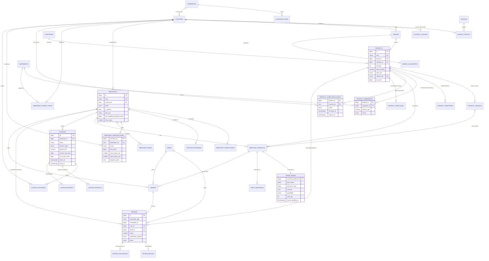

# Entity inventory: prototype seed to PostgreSQL

Status: analysis document for the Laravel 13 + PostgreSQL migration. Written 2026-09-25 by the data architect.
Scope: every global collection that the 16 `seed*.js` files create or change, with the Phase 1 (first import) entities covered field by field.

## 0. Method, legend and ground rules

**How the facts were collected**

- I read all 16 seed files in full.
- I then ran them headlessly (Node `vm`, stubbed `window`/`localStorage`) **in the exact order the HTML loads them** (`Comparo Performance.dc.html` lines 16–37). Every row count below is the measured length after all seed files have run. None of them is an estimate.
- The HTML (1.7 MB) was grepped and read only around the call sites that decide how a field is used. Engine files (`intel.js`, `labels.js` and others) were grepped for writes to seed collections and **none were found**, so the post-seed state is the state the app renders.
- Anything I could not confirm by reading code or running it is marked **unverified**.

**Load order (HTML lines 16–40).** Engine files are interleaved with the seeds but do not mutate seed data:
`seed.js` → `seed-community.js` → `seed-geo.js` → `seed-live.js` → `seed-gamify.js` → `seed-dose.js` → `seed-orders.js` → `seed-labels.js` → `seed-network.js` → (`labels.js`) → `seed-visibility.js` → `seed-governance.js` → (`visibility.js`, `governance.js`) → `seed-seo.js` → `seed-intel.js` → (`intel.js`) → `seed-growth.js` → (`growth.js`) → `seed-commercial.js` → (`commercial.js`) → `seed-addons.js`.

**Classification legend**

| Tag | Meaning | Migration rule |
|---|---|---|
| **SOURCE** | Real entity data that would exist in production (catalogue, merchant settings, user content). `SOURCE (config)` marks platform reference or config data (plans, label definitions, rules), which belongs in seeders or config and is not user data. | Import. The values are fictional but the *shape* is production truth. |
| **DERIVED** | Computable from other rows. | Never store as truth. Compute it, or cache it with a single writer job plus a test against the source (BACKEND-READINESS.md §7). |
| **DEMO-CONSTANT** | An invented number that stands in for something production would measure (analytics, counts, rates, KPIs). | **Never migrate as production data.** Use it only as test fixtures or in a clearly labelled demo seeder. |
| **SNAPSHOT** | A historic series. | In the seed every series is synthetic, so it is SNAPSHOT and DEMO together. Production fills these tables from jobs. |

**Target conventions.** They are stated once and assumed in every table below:
- **Money** is `bigint` minor units plus `char(3)` currency. All seed money is **EUR floats** (`seed.js` line 2: "Prices are stored in EUR and converted at display time"). Import as `round(x*100)`.
- **Percentages and rates** that are not money use `numeric(5,2)`, for example VAT `25.5`.
- **FX rates** use `numeric(18,8)`.
- **Time**: every seed timestamp is epoch **milliseconds** measured against a frozen clock. Import as `timestamptz` (UTC) via `to_timestamp(ms/1000.0)`. Day-only values (`affiliate.daily.day`) become `date`.
- **Enums** become Postgres enums or check constraints. Ids become `bigint` identity unless noted.
- Plural snake_case Laravel table names.

---

## 1. Global generation facts (PRNG, clock)

### 1.1 The frozen clock

| Constant | Where | Value |
|---|---|---|
| `NOW` | `seed.js` line 13 | `new Date('2026-09-06T09:00:00Z').getTime()` = **1788685200000** (Sun 2026-09-06 09:00 UTC) |
| `DAY` | `seed.js` line 12 | `86400000` |
| `historyDays` | `seed.js` line 226 | `365` |
| `HOUR` | `seed-intel.js` line 13, `seed-growth.js` line 11 | `3600000` (local constant) |

Every later file reads `S.NOW` / `S.DAY`. None defines its own base date. Every seeded timestamp is `NOW ± k·DAY/HOUR`.

**Live clock layered on top** (`seed-visibility.js` lines 45–128). `S.helpers.now = S.NOW + offset + (Date.now() − BOOT)`. The offset is persisted in `localStorage['comparo.clock.v2']` (saved every 5 s and on `pagehide`) and clamped to `[0, 30 days]`. `S.helpers.ago` is replaced by one that reads this clock. `S.helpers.sanitizeStamps` rewrites stored future stamps (fields `ts, at, created, date, submittedAt, decidedAt, lastActivity, issued, verifiedAt, resolvedAt, opened, updated, lastTopUp, since`). The app's `now()` delegates to it (HTML line 17947).
→ **Migration consequence.** Seeded timestamps are relative to 2026-09-06 09:00 UTC. On import, either keep them absolute (the demo is dated September 2026) or shift every stamp by `(import_time − NOW)` in one transform. Never mix the two.

### 1.2 PRNGs

All files use the same algorithm: **mulberry32** (`s += 0x6D2B79F5; t = imul(s ^ s>>>15, 1|s); …`). Each file has its own seed. Values depend on **call order**, so any edit to a seed file reshuffles every later value in that file. Import from a **frozen JSON export** of the evaluated `window.SEED`, and never re-implement the generators in PHP.

| File | PRNG seed | Declared at | Notes |
|---|---|---|---|
| `seed.js` | `20260906` | line 4–5 (`mk(20260906)`) | helpers `pick/int/flt/chance/shuffle` lines 6–10, `slug` line 11 |
| `seed-community.js` | `77123456` | line 7 | |
| `seed-geo.js` | `0x3f1a7c5d` | line 23 | |
| `seed-live.js` | `0x6c1f3aa9` | line 24 | |
| `seed-gamify.js` | `0x1d7b44c1` | line 23 | |
| `seed-dose.js` | **none** | — | literals plus id arithmetic (`p.id % 7`, `p.id % 3`, `(p.id*13)%210`) lines 97–100 |
| `seed-orders.js` | `0x9e3779b9` | line 16 | |
| `seed-labels.js` | `0x2ba7f10d` | line 21 | reply latency is deterministic `(4 + (id*17)%92) h` (line 126) |
| `seed-network.js` | `0x5e11cd03` | line 21 | |
| `seed-visibility.js` | `0x41c9e7b3` | line 28 | plus the live clock (above) |
| `seed-governance.js` | `0x6fd21b47` | line 27 | |
| `seed-seo.js` | `31415926` | line 7 | |
| `seed-intel.js` | `20260907` | line 8 | |
| `seed-growth.js` | `20260908` | line 7 | |
| `seed-commercial.js` | `20260909` | line 7 | |
| `seed-addons.js` | `0x7ab39f21` | line 22 | |

### 1.3 Cross-file mutations (import ordering hazards)

The seeds are not append-only. Later files **rewrite fields on earlier rows**. The export must be taken *after* all 16 files have run.

| Mutated collection / field | By | Lines | Effect |
|---|---|---|---|
| `products`, `brands`, `merchants`, `offers`, `coupons`, `reviews`, `users`, `complianceRules`, `feeds`, `affiliate.daily` | `seed-community.js` | 18–325 | appends 4 brands, 18 products, 5 merchants, offers, coupons, reviews, 20 users, 6 compliance rules; adds community metrics to all merchants |
| `merchants[].shipsTo`, `.zones[*]` (+`carrier`, `duty`), `.marketCount`; `currencies`, `countries` (+`eu`,`region`,`customs`,`localised`), `complianceRules` | `seed-geo.js` | 30–150 | extends every merchant to new markets **in place** |
| `coupons[].countries` | `seed-geo.js` (indirect) | seed.js 190, community 141 | exclusive coupons and all community coupons hold a **reference** to `m.shipsTo`, so the geo extension silently widens them (ids 17–28) |
| `forumCategories` | `seed-live.js` | 33–35 | splices in `price-history` |
| `levels` | `seed-gamify.js` | 67 | replaced: 5 levels → 10 |
| `products[].doses/doseSource/doseSourceLabel/doseUpdated` | `seed-dose.js` | 85–101 | |
| `reviews[].verifyMethod` | `seed-orders.js` | 128 | rewritten from the generated order |
| `reviews[].reply` (date rewritten, new replies added), `brands[].labReports` | `seed-labels.js` | 127–156 | |
| `orders[].returnPostagePaidBy/refundedAt/refundDays` | `seed-governance.js` | 156–160 | returned orders only |
| `gm.xpSources` | `seed-governance.js` | 223–228 | appends 2 |
| `*.eid`, `categories[].context`, `articles[].authorId/editorId/reviewedAt/dataUpdatedAt/status` | `seed-seo.js` | 15–20, 77, 250–256 | |
| `merchants[].ix` | `seed-intel.js` | 47–61 | |
| `users` (+6), `reviews` (+43 fraud cases) | `seed-intel.js` | 89–164 | |
| `offers[].price`, `.priceBefore`, `.oldPrice`, `.updated`, `.ix` | `seed-intel.js` | 188–222 | **current prices changed after price history was built** |
| `coupons[].ix`, `.code` (SUPBAY18), `.ends` | `seed-intel.js` | 227–249 | |
| `feedItems` (+12) | `seed-intel.js` | 304–311 | |
| `cx.features`, `cx.entitlements`, `cx.placements[].basePrice/format/share/audience*`, `cx.merchantAddons` | `seed-addons.js` | 41–62, 395–433, 278–289 | |

---

## 2. Phase 1 entities, field by field

Phase 1 = markets, currencies, FX, brands, categories, products (+variants, packs, identifiers), ingredients and doses, merchants (+trust inputs), shipping, offers, coupons, compliance, price history, reviews. `users` and `orders` are included as supporting entities because reviews and verification depend on them.

### 2.1 `S.currencies` → `currencies` (+ `exchange_rates`)

- **Generated:** literal array, `seed.js` lines 17–24 (6 rows). `seed-geo.js` lines 30–32 appends 6 more if absent.
- **Rows: 12** (EUR, USD, GBP, CZK, PLN, SEK, DKK, NOK, CHF, HUF, RON, BGN).
- **Class:** the entity is SOURCE (config). `rate` is a DEMO-CONSTANT.

| Field | JS type | Example | Meaning | FK | Class |
|---|---|---|---|---|---|
| `code` | string | `"CZK"` | ISO 4217 code (natural key) | — | SOURCE |
| `symbol` | string | `"Kč"` | display symbol | — | SOURCE (config) |
| `rate` | number | `25.2` | units of this currency per 1 EUR, **static, undated** | — | DEMO-CONSTANT |
| `locale` | string | `"cs-CZ"` | Intl locale used by `fmt` | — | SOURCE (config) |

- **FX facts.** There is no exchange-rate history and no timestamp. `fmt(eur, code)` (`seed.js` lines 477–484) multiplies by `rate`. Decimals are **hard-coded**: 0 for CZK/SEK/PLN, 2 for everything else, including HUF (line 480). A second, conflicting FX table sits in `S.cx.settings.fx` (`seed-commercial.js` line 392, `fxDate: '2026-09-01'`, 6 currencies only).
- **Target tables.**
  - `currencies(code char(3) PK, symbol, minor_units smallint, locale)`.
  - `exchange_rates(id, base char(3)='EUR', quote char(3) FK currencies, rate numeric(18,8), as_of timestamptz, source)` with unique `(base, quote, as_of)`.
  - Import the 12 seed rates as a single dated row set, `as_of = 2026-09-01` or NOW, and label the source `demo`.

### 2.2 `S.countries` (markets) → `countries` (+ `regions`, `country_customs`)

- **Generated:** literal, `seed.js` lines 25–38 (12). `seed-geo.js` lines 58–69 appends 15, and lines 77–83 add `eu`, `region`, `customs`, `localised` to every row. `seed-seo.js` line 19 adds `eid`.
- **Rows: 27.** Order: DE, AT, CZ, SK, PL, FR, IT, ES, NL, SE, GB, US, BE, PT, IE, DK, FI, NO, CH, HU, RO, BG, GR, SI, HR, LT, EE.

| Field | JS type | Example | Meaning | FK | Class |
|---|---|---|---|---|---|
| `iso` | string | `"DE"` | ISO 3166-1 alpha-2 (natural key) | — | SOURCE |
| `name` | string | `"Germany"` | English name. Also the source of the country route slug `#/countries/germany` (seed-live line 67) | — | SOURCE |
| `currency` | string | `"EUR"` | local currency | `currencies.code` | SOURCE |
| `lang` | string | `"de"` | default language | — | SOURCE |
| `vat` | number | `19`, `25.5` (FI), `8.1` (CH) | standard VAT %, for display | — | SOURCE |
| `age` | number | `18` | legal adult age for restricted products (18 everywhere) | — | SOURCE |
| `eu` | boolean | `false` for GB/US/CH/NO | inside the EU customs union (`NON_EU` list, geo line 65) | — | SOURCE |
| `region` | string | `"DACH"` | **display name** of the region, not its key (geo line 79) | `regions.name` (by name) | DERIVED (from `regions.markets`) |
| `customs` | object\|null | `{vatAtImport:true, threshold:0, handling:12, note:"…"}` | import treatment, non-EU only (geo lines 71–76). `handling` is an EUR fee, `threshold` for US = 800 **USD** | — | SOURCE |
| `localised` | boolean | `true` for the original 12 | UI translated for this market (geo line 82) | — | SOURCE (config) |
| `eid` | string | `"MKT-00001"` | stable entity id **by array position** (seo line 19) | — | DERIVED |

- **`S.regions`** (geo lines 35–44, **8 rows**, literal): `{key:'DACH', name, markets:[iso], near:[regionKey]}`. SOURCE (config).
  - Target: `regions(key PK, name)`, `region_country(region_key, country_iso)`, `region_adjacency(region_key, near_key)`.
  - `helpers.shipBand(a,b)` (geo lines 47–54) returns 0 = same country, 1 = same region, 2 = adjacent, 3 = elsewhere. That value is DERIVED.
- **`S.marketStats`** (geo lines 153–166, 27 rows): shops, lanes, medianShip, fastestDays, domestic, carriers, freeShipShops. **DERIVED**, do not store.
- **Target:** `countries(iso2 char(2) PK, name, currency_code FK, default_language, vat_rate numeric(5,2), min_age smallint, is_eu bool, is_localised bool, active bool)`. Customs go in `country_customs(country_iso PK/FK, vat_at_import bool, duty_free_threshold_minor bigint, threshold_currency char(3), handling_fee_minor bigint, handling_currency char(3), note)`.

### 2.3 `S.brands` → `brands` (+ `brand_lab_reports`)

- **Generated:** `seed.js` lines 41–55 map `brandDefs` (9 literal tuples) with PRNG `reviews`/`founded`. `seed-community.js` lines 18–24 append 4 (Helix Nutrition, Vertex Labs, Grindstone, Aurora Vital). `seed-labels.js` lines 145–156 add `labReports`, and `seed-seo.js` line 16 adds `eid`.
- **Rows: 13.**
- **Slug:** `slug(name)` (`seed.js` line 11): lowercase, NFD with diacritics stripped, every non-`[a-z0-9]` run replaced by `-`, leading and trailing `-` trimmed. So `IRONFORGE` → `ironforge` and `PureCore Nutrition` → `purecore-nutrition`.

| Field | JS type | Example | Meaning | FK | Class |
|---|---|---|---|---|---|
| `id` | number | `1` | 1-based position in the array | — | SOURCE (surrogate) |
| `name` | string | `"IRONFORGE"` | brand name | — | SOURCE |
| `slug` | string | `"ironforge"` | URL key, unique | — | DERIVED from name (store, unique) |
| `country` | string | `"DE"` | country of origin | `countries.iso` | SOURCE |
| `rating` | number | `4.7` | brand rating | — | **DEMO-CONSTANT** (must be DERIVED from reviews) |
| `desc` | string | `"German manufacturing…"` | description | — | SOURCE |
| `reviews` | number | `706` | review count (PRNG 120–1900) | — | **DEMO-CONSTANT** |
| `founded` | number | `2001` | founding year (PRNG) | — | SOURCE (value invented) |
| `labReports` | object | `{publishes:true, cadence:"every batch", lastAt, lotMatch:true, url:"https://ironforge.example/coa", checkedAt, checkedBy:"quality@comparo"}` | CoA register, evidence for the `lab_reports_published` label. `publishes = (index % 3 !== 1)` | — | SOURCE |
| `eid` | string | `"BRD-00001"` | `'BRD-'+pad5(id)` | — | DERIVED |

- **Target:** `brands(id, slug unique, name, country_iso FK, description, founded_year smallint)`, plus `brand_lab_reports(brand_id, publishes, cadence enum, last_report_at, lot_match bool, url, checked_at, checked_by)`. Do **not** create `rating`/`review_count` columns.

### 2.4 `S.categories` → `categories`

- **Generated:** literal, `seed.js` lines 57–67. `seed-seo.js` line 77 adds `context` and line 18 adds `eid`.
- **Rows: 9.** Flat, with no parent.

| Field | Type | Example | Meaning | Class |
|---|---|---|---|---|
| `id` | number | `1` | literal id | SOURCE |
| `name` | string | `"Recovery & sleep"` | | SOURCE |
| `slug` | string | `"recovery-sleep"` | literal, not produced by `slug()` (`slug('Recovery & sleep')` would give the same value) | SOURCE |
| `context` | string | `"Protein powders are compared on price per 100 g of protein…"` | editorial/SEO intro | SOURCE (content) |
| `eid` | string | `"CAT-00001"` | | DERIVED |

- **Target:** `categories(id, parent_id null, slug unique, name, position, intro_text)`.

### 2.5 `S.ingredients` + doses → `ingredients`, `product_ingredients`, `ingredient_market_limits`

- **`S.ingredients`** (`seed.js` line 68): a literal array of **28 names** (strings, with no ids). It is referenced everywhere **by name**, both from `product.ingredients[]` and from dose keys.
- **`S.ingredientEntities`** (`seed-seo.js` lines 53–63, 28 rows) supplies the entity form: `{id:i+1, eid:'ING-'+pad5, name, slug:slug(name), context, productIds[], categoryIds[], brandIds[], updated}`. `productIds`, `categoryIds` and `brandIds` are **DERIVED** (reverse index); `context` is SOURCE (content); `updated` is DEMO.
  - Slug examples: `"Whey isolate"` → `whey-isolate`, `"BCAA 4:1:1"` → `bcaa-4-1-1`, `"Omega-3 EPA/DHA"` → `omega-3-epa-dha`.
- **Doses** (`seed-dose.js`): table `D` (lines 15–62) is keyed by **product slug** and maps ingredient name to **mg per serving**. It covers all **46** products (`S.doseMeta.dosedProducts = 46`), and every ingredient in `product.ingredients` has a dose (verified, 0 mismatches). Each product gets `p.doses = [{ingredient, mg, carrier, nrv}]` (lines 89–94).

| Field (per dose) | Type | Example | Meaning | Class |
|---|---|---|---|---|
| `ingredient` | string | `"Caffeine"` | FK by **name** → `ingredients` | SOURCE |
| `mg` | number | `200`, `0.05` (Vitamin D3) | amount per serving in **mg**, fractional allowed | SOURCE |
| `carrier` | boolean | `true` for Maltodextrin/Cyclic dextrin | excluded from "active" totals (`CARRIER`, line 68) | SOURCE (ingredient attribute, not per product) |
| `nrv` | number\|null | `10` (Zinc) | EU NRV in mg (`NRV`, line 72). null = no NRV | SOURCE (ingredient attribute) |

- **Product-level dose provenance** (lines 97–100):
  - `doseSource` is `brand_spec` when `id%7==0`, else `merchant_feed` when `id%3==0`, else `label_photo`. The assignment is DEMO and the values are enum SOURCE. Distribution: 27 label_photo / 13 merchant_feed / 6 brand_spec.
  - `doseSourceLabel` is DERIVED (display).
  - `doseUpdated = NOW − ((id*13)%210)·DAY`.
- **`S.doseMeta`** (lines 103–109): `{carriers[], nrv{}, limits[5], dosedProducts, note}`. `limits` = `{ingredient, max, unit:'mg', scope:'per serving'|'daily', markets[], rule}`. SOURCE (regulatory config).
- **Target:**
  - `ingredients(id, slug unique, name unique, is_carrier bool, nrv_mg numeric(12,4) null, intro_text)`.
  - `product_ingredients(product_id FK, ingredient_id FK, amount_mg numeric(12,4), per enum('serving') default 'serving', source enum(label_photo|merchant_feed|brand_spec|wiki), read_at timestamptz, UNIQUE(product_id, ingredient_id))`.
  - `ingredient_market_limits(ingredient_id, country_iso, max_mg numeric, scope enum(per_serving|daily), rule_text)` with unique `(ingredient_id, country_iso, scope)`.
  - Store `mg` as `numeric` rather than an integer, because of values such as 0.05 and 10.5.

### 2.6 `S.products` → `products`, `product_variants`, `product_identifiers`

- **Generated:**
  - `seed.js` lines 71–116: 28 literal `productDefs` tuples `[name, brandIdx, catId, pack, servings, unit, basePriceEUR, ingredients[], short]`, mapped with PRNG for variants, views, watchers and created.
  - `seed-community.js` lines 28–62: 18 more. The brand is resolved **by name** there, and the flavour pool differs (Berry instead of Salted caramel).
  - Price-history fields are added by seed.js lines 227–250 and community lines 150–173. Doses by seed-dose. `eid` by seed-seo line 15.
- **Rows: 46** (ids 1–46).

| Field | JS type | Example (id 1) | Meaning | FK | Class |
|---|---|---|---|---|---|
| `id` | number | `1` | `i+1` / `S.products.length+1` | — | SOURCE (surrogate) |
| `name` | string | `"Performance Alpha"` | | — | SOURCE |
| `slug` | string | `"performance-alpha"` | `slug(name)`, unique (46/46 verified) | — | DERIVED (store unique) |
| `brandId` | number | `4` | brand | `brands.id` | SOURCE |
| `categoryId` | number | `4` | single category | `categories.id` | SOURCE |
| `pack` | string | `"360 g"`, `"180 caps"`, `"60 sachets"` | pack size as **text**: quantity + unit. Parsed with `parseFloat` | — | SOURCE (split into `pack_quantity numeric` + `pack_unit enum`) |
| `servings` | number | `30` | servings per pack | — | SOURCE |
| `unit` | string | `g`\|`caps`\|`tabs`\|`sachets`\|`gummies` | pack unit (5 values measured) | — | SOURCE (enum) |
| `base` | number | `39.9` | **generator anchor price EUR**, which offers are drawn around (factor 0.82–1.18) | — | **DEMO-CONSTANT** (not a real price) |
| `ingredients` | string[] | `["L-citrulline malate","Beta-alanine","Caffeine","L-theanine"]` | declared ingredient names | `ingredients.name` | SOURCE (superseded by `doses`) |
| `short` | string | `"Fully disclosed pre-workout…"` | short description | — | SOURCE |
| `ean` | string | `"85910079191"` | `'859' + String(1000000+id*7919).slice(0,7) + (id%10)`. **11 digits, no GS1 check digit, not a valid GTIN** | — | SOURCE (demo value, fails GTIN validation) |
| `sku` | string | `"CMP-0001"` | internal SKU `'CMP-'+pad4(id)` | — | SOURCE |
| `rrp` | number | `48.7` | `round(base*1.22, 1)`, EUR | — | DERIVED/DEMO (an invented RRP) |
| `variants` | string[] | `["Vanilla","Chocolate","Salted caramel","Unflavoured"]` | **flavour names**. Powders (`unit==='g'`) get 2–4, all others `["Standard"]` | — | SOURCE |
| `packs` | string[] | `["360 g","720 g"]` | pack-size options. For `g` products the second is `2×` (`"1.8 kg"` if ≥1000 g). Non-g products have one | — | SOURCE (demo) |
| `desc` | string | short + fixed disclaimer | long description | — | SOURCE |
| `views` | number | `6968` | page views (PRNG) | — | **DEMO-CONSTANT** |
| `watchers` | number | `1364` | watchlist count (PRNG). Read by the `community_favourite` label | — | **DEMO-CONSTANT** (must be DERIVED from watchlists) |
| `created` | number(ms) | `1728982800000` | created_at | — | SOURCE |
| `hist` | object | `{min:[365], avg:[365], byMerchant:{"1":[365],"4":[365],"5":[365]}}` | price history (see §2.11) | — | SNAPSHOT (synthetic) |
| `lowestEver` | number | `35.02` | `min(hist.min)` | — | **DERIVED** |
| `change30` / `change7` | number | `2.7` / `0` | % change of current min vs `min[334]` / `min[357]` | — | **DERIVED** |
| `doses` | object[] | see §2.5 | amount per serving | — | SOURCE |
| `doseSource`, `doseSourceLabel`, `doseUpdated` | string / string / ms | `"label_photo"` | dose provenance | — | SOURCE / DERIVED / SOURCE |
| `eid` | string | `"PRD-00001"` | `'PRD-'+pad5(id)` | — | DERIVED |

- **Variants, flavours and packs.** There is **no variant entity**. `variants` (flavours) and `packs` (sizes) are two independent lists, the EAN is per product (not per variant), and offers name a variant by **string** (`offer.variant`, which always matches one of `product.variants`; 0 mismatches). `offer.pack` is **always `product.pack`**, so the second pack size never has an offer. Merges (duplicate resolution) exist only in UI state (`state.merges`, HTML lines 11716 and 12852), not in the seed. `S.duplicateCandidates` (seo lines 287–302, 5 rows) is SOURCE (matching queue).
- **Target:**
  - `products(id, slug unique, brand_id FK, category_id FK, name, short_description, description, internal_sku unique, servings int, pack_quantity numeric(10,2), pack_unit enum(g,caps,tabs,sachets,gummies), rrp_minor bigint null, rrp_currency char(3), status enum(draft,active,merged,archived), merged_into_id self FK, created_at)`.
  - `product_variants(id, product_id FK, flavour varchar, pack_quantity, pack_unit, gtin varchar(14) null unique, UNIQUE(product_id, flavour, pack_quantity, pack_unit))`, built as the cartesian product of flavours × packs **or** only the combinations that appear on offers (decision needed).
  - `product_identifiers(product_id|variant_id, scheme enum(gtin,ean,internal), value, UNIQUE(scheme,value))`, so the invalid 11-digit EANs can be stored as `scheme='legacy_demo'` without breaking GTIN validation.
  - Views and watchers go to analytics tables, not onto `products`.

### 2.7 `S.merchants` → `merchants`, `merchant_verifications`, `affiliate_programs`, `merchant_metrics_*`

- **Generated:**
  - `seed.js` lines 119–158: 8 literal `merchDefs` `[name, country, rating, reviews, verified, partner, tier, shipsTo[], baseShip, web]`, `freeOverTable` (line 129) and PRNG for the rest.
  - `seed-community.js` lines 65–100 add 5 with a literal free threshold at index 10. Lines 102–108 add community metrics to the original 8.
  - `seed-geo.js` extends `shipsTo`/`zones`. `seed-seo.js` line 17 adds `eid`. `seed-intel.js` lines 22–62 add `ix`.
- **Rows: 13.**

| Field | JS type | Example (id 1 PeakSupps) | Meaning | FK | Class |
|---|---|---|---|---|---|
| `id` | number | `1` | | — | SOURCE |
| `name` | string | `"PeakSupps"` | trading name | — | SOURCE |
| `slug` | string | `"peaksupps"` | `slug(name)` | — | DERIVED (unique) |
| `country` | string | `"DE"` | country of establishment, also the warehouse country | `countries.iso` | SOURCE |
| `rating` | number | `4.8` | **population** rating (the prototype blends it with held reviews: HTML lines 12897–12909) | — | **DEMO-CONSTANT** |
| `reviews` | number | `3421` | **population** review count (only 13 held) | — | **DEMO-CONSTANT** |
| `verified` | boolean | `true` | verification passed | — | SOURCE |
| `partner` | boolean | `true` | partner tier (extends shipping reach in geo line 99 and label targets) | — | SOURCE |
| `tier` | string | `"PREMIUM"` | `FREE`\|`PRO`\|`PREMIUM` (seed-geo line 99 also tests `'GROWTH'`, which never occurs) | — | SOURCE (conflicts, see §5) |
| `status` | string | `"verified"` | `'verified'`\|`'pending'` (`verified ? 'verified' : 'pending'`) | — | SOURCE (redundant with `verified`) |
| `shipsTo` | string[] | 22 isos | served markets. Equals `Object.keys(zones)` (verified 13/13) | `countries.iso` | **DERIVED** from zones |
| `zones` | object | `{DE:{cost:3.4, days:[1,2], carrier:"GLS", duty:false}, …}` | per-country shipping, see §2.8 | — | SOURCE |
| `freeOverEur` | number | `85` | free-shipping threshold, EUR integer, **per merchant** | — | SOURCE |
| `web` | string | `"peaksupps.de"` | domain (no scheme) | — | SOURCE |
| `currencies` | string[] | `["USD","GBP"]` | accepted currencies (PRNG, **excludes the home currency EUR in this example**) | `currencies.code` | SOURCE (values nonsensical) |
| `carriers` | string[] | `["FedEx","GLS","DHL"]` | carriers used (PRNG, can disagree with `zones[*].carrier`) | — | SOURCE |
| `payments` | string[] | `["PayPal","Apple Pay","Bank transfer"]` | payment methods | — | SOURCE |
| `sub` | object | `{shipping:4.3, comms:3.6, price:4.7, support:4.8, claims:3.5, trust:3.8}` | sub-ratings | — | **DEMO-CONSTANT** (DERIVE from review `sub`) |
| `created` | ms | | account created | — | SOURCE |
| `productCount` | number | `1241` | catalogue size | — | **DEMO-CONSTANT** |
| `desc` | string | `"… holding 1078 SKUs …"` | description with a **second random SKU count embedded**, disagreeing with `productCount` | — | SOURCE (content, fix the text) |
| `returnDays` | number | `14` | return window (14/30/60) | — | SOURCE |
| `affiliate` | object | `{network:"Tradedoubler", commission:4.7, cookie:30, sub:"cmp-peaksupps"}` | affiliate program: network name, commission %, cookie days, sub-id prefix | network by name | SOURCE → `affiliate_programs` |
| `faq` | object[] | `[{q,a}]×3` | FAQ copy (contains random day counts) | — | SOURCE (content) |
| `responseRate`, `responseHours`, `verifiedOrderRate`, `complaints30`, `complaintsResolved`, `claimed` | number / number / number / number / number / boolean | `77, 29.3, 51, 5, 85, true` | community metrics (community lines 97–98, 104–106) | — | **DEMO-CONSTANT** (DERIVE from replies, orders, complaints). `claimed` = SOURCE |
| `marketCount` | number | `22` | `shipsTo.length` | — | **DERIVED** |
| `eid` | string | `"SHP-00001"` | | — | DERIVED |
| `ix` | object | see below | trust inputs | — | **DEMO-CONSTANT** |

**`merchant.ix`: trust-score inputs** (`seed-intel.js` lines 22–61; ids 1–8 use the literal `profiles`, ids 9–13 are computed from `rating`):

| `ix` field | Example (id 1) | Meaning | Production source (target) |
|---|---|---|---|
| `bizVerified` | `true` | business verification result | `merchant_verifications.decision = approved`, which is SOURCE |
| `complaintRate` | `0.4` | % of orders with a complaint | DERIVED from `orders`/`disputes` |
| `resolution` | `97` | % of complaints resolved | DERIVED |
| `responseRate` | `98` | % of reviews/questions answered | DERIVED from `review_replies`, `shop_questions` |
| `priceAccuracy` | `99.2` | % of offers matching the landing page | DERIVED from price checks and reports |
| `feedUptime` | `99.7` | % of successful feed runs | DERIVED from `feed_runs` |
| `shipAccuracy` | `97.4` | shipping cost accuracy % | DERIVED |
| `brokenLinkRate` | `0.1` | % of 404/redirect-failed offer links | DERIVED from link checks |
| `communityReports` | `1` | open community reports (penalty) | DERIVED |
| `deliveryOnTime` | `96` | % delivered inside the promise | DERIVED from `orders` (`gp.measured` already does this) |
| `trend` | `"up"` | trust trend | DERIVED |
| `accountAgeDays` | `1420` | account age (**contradicts `created`**) | DERIVED from `created_at` |
| `verifiedOrderRate`, `verifiedReviewRatio` | `87`, `85` | computed from `rating` | DERIVED |
| `trustSeries` | number[365] | daily trust delta, random walk | SNAPSHOT (`merchant_trust_snapshots`) |
| `sla` | `{feedFreshnessTarget:'6 h', feedFreshnessActual:'2.2 h', …}` | SLA targets (config) and actuals (**strings with units**) | targets SOURCE (config), actuals DERIVED |
| `cvr`, `returnRate` | `5.34`, `1.7` | conversion %, return % | DERIVED (affiliate conversions, orders) |

- **The trust score itself** is computed by `intel.js trust(m)` (lines 40–94): 12 weighted signals summing to 100, minus a community-report penalty. **DERIVED.** Store it only in a `merchant_scores` cache table written by `ScoreTrust`.
- **Verification** is spread over `verified`, `status`, `ix.bizVerified` (these disagree, see §5), `cx.accounts[].legalName/companyId/vatId` (commercial lines 82–85) and `S.merchantApplications` (seed.js lines 160–164).
- **Feed uptime** also exists as `S.feeds[m].status/errors` and `ix.feedRuns`.
- **Target:**
  - `merchants(id, slug unique, name, website, country_iso FK, status enum(pending,verified,rejected,suspended), is_partner bool, plan_key FK plans, free_shipping_threshold_minor bigint, free_shipping_currency char(3), return_days smallint, description, payment_methods text[], carriers text[], accepted_currencies char(3)[], claimed bool, created_at)`.
  - `merchant_verifications(merchant_id, legal_name, registration_number, vat_number, decision, reviewed_by, reviewed_at)`.
  - `affiliate_programs(merchant_id, network_id null, commission_rate numeric(5,2), cookie_days, sub_id_prefix, status)`.
  - `merchant_faqs(merchant_id, position, question, answer)`.
  - Trust inputs → `merchant_metric_snapshots(merchant_id, metric enum, value numeric, measured_at)`, filled by jobs and never imported from `ix`.

### 2.8 Shipping: `merchant.zones` + `S.shipLanes` → `merchant_shipping_rates`

- **Generated:**
  - `seed.js` lines 134–138: for each literal `shipsTo` country, home cost = `round(baseShip*0.7, 1)` and days `[1,2]`. Cross-border cost = `baseShip × flt(1,1.9)` with days `[int(2,4), int(4,8)]`.
  - `seed-community.js` lines 76–80 do the same (multiplier 1–1.8).
  - `seed-geo.js` lines 94–112 extend every merchant to more markets by reach:
    - reach is 3 for a partner, 2 for PRO/GROWTH, 1 otherwise;
    - non-EU markets are reserved for partners;
    - band 3 is skipped with 45 % probability;
    - cost = `baseCost × bandMult{1:1.25, 2:1.7, 3:2.3} × (0.85..1.25)`, days = `bandDays + jitter`.
  - Lines 114–125 add `carrier` (picked from `carrierByRegion`) and `duty = !country.eu` to **every** zone, and emit one lane per zone.
- **Rows:** zones are embedded (13 merchants, 155 merchant×country pairs, per-merchant counts 4–25). **`S.shipLanes`: 155** (unique per merchant+to, verified). Bands: 13×0, 38×1, 64×2, 40×3.

| Field | JS type | Example | Meaning | FK | Class |
|---|---|---|---|---|---|
| (zone key) | string | `"DE"` | destination country | `countries.iso` | SOURCE |
| `cost` | number | `3.4` | shipping cost **EUR**, 1 decimal | — | SOURCE |
| `days` | [number,number] | `[1,2]` | transit days min/max | — | SOURCE |
| `carrier` | string | `"GLS"` | carrier on this lane | — | SOURCE |
| `duty` | boolean | `false` | destination is outside the EU. **DERIVED from `countries.eu`** (true even for SupplementBay's domestic US lane) | — | DERIVED |
| lane `merchantId` | number | `1` | | `merchants.id` | SOURCE |
| lane `from` / `to` | string | `"DE"`/`"NL"` | origin (= merchant country) / destination | `countries.iso` | DERIVED / SOURCE |
| lane `band` | 0–3 | `2` | distance band | — | DERIVED (`shipBand`) |
| lane `cutoff` | string | `"17:00"`/`"16:00"`/`"14:00"` | dispatch cut-off, a function of band only | — | SOURCE (demo rule) |
| lane `tracked` | boolean | `true` | always true | — | SOURCE |
| lane `pickup` | boolean | | pickup-point option (band ≤ 1, 70 %) | — | SOURCE |
| lane `cod` | boolean | | cash on delivery (domestic only, 50 %) | — | SOURCE |

- **Free-shipping threshold:** `merchant.freeOverEur` (EUR), **one value per merchant and all countries**. seed.js `freeOverTable` [85,48,60,36,70,56,40,60] (line 129), community tuple index 10 [52,45,60,55,48].
- **How it is applied** (HTML lines 12928–12951): `ship = zone ? (effectivePrice ≥ freeOverEur ? 0 : zone.cost) : n/a`. The threshold is compared with the **single offer's effective price** (after a percent or fixed coupon), not a basket, except in basket compare (line 13195: `sub >= m.freeOverEur`). Delivery estimate = `zone.days`. Order promise = `zone.days[1] + 1` (seed-orders line 60).
- **Target:** `merchant_shipping_rates(id, merchant_id FK, destination_iso FK, carrier, cost_minor bigint, currency char(3) default 'EUR', transit_days_min smallint, transit_days_max smallint, dispatch_cutoff time, tracked bool, pickup_available bool, cod_available bool, free_over_minor bigint null, UNIQUE(merchant_id, destination_iso, carrier))`. Put `free_over_minor` here and allow NULL to mean "use merchant default", so that DATABASE.md's per-option `free_over` and the seed's per-merchant value are both representable. Do not store `band`, `duty` or `from`.

### 2.9 `S.offers` → `merchant_products` + `offer_prices` (+ `offers` publication)

- **Generated:**
  - `seed.js` lines 196–223: for each of the 28 base products, 3–6 shuffled merchants. `price = round(base × flt(0.82,1.18,3) × (FREE ? 0.97 : 1), 2)`; `oldPrice` is set with 42 % probability to `price × 1.08..1.45`; availability comes from one draw `av` (<0.68 in_stock, <0.82 low_stock, <0.92 preorder, else out_of_stock); stock is `int(3,240)` only if `av < 0.82`.
  - `seed-community.js` lines 112–147: offers for the 18 new products (3–6 merchants each) plus 8–14 original products for each new merchant. Duplicate (product, merchant) pairs are skipped.
  - `seed-intel.js` lines 174–222 then **overwrite**: 4 prices become anomalies (`priceBefore` is kept), 4 `updated` are made stale (52–128 h), 1 `oldPrice` is inflated as a fake discount, and 5 `ix.link` statuses are set.
- **Rows: 267** (ids 1–267). (product, merchant) is unique (267/267) and (merchant, merchantSku) is unique (267/267). There are 3–9 offers per product and 16–26 per merchant. Availability: 181 in_stock / 37 low_stock / 30 preorder / 19 out_of_stock. 116 have `oldPrice`, 14 are `sponsored`, 65 have a `couponId`.

| Field | JS type | Example | Meaning | FK | Class |
|---|---|---|---|---|---|
| `id` | number | `7` | | — | SOURCE |
| `productId` | number | `2` | matched canonical product (always set) | `products.id` | SOURCE |
| `merchantId` | number | `6` | | `merchants.id` | SOURCE |
| `price` | number | `19.97` | current price **EUR, VAT-inclusive (assumed)**, 2 dp. Range 1.70–103.21 (1.70 is a seeded anomaly) | — | SOURCE |
| `oldPrice` | number\|null | `24.96` | struck-through reference price (always > price) | — | SOURCE (subject to fake-discount checks) |
| `availability` | string | `"out_of_stock"` | enum `in_stock\|low_stock\|preorder\|out_of_stock` | — | SOURCE |
| `stock` | number | `0` | units (0 for preorder/out_of_stock) | — | SOURCE |
| `warehouse` | string | `"SE"` | **always = merchant.country** | `countries.iso` | DERIVED (seed) / SOURCE (prod) |
| `variant` | string | `"Vanilla"` | flavour name, one of `product.variants` | → `product_variants` | SOURCE |
| `pack` | string | `"500 g"` | always `product.pack` | → `product_variants` | SOURCE |
| `couponId` | number\|null | `13` | a coupon of the same merchant (0 cross-merchant). Read only by the intel deal score (`intel.js` line 503). The offer table picks the best coupon dynamically (HTML lines 12938–12947) | `coupons.id` | DEMO (do not import; coupon applicability is DERIVED) |
| `sponsored` | boolean | `false` | paid flag (8 % / 7 %, never on FREE) | — | DEMO (DERIVE from `sponsored_bookings`) |
| `merchantSku` | string | `"NOR-62"` | `upper(name[0..3]) + '-' + productId*31` | — | SOURCE |
| `ean` | string | `"85910158382"` | copy of `product.ean` | — | DERIVED (feed GTIN in prod) |
| `url` | string | `"https://nordicgains.se/p/strength-core"` | `'https://'+web+'/p/'+product.slug` | — | SOURCE |
| `updated` | ms | `NOW − 0..22 h` (stale ones up to 106 h) | last feed update | — | SOURCE |
| `clicks30` | number | `261` | outbound clicks in 30 d | — | **DEMO-CONSTANT** (DERIVE from `affiliate_clicks`) |
| `eid` | string | `"OFR-00007"` | | — | DERIVED |
| `priceBefore` | number | (4 offers) | feed price before the anomaly override | — | DEMO |
| `ix` | object | `{anomaly:'too_low', marketMedian:20.7, feedRaw:17.34}` / `{stale:true}` / `{link:404}` / `{refPriceRaisedAt}` | seeded QA flags, 10 offers | — | DEMO (DERIVED by `DetectAnomalies` and link checks) |

- **Price semantics:** EUR everywhere. The UI converts with `currencies.rate`. `merchant.currencies` is never used for prices. **No VAT flag or basis is stored** (unverified whether prices are gross; the text implies gross consumer prices).
- **Target** (DATABASE.md three-way split, simplified):
  - `merchant_products(id, merchant_id FK, product_id FK null, variant_id FK null, merchant_sku, gtin, raw_title, product_url, match_type enum, match_confidence numeric(4,3), matched_at, UNIQUE(merchant_id, merchant_sku))`.
  - `offer_prices(merchant_product_id PK/FK, price_minor bigint, old_price_minor bigint null, currency char(3), vat_included bool, availability enum, stock_qty int null, warehouse_iso FK, source_updated_at timestamptz, fetched_at timestamptz)`.
  - Publication and compliance filtering is a view or a column, **not** a paid `position_boost` (see §5).

### 2.10 `S.coupons` → `coupons`, `coupon_countries`, `coupon_reports`

- **Generated:**
  - `seed.js` lines 167–183: FREE merchants get 1, others 2–3. `type` is picked from percent/fixed/freeship. `code = upper(lettersOf(name).slice(0,5) + int(5,25))`. **`title` and `value` use separate `int()` draws**, so they disagree.
  - `seed.js` lines 184–193: Comparo exclusives for merchants 1, 2, 3, 5 with `code:'COMPARO'+int(10,20)`, `exclusive:true` and `countries = m.shipsTo` **(a shared reference)**.
  - `seed-community.js` lines 132–145: coupons for merchants 9–13, `countries = m.shipsTo` (shared reference).
  - `seed-intel.js` lines 226–249 add `ix` and override 3 coupons. The first coupon of **merchant 6** gets `code = 'SUPBAY18'`, state invalid; merchant 8's first coupon gets `ends = NOW − 3 d`.
- **Rows: 28.** Types: 11 percent / 9 fixed / 8 freeship. `ix.state`: 12 verified, 5 merchant, 4 community, 4 invalid, 2 unverified, 1 expired.

| Field | JS type | Example | Meaning | FK | Class |
|---|---|---|---|---|---|
| `id` | number | `1` | | — | SOURCE |
| `merchantId` | number | `1` | issuing shop | `merchants.id` | SOURCE |
| `code` | string | `"PEAKS20"` | coupon code. **Not unique per merchant** (2 duplicates) | — | SOURCE |
| `title` | string | `"€10 off your order"` | display text. **Disagrees with `value` on 18/28** | — | SOURCE (regenerate from type+value) |
| `type` | string | `percent`\|`fixed`\|`freeship` | discount type | — | SOURCE (enum) |
| `value` | number | `6` | percent (5–20) or EUR amount (5–15). 0 for freeship | — | SOURCE (fixed → `value_minor`) |
| `minOrder` | number | `80` | minimum order EUR (0/30/50/80). Compared with the **offer price**, not the basket (HTML line 12938). 6 freeship coupons titled "no minimum" have `minOrder > 0` | — | SOURCE |
| `countries` | string[] | `["DE","AT","CZ"]` | valid markets. A subset of `shipsTo`, but aliased to `shipsTo` for ids 17–28 | `countries.iso` | SOURCE |
| `starts` / `ends` | ms | | validity window | — | SOURCE |
| `exclusive` | boolean | `true` | Comparo-exclusive code | — | SOURCE |
| `uses` | number | `1670` | redemption count | — | **DEMO-CONSTANT** |
| `verifiedAt` | ms | | last verification | — | SOURCE (DERIVED from last confirmed report) |
| `ix.state` | string | `verified\|community\|merchant\|unverified\|invalid\|expired` | coupon status (intel lines 232–237). **DERIVED** from reports + `ends` | — | DERIVED |
| `ix.reports` | `{worked, failed}` | `{worked:421, failed:27}` | success reports (aggregate counts) | — | DEMO-CONSTANT (DERIVE from `coupon_reports`) |
| `ix.lastReport` | ms | | last report time | — | DERIVED |
| `ix.verifiedBy` | string\|null | `"Comparo data team"` | verifier label. SUPBAY18 keeps "Comparo data team" although invalid | — | DERIVED |

- **Scoping.** Coupons are scoped by merchant and country only. There is **no product or category scoping** in the seed (DATABASE.md has `product_ids`, `category_ids`). No usage limit or per-user limit. Stacking is not modelled: the offer table applies the single best coupon (HTML lines 12941–12950).
- **Target:**
  - `coupons(id, merchant_id FK, code, title, description, discount_type enum(percent,fixed,free_shipping,bundle), percent_off numeric(5,2) null, amount_off_minor bigint null, currency char(3) null, min_order_minor bigint default 0, starts_at, ends_at, is_exclusive bool, source enum(merchant,feed,community,comparo), created_at, UNIQUE(merchant_id, code))`. De-duplicate IRONL5 (merchant 2) and COREN11 (merchant 11) on import.
  - `coupon_countries(coupon_id, country_iso)`.
  - `coupon_products(coupon_id, product_id)` and `coupon_categories(coupon_id, category_id)`: empty in Phase 1.
  - `coupon_reports(id, coupon_id, user_id null, outcome enum(worked,failed), basket_total_minor, country_iso, reported_at)`. Aggregate `ix.reports` must not be imported as rows (they are counts, not events).

### 2.11 Price history: `product.hist` → `price_snapshots` (per offer) + `product_price_daily` (materialised)

- **Per product, not per offer.** `seed.js` lines 227–250 for products 1–28 and `seed-community.js` lines 150–173 for products 29–46. The walk runs **backwards** from today:
  - `min[364] = current min offer price`, `avg[364] = current mean offer price` (unrounded, e.g. `41.5333…`).
  - Going back: `min[i] = max(base*0.55, round(min[i+1] × (1 + (R−0.48)×0.022) × spike, 2))`, with `spike = 1.04..1.12` at 3 % probability.
  - `avg[i] = round(max(min[i]×1.04, avg[i+1] × (1+(R−0.49)×0.018)), 2)`.
- **Per merchant, partial:** `byMerchant[merchantId]` is filled only for the **first 3 offers of each product** (in `offers` order). It ends at that offer's price and walks back with `(R−0.47)×0.02`, floored at `min[i]`. 138 series cover 138 of 267 offers (51.7 %).
- **No dates are stored.** Index `i` means the day `NOW − (364−i)·DAY`. No currency (EUR implied), no availability.
- **Rows:** 46 × 365 min + 46 × 365 avg = 33,580 product-day values. 138 × 365 = **50,370** offer-day values. (`seed-growth.js` line 501 types "Price snapshots 16,790" = 46 × 365, a typed constant.)
- **Consistency:** in **11 products** `hist.min[364]` no longer equals the current minimum offer price, because offers were added (community line 147) and prices changed (intel lines 188–189) after history was computed.
- **Consumers:**
  - `lowestEver`, `change30`, `change7` (DERIVED).
  - The fake-discount check (`ix.fakeDiscounts[].median90` = mean of `min[275..364]`, intel line 222).
  - Label `no_fake_discounts` (merchant's 90-day high "where we hold the series", AUDIT §K).
  - `S.gx`/`cx` reports.
- **Class:** SNAPSHOT, synthetic, so **DEMO**. Do not import as real history. Import only if the demo environment needs charts, tagged `source='demo'`.
- **Target:**
  - `price_snapshots(merchant_product_id FK, captured_on date, price_minor bigint, currency char(3), availability enum, PRIMARY KEY(merchant_product_id, captured_on))`, immutable and partitioned by month (per offer, the "correct, larger" option of BACKEND-READINESS §4.4).
  - `product_price_daily(product_id, country_iso, day, min_minor, avg_minor, offer_count)` as a materialised view or table written only by `AggregatePrices`.
  - Seed `hist.min/avg` would map to `product_price_daily` with `country_iso = NULL` (the seed history is not per market).

### 2.12 `S.complianceRules` → `product_compliance_rules`

- **Generated:** literal calls to `addRule()` plus PRNG for `reviewedBy`/`reviewedAt`.
  - `seed.js` lines 253–269: 25 rows.
  - `seed-community.js` lines 300–312: 6 rows.
  - `seed-geo.js` lines 138–150: 34 rows, skipping existing (product, country) pairs.
- **Rows: 65**, unique (productId, country) 65/65. Status counts: 24 restricted, 16 prescription_only, 15 unknown, 6 not_allowed, 4 allowed. They cover only 9 products.

| Field | JS type | Example | Meaning | FK | Class |
|---|---|---|---|---|---|
| `id` | number | `1` | | — | SOURCE |
| `productId` | number | `23` | product (resolved **by name** at seed time) | `products.id` | SOURCE |
| `country` | string | `"DE"` | market | `countries.iso` | SOURCE |
| `status` | string | `allowed\|restricted\|prescription_only\|not_allowed\|unknown` | regulatory status | — | SOURCE (enum) |
| `reason` | string | `"Melatonin above the food supplement threshold…"` | explanation. `''` for unknown | — | SOURCE |
| `source` | string | `"National medicines agency"` | legal source | — | SOURCE |
| `reviewedBy` | string\|null | `"legal@comparo"` | staff email. null when unknown | → users (staff) | SOURCE |
| `reviewedAt` | ms\|null | | review time | — | SOURCE |

- **Missing row = allowed in the prototype.** `comp(pid, iso)` (HTML lines 12877–12882) returns `{status:'allowed', source:'Default policy'}` when no row exists. DATABASE.md and COMPLIANCE.md line 66 say new products should default to `unknown` (see §5). UI overrides live in `state.ovComp`.
- **Target:** `product_compliance_rules(id, product_id FK, country_iso FK, status enum, reason text, legal_source text, reviewed_by_user_id FK null, reviewed_at, expires_at null, UNIQUE(product_id, country_iso))`. Related config: `ingredient_market_limits` (§2.5).

### 2.13 `S.reviews` → `reviews`, `review_replies`, `review_sub_ratings`, `review_signals`

- **Generated:**
  - `seed.js` lines 295–339: 1–4 per product (type `product`), 3–6 per merchant (type `merchant`) and 5 moderation cases (`modSeed`: 2 flagged, 3 pending).
  - `seed-community.js` lines 251–297: 2–5 per product and 7–12 per merchant, with new fields.
  - `seed-intel.js` lines 106–164: 43 fraud-case reviews (clusters A–D) plus `ix.reviewFlags` keyed by review id.
  - `seed-orders.js` line 128 rewrites `verifyMethod`. `seed-labels.js` lines 127–142 rewrite reply dates and add replies.
- **Rows: 410** (218 product, 192 merchant). Status: 405 approved, 3 pending, 2 flagged.

| Field | JS type | Example | Meaning | FK | Class |
|---|---|---|---|---|---|
| `id` | number | `109` | | — | SOURCE |
| `type` | string | `product`\|`merchant` | polymorphic target type | — | SOURCE |
| `targetId` | number | `1` | product or merchant id | `products.id` / `merchants.id` | SOURCE |
| `userId` | number | `23` | author | `users.id` | SOURCE |
| `rating` | number | `3` | 1–5 | — | SOURCE |
| `title`, `text` | string | | review body (from pools, so many duplicates) | — | SOURCE |
| `pros`, `cons` | string[] | `["fast delivery"]` | | — | SOURCE |
| `recommend` | boolean | `rating >= 4` | | — | DERIVED in seed / SOURCE in prod |
| `verifiedPurchase` | boolean | `false` | purchase verified | — | SOURCE (should be DERIVED from `orders`/proof) |
| `verifyMethod` | string\|undefined | `affiliate_conversion`\|`order_reference`\|`merchant_confirmed` | verification route. **Also present on 102 unverified reviews**, missing on 12 verified ones | — | SOURCE (see §5) |
| `merchantId` | number\|null | `5` | product reviews: shop bought from | `merchants.id` | SOURCE |
| `date` | ms | | published_at | — | SOURCE |
| `helpful`, `notHelpful` | number | `31`, `4` | vote counts | — | **DEMO-CONSTANT** (DERIVE from `review_votes`) |
| `status` | string | `approved\|pending\|flagged` | moderation | — | SOURCE |
| `reply` | object\|null | `{text, date, author:"PeakSupps support"}` | merchant reply. `date = review.date + (4 + (id*17)%92) h` (labels line 126) | — | SOURCE → `review_replies` |
| `reported` | boolean | | | — | DERIVED from `review_reports` |
| `sub` | object\|null | three incompatible shapes, see below | sub-ratings | — | SOURCE |
| `resolved` | boolean | (community merchant reviews) | issue resolved | — | SOURCE |
| `usedFor`, `experience` | string | `"3–6 months"`, `"intermediate"` | product-review context | — | SOURCE |
| `photos` | number | `0..3` | photo **count**, with no files | — | DEMO (→ `review_media`) |

- **Sub-rating shapes** (need one normalised model):
  - seed.js merchant: `{shipping, comms, price, support, order}` (line 319).
  - community merchant: `{shipping, shippingCost, support, comms, accuracy, returns}` (line 287).
  - community product: `{value, quality, packaging, ease}` (line 265).
  - Old product reviews and fraud reviews: `sub` is absent or null.
- **Credibility is DERIVED.**
  - `intel.js reviewTrust(r)` (lines 131–158) starts at 100 and subtracts penalties: duplicate text 34, burst 24, account younger than 14 d 14, not verified 10, shared device (>2) 16, repeated target 8, body shorter than 60 chars 6. Levels: High confidence ≥85, Normal ≥65, Needs review ≥45, Suspicious.
  - `reviewWeight` (HTML lines 12886–12896): verified = 1.0, Suspicious 0.25, Needs review 0.6, otherwise 0.75.
  - Inputs that are SOURCE: `ix.reviewFlags[reviewId] = {device, session, accountAgeDays, duplicateOf, burst, cluster}` (43 entries), which become `review_signals` (device_hash, session_hash).
- **Aggregates.** Product rating is weighted from held reviews. Merchant rating **blends** the seeded population `m.rating` with held reviews in proportion `held/m.reviews` (HTML lines 12897–12909). Only the weighted held-review computation belongs in production.
- **Target:**
  - `reviews(id, reviewable_type enum(product,merchant), reviewable_id, user_id FK, purchased_from_merchant_id FK null, order_id FK null, rating smallint check 1..5, title, body, pros text[], cons text[], recommends bool, verification_method enum(affiliate_conversion,order_reference,merchant_confirmed) null, verified_at null, status enum(pending,approved,rejected,flagged,hidden), usage_duration enum null, experience_level enum null, resolved bool, published_at)`.
  - `review_sub_ratings(review_id, dimension enum, score smallint)`, with a unified dimension set: shipping, shipping_cost, communication, price, support, order_accuracy, returns, value, quality, packaging, ease.
  - `review_replies(review_id unique, merchant_id, body, author_label, published_at)`, `review_votes`, `review_signals`.
  - The unique `(reviewable_type, reviewable_id, user_id)` **cannot be enforced on the seed** (55 duplicate triples, see §5).

### 2.14 Supporting: `S.users` → `users` + `user_profiles`; `S.orders` → `orders`

- **`S.users`:**
  - `seed.js` lines 272–276: 15 users.
  - community lines 202–235: +20 users, plus rep/level/bio/badges/username for all.
  - intel lines 84–93: +6 young "fraud" accounts that carry `reputation` instead of `rep` and have no `level`.
  - **Rows: 41.**
  - Fields: `id, nick, username (slug(nick)), country FK, joined ms, reviews (count, DEMO), helpful (DEMO), verified bool, avatar (initials), rep (DERIVED/DEMO), level (DERIVED), bio, answers/threads/dealsShared (DEMO), badges[] (DERIVED from rules, community lines 225–232), publicProfile`.
  - No email, no password.
  - Target: `users` + `user_profiles(nickname unique, username unique, country_iso, bio, public_profile)`. Import users only for demo environments.
- **`S.orders`** (`seed-orders.js`, **408 rows**, sorted by `placedAt` desc):
  - One order per verified review that has a merchant (lines 118–129), plus `round(9 + m.reviews/200)` unreviewed orders per merchant (lines 133–144).
  - Fields: `id 'ORD-'+(10000+n), userId, merchantId, productId, offerId, market (buyer country if served, else merchant country), qty (1|2), unitPrice, itemTotal, shipping, total (EUR), currency 'EUR', placedAt, shippedAt, deliveredAt, promisedDays = zone.days[1]+1, actualDays, status (delivered 382 / returned 21 / disputed 5), carrier, tracking, source (comparo_click 196 / direct 212), clickId 'CLK-'+(500000+n*17), reviewId, returnedAt, returnReason, disputeReason, refund`, plus governance additions `returnPostagePaidBy, refundedAt, refundDays`.
  - Classification: SOURCE shape. The rows are DEMO. Measured delivery (`gp.measured`, 69 rows) and returns (`gv.returnsIndex`, 69 rows) are DERIVED from them.
  - Target: `orders(id, public_ref unique, user_id, merchant_id, offer_id, country_iso, currency, item_total_minor, shipping_minor, total_minor, placed_at, shipped_at, delivered_at, promised_days, status enum, source enum, affiliate_click_id, carrier, tracking_ref)` + `order_items(order_id, product_id, merchant_product_id, qty, unit_price_minor)` + `order_returns`. Not in DATABASE.md (see §5).

### 2.15 Feeds (raw merchant product input): `S.feeds`, `S.feedItems`

- **`S.feeds`** (`seed.js` lines 380–386 + community line 324): **13 rows**, one per merchant.
  - Fields: `{merchantId, url 'https://'+web+'/feed/comparo.xml', format XML|CSV|JSON|API, interval '1 h'|'4 h'|'12 h'|'24 h' (string), lastRun, items, matched = items−unmatched, unmatched, errors, status ok|warning}`.
  - `url/format/interval` are SOURCE. Counts and status are DEMO (DERIVE from `feed_runs`). The interval string conflicts with the `feed.interval_hours` entitlement (seed-addons lines 33–49).
  - Target: `merchant_feeds(merchant_id, url, format enum, interval_minutes int)`.
- **`S.feedItems`** (`seed.js` lines 368–379 + intel lines 289–311): **22 rows**.
  - Fields: `{id, merchantId, raw, ean, price, suggested (productId|null), confidence 0..1, status auto|suggested|unmatched|compliance_hold|pending, brandRaw?, packRaw?, variantRaw?}`.
  - SOURCE (match queue). Target: `merchant_products` rows with `match_type`/`match_confidence`, raw attributes in `raw_payload jsonb`.
- **`ix.feedRuns`** (intel lines 261–275): 78 rows `{id, merchantId, ts, items, added, changed, removed, errors, durationMs, status}`. DEMO SNAPSHOT → `feed_runs`.

---

## 3. Inventory of all other collections

Row counts are measured. The class column gives the collection class; notable field exceptions are named. "Target" is the proposed table, or `—` when the data belongs in config, lang files or computed services rather than tables.

### 3.1 `seed.js` (remaining globals, `window.SEED` lines 497–503)

| Global | Generation (lines) | Rows | Key fields | Class | Target |
|---|---|---|---|---|---|
| `NOW`, `DAY`, `historyDays` | 12–13, 226 | — | see §1 | config | — |
| `merchantApplications` | literal 160–164 | 3 | id, name, country, web, contact (email), vat, submitted, docs[], countriesSold[], status, note | SOURCE (duplicates live merchants 9–11) | `merchant_applications` |
| `affiliate.daily` | PRNG 342–352 (+community 315–323) | 390 (13 × 30) | merchantId, day (YYYY-MM-DD), clicks, unique, conv, revenue, commission (= revenue × rate / 100) | DEMO-CONSTANT SNAPSHOT (`commission` DERIVED) | `affiliate_daily_stats` (materialised from clicks/conversions) |
| `affiliate.clicks` | PRNG 353–365 | 40 | id, merchantId, productId, country, placement, campaign, network, subId, session 'anon-…', ts, converted | DEMO (shape = SOURCE) | `affiliate_clicks` (uuid, partitioned) |
| `articles` | literal 389–405 | 6 | id, title, slug (`slug(title)`), cat, tags[], author (name), date, read (minutes), excerpt, body[4]; +seo: authorId, editorId, reviewedAt, dataUpdatedAt, status | SOURCE (content). Excerpts quote invented stats | `articles`, `article_tags` |
| `sponsored` | literal 408–414 | 5 | id, type, merchantId, slot, starts, ends, budget, spent, cpc, status | SOURCE shape, DEMO values. Superseded by `cx.campaigns` and `vs.bookings` | `sponsored_bookings` |
| `subscriptions` | 415–418 | 8 | merchantId, plan (= tier), price 399/149/0, since, renews, status | DEMO. Contradicts `cx.subscriptions` | → use `cx.subscriptions` |
| `invoices` | 419–427 | 15 | id 'INV-2026-1xx', merchantId, amount, issued, status, items[] | DEMO. Contradicts `cx.invoices` | → use `cx.invoices` |
| `auditLog` | literal 428–437 | 8 | id, ts, actor (email), action (dotted), entity (free text), ip | DEMO | `audit_logs` (append-only; no seed import) |
| `helpers` | 440–502 (+geo, community, visibility) | 17 fns | norm, lev, fuzzyScore, fmt, num, dateLong, dateShort, ago, isoDate, slug, synonyms, shipBand, regionOf, levelFor, trending, now, sanitizeStamps | code | PHP services (`Str::slug`-compatible slugger must reproduce §7) |

### 3.2 `seed-community.js`

| Global | Lines | Rows | Key fields | Class | Target |
|---|---|---|---|---|---|
| `badges` | 176–186 | 9 | key, label, desc, color | SOURCE (config); awarding is DERIVED | `badges` |
| `levels` | 187–193 | 5 → **replaced to 10** by gamify line 67 | key, label, min | SOURCE (config) | `reputation_levels` |
| `repRules` | 194–201 | 6 | action, points | SOURCE (config), superseded by `gm.xpSources` | `reputation_rules` |
| `tags` | 329 | 18 | string | SOURCE | `tags` |
| `forumCategories` | 332–347 (+live 33–35) | 15 | slug, name, desc, icon | SOURCE | `forum_categories` |
| `forumThreads` | 348–416 | 20 | id, slug (`slug(title).slice(0,60)`), category (slug FK), kind question\|discussion, title, body, tags[], country, userId, created, views, pinned, locked, status, votes, acceptedReplyId, productId, merchantId, lastActivity | SOURCE. `views`/`votes` DEMO, `lastActivity` DERIVED | `forum_threads` |
| `forumReplies` | 402–411 | 112 | id, threadId, userId, body, created, votes, status, quoteOf | SOURCE. `votes` DEMO | `forum_replies` |
| `guides` | 419–444 | 8 | id, slug, title, category, tags, excerpt, userId, created, status, views, votes, read, body[5], relatedProducts[], relatedShops[] | SOURCE (views/votes DEMO) | `guides`, `guide_related` |
| `communityDeals` | 447–478 | 15 | id, merchantId, productId (name-resolved), title, price, oldPrice (EUR), code, country, userId, created, expires, description, status, votesGood, votesExpired, votesWrong, comments, views, link | SOURCE. Votes/comments/views DEMO | `community_deals` |
| `shopQA` | 481–498 | 43 | id, merchantId, question, askedBy, asked, answer, official, answeredBy (**merchant name or user nick string**), answered, votes | SOURCE | `shop_questions` |
| `announcements` | 499–505 | 5 | id, merchantId, kind, title, body, date | SOURCE | `merchant_announcements` |
| `insightTopics` | 508 | 8 | string | SOURCE (config) | config |
| `notifTemplates` | 511–522 | 10 | kind, text (hard-coded names), href | DEMO | — (notifications are generated) |
| `activity` | 525–559 | 60 | id, kind, userId, text, href, target, rating?, ts | DEMO / DERIVED | `activity_items` (written by events) |
| (merchants/products/offers/coupons/reviews/users/compliance/feeds additions) | see §2 | | | | |

### 3.3 `seed-geo.js`

| Global | Lines | Rows | Class | Target |
|---|---|---|---|---|
| `regions` | 35–44 | 8 | SOURCE (config) | `regions` (§2.2) |
| `shipLanes` | 93–127 | 155 | SOURCE/DERIVED (§2.8) | `merchant_shipping_rates` |
| `marketPacks` | 130–134 | 8 | key, name, markets[], price (€/month), includes[]. SOURCE (config, pricing) | `market_packs` |
| `geoNote` | 135 | string | copy | lang |
| `marketStats` | 153–166 | 27 | DERIVED | computed |
| `countries.*`, `currencies`, `complianceRules` additions | §2 | | | |

### 3.4 `seed-live.js` → `S.lv` (live rooms)

| Key | Lines | Rows | Key fields | Class | Target |
|---|---|---|---|---|---|
| `lv.rules` | 39–45 | 5 | text | copy | lang/config |
| `lv.rooms` | 49–128 | 38 | key (`sec:`/`mkt:`/`grp:`/`evt:`+scope), kind, scope, name, sub, href, icon, slow (s), mods[username], baseOnline (DEMO), priceFeed, plusOnly?, eventId? | SOURCE (config), `baseOnline` DEMO | `chat_rooms` |
| `lv.groups` | 75–94 | 8 | id, name, slug (literal), desc, market, members (DEMO), tags, created, visibility, plusOnly, owner, mods, postsWeek (DEMO), roomKey, contributions (DEMO) | SOURCE + DEMO counts | `groups`, `group_members` |
| `lv.events` | 104–120 | 5 | id, title, slug, kind, startsAt, endsAt, desc, host, hostRole, rsvp (DEMO), roomKey, past (DERIVED), transcript, questions (DEMO), market | SOURCE | `live_events` |
| `lv.experts` | 131–136 | 4 | username, nick, field, credential, verifiedBy, since, answers (DEMO) | SOURCE | `expert_credentials` |
| `lv.polls` | 140–154 | 6 | id, question, options[], section, votes[] (DEMO), created, closes, total (DERIVED), byMarket (DEMO) | SOURCE + DEMO | `polls`, `poll_votes` |
| `lv.bounties` | 157–163 | 3 | id, threadId, slug, title, stake, backers, opened, expires, section | SOURCE | `bounties` |
| `lv.messages` | 235–279 | 323 | id 'lm'+n, room, userId\|null, body, ts, kind msg\|price\|system, pinned, reply, ref{…} | DEMO (price events are DERIVED) | `chat_messages` (no import) |
| `lv.script` | 285–301 | 38 keys | body, userId, after (ms) | DEMO (UI simulation) | — |
| `lv.promotions` | 304–312 | 5 | room, roomName, title, slug, messages, promotedBy, at, views | SOURCE + DEMO | `chat_promotions` |
| `lv.stats`, `lv.expertNote` | 314–326 | — | DERIVED / copy | computed |

### 3.5 `seed-gamify.js` → `S.gm`

| Key | Lines | Rows | Class | Target |
|---|---|---|---|---|
| `gm.xpSources` | 30–45 (+gov 224–227) | 16 | key, label, xp, cap, group, why, proof, collects. SOURCE (config) | `xp_sources` |
| `gm.reversals` | 46–51 | 4 | SOURCE (config) | enum + lang |
| `gm.levels` | 54–65 | 10 | n, key, label, min, perks[]. SOURCE (config) | `reputation_levels` |
| `gm.badgeTiers` | 69–75 | 5 | SOURCE (config) | `badge_tiers` |
| `gm.streak` | 78–83 | obj | SOURCE (config) | config |
| `gm.quests` | 86–96 | 9 | SOURCE (config) | `quests` |
| `gm.season` | 99–117 | obj | key, name, starts, ends, goal, progress (DEMO), leaderboard[41] (**DERIVED** from user DEMO counts + PRNG streak), past[2] | mixed | `seasons`; leaderboard computed |
| `gm.rewards` | 120–131 | 10 | key, name, cost (XP), kind, grants{}, desc, stock | SOURCE (config) | `rewards` |
| `gm.myLedger` | 135–145 | 9 | key, at, xp, status, note, reversal? | DEMO (signed-in user) | `xp_ledger` |
| `gm.myStreak` | 146 | obj | DEMO | derived |
| `gm.integrity`, `gm.rewardNote` | 148–155 | 6 / string | copy | lang |
| `gm.stats` | 157–165 | obj | DERIVED | computed |
| `S.levels` overwrite | 67 | 10 | see §5 | |

### 3.6 `seed-dose.js`

`products[].doses/doseSource/doseSourceLabel/doseUpdated` and `S.doseMeta` are covered in §2.5. No PRNG.

### 3.7 `seed-orders.js`

`S.orders` (408) and `S.orderMeta` `{note, minSample: 8}` (SOURCE config: the publication threshold) are covered in §2.14. `reviews[].verifyMethod` is rewritten on 180 reviews that are backed by an order.

### 3.8 `seed-labels.js` → `S.lb`

| Key | Lines | Rows | Class | Target |
|---|---|---|---|---|
| `lb.catalogue` | 29–112 | 8 | key, name, scope, tone, editorial?, claim, notClaim, criteria[], evidence, review, revoke. SOURCE (config); label **assignment is DERIVED** (labels.js) | `label_definitions` |
| `lb.note`, `lb.rejected` | 113–119 | string / 4 | copy / SOURCE (config) | lang |
| `lb.editorialLog` | 159–167 | 9 | productId, product (name copy), at, editor, verdict passed\|held back, note | SOURCE | `label_editorial_reviews` |
| `lb.revocations` | 170–190 | 5 | label, scope, targetId (merchant only), target (name), targetHref, at, reason, restoreAt | SOURCE (the product/brand ones have **no targetId**, only a name) | `label_revocations` |
| `lb.verdicts` | 193–218 | 3 | id 'V-n', question, status, opened, closed, participants (DEMO), market, method, answer, dissent, href | SOURCE | `community_verdicts` |
| `lb.verdictNote`, `lb.stats` | 219–228 | — | copy / DERIVED | |
| `brands[].labReports` | 145–156 | 13 | §2.3 | SOURCE | `brand_lab_reports` |
| `reviews[].reply` rewrites | 126–142 | — | §2.13 | | |

### 3.9 `seed-network.js` → `S.net`

| Key | Lines | Rows | Class | Target |
|---|---|---|---|---|
| `net.intrusionScale`, `net.ladder`, `net.ladderCannotEver`, `net.ladderNote` | 30–125 | 6 / 11 / 6 | SOURCE (config/copy). `ladder[].effect` quotes invented measurements (DEMO) | config/lang |
| `net.partnerTypes` | 128–139 | 10 | `count` DEMO | config |
| `net.tiers`, `net.tierNote` | 140–146 | 4 | SOURCE (config) | `partner_tiers` |
| `net.pipeline` | 148–156 | 7 | `count` DEMO | computed |
| `net.processes` | 157–163 | 5 | SOURCE (config) | lang |
| `net.partners` | 165–204 | 14 | id, name, type, country, tier, kind, what, terms, since, status, monthlyValue (DEMO), clicksMonth (DEMO), obligationOnUs | SOURCE + DEMO | `partners` |
| `net.affiliateNetworks` | 207–226 | 6 | network, shops (DERIVED), markets[], cookie, validation, payment, dedup, ourIntegration, note | SOURCE (config) | `affiliate_networks` |
| `net.commissionTiers` | 227–233 | 5 | category (**name**), base, volume[[threshold, rate]] | SOURCE (config) | `commission_tiers` |
| `net.affiliateRules`, `net.demandNote`, `net.demandRules` | | | copy | lang |
| `net.demand` | 244–273 | 6 | id 'DS-10x', productId (slug-resolved; **one null**), product, slug, market, pledges (DEMO), bands[], histogram (PRNG), total, bestPrice (typed), clearing (DERIVED), gap (DERIVED), status, opened, responses[] | SOURCE shape, DEMO values | `demand_signals`, `demand_pledges`, `demand_responses` |
| `net.desks` | 284–294 | 5 | merchantId, shop (name copy), market, roomKey, at, past, staff, answered/promoted (DEMO), rules | SOURCE | `shop_desk_sessions` |
| `net.stats` | 296–307 | obj | DERIVED | computed |

### 3.10 `seed-visibility.js` → `S.vs` (+ live clock, §1.1)

| Key | Lines | Rows | Class | Target |
|---|---|---|---|---|
| `vs.gateReason`, `vs.gateSteps`, `vs.appSteps`, `vs.appChecks`, `vs.appStatuses` | 131–168 | 3/4/5/7/7 | SOURCE (config/copy). `appStatuses` = enum for merchant applications | enum + lang |
| `vs.forbidden`, `vs.formats`, `vs.markers`, `vs.caps`, `vs.gateDefs`, `vs.priceModel`, `vs.transparency` | 171–317 | 8/8/4/8/11/5/4 | SOURCE (config). `transparency` quotes 3.8 % (DEMO) | config |
| `vs.surfaces` | 204–217 | 12 | key, name, page, listLength, slots[] (reserved 1-based indices, never 1), cap, format, base (€), gates[], note | SOURCE (config) | `ad_surfaces` |
| `vs.inventory` | 246–267 | 120 (12 surfaces × 10 markets) | surface, market, capacity, holdback, sellable, booked (PRNG), free, nextFree, price (DERIVED: base × marketWeight × scarcity) | DEMO / DERIVED | computed from bookings |
| `vs.bookings` | 278–294 | 10 | id 'VIS-70n', merchantId, surface, market, starts, ends, price, status, impressions/clicks/dropped (DEMO) | SOURCE shape | `sponsored_bookings` |
| `vs.stats` | 299–311 | obj | DERIVED (except `sponsoredClickShare: 3.8`, `refusedCreatives: 3`, both DEMO) | computed |

### 3.11 `seed-governance.js` → `S.gv`

| Key | Lines | Rows | Class | Target |
|---|---|---|---|---|
| `gv.juryEligibility`, `gv.juryRules`, `gv.caseTypes` | 36–58 | 5/7/5 | SOURCE (config) | config |
| `gv.cases` | 59–88 | 6 | id 'JUR-210n', type, title, detail, status, opened, deadline (DERIVED +3 d), votes{uphold, overturn, abstain} (DEMO), verdict (DERIVED), appealed, decidedAt, reasons[] | SOURCE | `jury_cases`, `jury_votes` |
| `gv.juryStats` | 89–96 | obj | DERIVED (`medianHours: 41` DEMO) | computed |
| `gv.wikiFields`, `gv.wikiRules` | 101–118 | 7/7 | SOURCE (config) | `wiki_fields` |
| `gv.wikiProposals` | 120–133 | 6 | id 'WIK-50n', productId, field, author (username), at, before, after, evidence, status, reviewers[], note | SOURCE | `product_wiki_revisions` |
| `gv.wikiHistory`, `gv.wikiStats` | 134–150 | 3 / obj | DEMO / DERIVED | computed |
| `gv.returnReasonGroups`, `gv.returnsRules`, `gv.returnsActions` | 161–220 | 5/7/4 | SOURCE (config) | config |
| `gv.returnsIndex` | 172–193 | 69 | merchantId, market, orders, returns, enough, returnRate, faultRate, medianRefundDays, shopPaysPostage, window | **DERIVED** from orders | computed |
| `gv.returnsStats` | 203–213 | obj | DERIVED | computed |
| orders return fields | 154–160 | 21 orders | `returnPostagePaidBy` (deterministic), `refundedAt`, `refundDays` (DERIVED) | SOURCE shape / DEMO | `order_returns` |

### 3.12 `seed-seo.js`

| Global | Lines | Rows | Class | Target |
|---|---|---|---|---|
| `*.eid` on products/brands/merchants/categories/countries/offers | 14–20 | — | DERIVED (see §7) | not stored, or `public_id` |
| `ingredientEntities` | 53–63 | 28 | §2.5 | `ingredients` |
| `categories[].context` | 66–77 | 9 | SOURCE (content) | `categories.intro_text` |
| `searchQueries` | 80–104 | 30 | id, query, intent (enum), volume, hasResults, clicks/merchantClicks/saves/zeroResults (DERIVED from volume by fixed ratios), trend, lastSeen | DEMO-CONSTANT | `search_query_stats` (from `search_logs`) |
| `synonymSets` | 105–112 | 6 | id, canonical, terms[], locale | SOURCE (config) | `search_synonyms` |
| `locales`, `localeMarkets` | 115–131 | 7 / 11 | coverage % DEMO; hreflang mapping SOURCE (config) | `locales`, config |
| `metaTemplates`, `indexRules`, `facetRules`, `crawlerPolicy`, `robotsRules` | 134–196 | 10/21/8/6/18 | SOURCE (config) | config / `seo_templates` |
| `redirects` | 199–205 | 5 | id, from, to, type 301\|302, reason, created | SOURCE | `redirects` |
| `brokenLinks`, `notFoundLog` | 206–218 | 4 / 5 | DEMO | `link_checks`, `not_found_logs` |
| `cwv` | 221–230 | 8 | DEMO-CONSTANT | — |
| `aiCitations` | 233–241 | 7 | DEMO-CONSTANT | `ai_citations` (manual import) |
| `authors` | 244–249 | 4 | id, name, slug, role, bio, expertise[], articles (DERIVED count) | SOURCE | `authors` |
| `articles` additions | 250–256 | | authorId (name-resolved), editorId, reviewedAt, dataUpdatedAt, status | SOURCE | `articles` |
| `research` | 259–266 | 6 | slug, title, metric, scope, target, question, period | SOURCE (config) | `research_reports` |
| `experiments` | 269–273 | 3 | ctr/clicks DEMO | DEMO | `experiments` |
| `attribution` | 276–283 | 6 | DEMO-CONSTANT | — |
| `eventTaxonomy` | 284 | 20 | SOURCE (config) | enum |
| `duplicateCandidates` | 287–302 | 5 | id, aId, bId, similarity, sameEan, note, sameBrand (DERIVED), packDiff (DERIVED), status | SOURCE (queue) | `product_duplicate_candidates` |
| `marketNotes` | 305–309 | 27 keys | DERIVED | computed |
| `seoMeta` | 311 | obj | `{generated: NOW, version: 'proto-3'}` | — |

### 3.13 `seed-intel.js` → `S.ix` (plus mutations, §1.3)

| Key | Lines | Rows | Class | Target |
|---|---|---|---|---|
| `merchants[].ix` | 22–62 | 13 | DEMO-CONSTANT (§2.7) | `merchant_metric_snapshots` (job-written) |
| `ix.riskEvents` | 65–81 | 14 | id, merchantId, kind, text, ts, severity | DEMO (shape SOURCE) | `merchant_risk_events` |
| extra `users` (6), `reviews` (43), `ix.reviewFlags` (43 keys) | 84–165 | | fraud fixtures | DEMO / SOURCE shape | `review_signals` |
| `ix.fraudCases` | 166–171 | 4 | id, kind, label, targetType, targetId, reviewIds[], all[], similarity, baseline, peak, window, note | DERIVED (clusters) + DEMO | `fraud_cases` |
| `ix.anomalySeeds`, `ix.fakeDiscounts`, `ix.linkHealth` | 180–223 | 4 / 1 / 5 | offerId, productId, merchantId, mode/claimed/median90, status | DERIVED by jobs; seeded DEMO | `offer_anomalies`, `offer_link_checks` |
| coupon `ix` | 226–249 | 28 | §2.10 | | |
| `ix.exclusives` | 252–258 | 5 | views/clicks/conversions/revenue/commission DEMO | SOURCE + DEMO | `exclusive_offers` |
| `ix.feedRuns`, `ix.feedDiff` | 261–286 | 78 / 9 | DEMO SNAPSHOT | `feed_runs`, `feed_run_changes` |
| extra `feedItems` | 289–311 | 12 | §2.15 | | |
| `ix.brandAliases` | 312–318 | 5 | canonical (**name**, includes non-existent brand "Peak Labs"), aliases[], sources, status | SOURCE | `brand_aliases` |
| `ix.newProductCandidates`, `ix.fieldConflicts` | 319–330 | 4 / 4 | SOURCE (queues); EANs are 10-digit strings | `product_candidates`, `field_conflicts` |
| `ix.sourcePriority` | 331–337 | 5 | SOURCE (config) | config |
| `ix.lineage`, `ix.catalogChanges` | 338–354 | 8 / 5 | DEMO (text) | `catalog_change_log` |
| `ix.demand` | 357–365 | 46 | productId, searches30, views30, saves30, compares30, clicks30 (DERIVED from offers), offers (DERIVED), trend7 | DEMO | computed |
| `ix.zeroSupply`, `ix.potentialMerchants` | 366–379 | 4 / 6 | DEMO / SOURCE (CRM) | `merchant_prospects` |
| `ix.tickets`, `ix.disputes`, `ix.notices`, `ix.status`, `ix.errors` | 382–419 | 8/5/3/6/6 | SOURCE shape, DEMO values | `support_tickets`, `disputes`, `notices`; status/errors from monitoring |
| `ix.automationRules`, `ix.merchantAutomations` | 422–438 | 8 / 5 | SOURCE (config); `runs`/`lastRun` DEMO | `automation_rules` |
| `ix.permissions`, `ix.roles`, `ix.staff` | 441–462 | 19 / 9 / 7 | SOURCE (config) / demo staff | spatie-style `permissions`, `roles`; staff = users |
| `ix.markets` | 467–482 | 27 | DERIVED counts + `flags` (SOURCE config: per-market feature flags) | `market_feature_flags` |
| `ix.experiments` | 485–491 | 5 | DEMO | `experiments` |
| `ix.events` | 494–524 | 193 | id, session, type, ts, country, device, productId, merchantId, query, converted | DEMO | `events` (analytics store) |
| `ix.priceReports`, `ix.offerCorrections` | 527–541 | 34 / 3 | offerId, productId, merchantId, kind, userId, ts, upheld | SOURCE shape, DEMO | `offer_reports` |
| `ix.rankWeights`, `ix.rankLabels` | 544–545 | obj / 5 | SOURCE (config): price 30, trust 20, delivery 14, reviews 12, freshness 10, availability 8, shipping 6 | `ranking_weights` |

### 3.14 `seed-growth.js` → `S.gx`

Essentially everything here is DEMO-CONSTANT or CRM data, not Phase 1. It covers 75 keys:

- **Pipelines and enums:** `pipelineStages`, `terminalStages`, `stages`, `sources`, `taskTypes`, `owners`, `teams`, `programStatuses`, `exclusiveStages/Terminal`, `creatorPipeline/Terminal/Stages`, `campaignTypes`, `contentTypes`, `contentPipeline/Terminal/Statuses`, `taskPipeline/Terminal`, `leadPipeline/Terminal`, `experimentStages/Terminal`, `researchStages/Terminal`, `socialStages/Terminal`, `newsletterBlocks`, `launchChecklist`. These are SOURCE (config) → enums.
- **CRM records**, SOURCE shape with DEMO values:
  - `prospects` (22, ids `MP-1100…`, categories and brands drawn by PRNG) → `merchant_prospects`
  - `templates` (7) → `outreach_templates`
  - `tasks` (10, `GT-201…`) → `growth_tasks`
  - `affiliateDeals` (13) → `affiliate_programs` (history)
  - `exclusivePipeline` (6), `creators` (13, `CR-n`) → `creators`
  - `campaigns` (9, **`CMP-n`**) → `growth_campaigns`
  - `content` (26, `CO-n`) → `content_opportunities`
  - `newsletters` (6, `NL-4n`), `segments` (7) → `newsletters`
  - `research` (6, `RS-n`), `prContacts` (5), `backlinks` (5), `socialQueue` (6), `experiments` (7, `GX-n`)
  - `unanswered` (5, `Q-1n`)
- **DEMO-CONSTANT analytics** (never migrate): `impactLog`, `referralRewards`, `referralCohorts`, `referralAbuse`, `pointRules`, `internalLinkTasks`, `refreshQueue`, `aiAnswerGaps`, `linkableAssets`, `dataCards`, `channels`, `lifecycle`, `activationFunnel`, `cohorts`, `retention`, `communityActivation`, `reviewActivation`, `merchantActivation`, `pageTypeRevenue` (read by `seed-addons.js` to compute ad audiences), `assists`, `dropoff`, `marketGoals`, `playbook`, `alerts`, `growthAutomations`, `contributorCandidates`, `challenges`, `milestones`, `flywheel` (typed counts that happen to equal live counts).

### 3.15 `seed-commercial.js` → `S.cx`

| Key | Lines | Rows | Class | Target |
|---|---|---|---|---|
| `cx.featureGroups`, `cx.features` | 15–35 (+addons 41–42) | 10 / 26 | SOURCE (config) | `features` |
| `cx.plans` | 37–42 | 4 | key FREE\|PRO\|GROWTH\|ENTERPRISE, name, price{month,year} (EUR), order, status, version, blurb, custom? | SOURCE (config) | `plans`, `plan_prices` |
| `cx.entitlements` | 45–50 (+addons 51–62) | 104 | feature, plan, enabled, limit, value, usage_period | SOURCE (config) | `plan_entitlements` |
| `cx.planVersions`, `cx.annualDiscountPct` (17) | 51–57 | 4 | SOURCE (config) | `plan_versions` |
| `cx.accounts` | 63–90 | 13 | merchantId, status, plan, trial, billingCountry, billingCurrency, taxProfile, reverseCharge, owner, contractType/Start/End, renewalType, noticeDays, paymentStatus, notes, legalName, companyId 'REG-…', vatId, billingEmail, billingAddress, credits, firstSeen | SOURCE shape (plan comes from literal `accountPlan`, conflicts with `merchant.tier`) | `billing_accounts`, `merchant_verifications` |
| `cx.subscriptions` | 92–114 | 8 | id 'SUB-'+(2000+mid), plan, planVersion, status, billingPeriod, listPrice, price, currency EUR, discountPct, start, renewal, trial*, cancel*, pausedUntil, taxRate (= country VAT), taxMode, mrr (DERIVED) | SOURCE shape | `subscriptions` |
| `cx.subscriptionChanges` | 115–121 | 5 | DEMO | `subscription_events` |
| `cx.invoices` | 124–180 | 19 | id 'CMP-2026-0000n', merchantId, subscriptionId, issued, due, currency, status, items[], subtotal, tax, total, paidAt, timeline[] | SOURCE shape | `invoices`, `invoice_items`, `invoice_events` |
| `cx.creditNotes`, `cx.payments`, `cx.paymentMethods`, `cx.discounts` | 181–200 | 2/15/4/4 | SOURCE shape; `paymentMethods` are demo masks | `credit_notes`, `payments`, `billing_discounts` |
| `cx.placements` | 203–212 (+addons 395–433) | 12 | key, name, pageType, capacity, basePrice, model, minSpend, format, share, audienceSessions (DERIVED from DEMO), audience (string) | SOURCE (config) + DERIVED | `ad_placements` |
| `cx.campaigns` | 213–230 | 8 | id 'SP-10n', merchantId, name (prefixed with merchant name), placement, market, starts, ends, budget, spent, model, status, impressions/clicks/conversions/revenue (DEMO), creative{…}, compliance, rejectReason | SOURCE shape | `sponsored_campaigns` |
| `cx.frequencyCap`, `cx.marketplaceProducts`, `cx.exclusiveAgreements` | 231–245 | obj/6/4 | SOURCE (config / contract) | config, `exclusive_agreements` |
| `cx.pipelineStages`, `cx.pipelineTerminal`, `cx.opportunityTypes`, `cx.opportunities`, `cx.renewals`, `cx.merchantLeads`, `cx.proposals` | 248–299 | 6/2/6/17/7/4/3 | CRM, DEMO (`renewals` DERIVED) | `opportunities`, `merchant_leads`, `proposals` |
| `cx.apiPlans`, `cx.dataProducts` | 302–315 | 3 / 7 | SOURCE (config) | `api_plans`, `data_products` |
| `cx.apiKeys`, `cx.apiUsage`, `cx.apiUsageOther`, `cx.webhooks`, `cx.webhookLog` | 316–341 | 4/obj/2/3/5 | SOURCE shape, DEMO; keys are fake prefixes | `api_keys` (hashed), `api_usage_daily`, `webhooks`, `webhook_deliveries` |
| `cx.reports` | 342–347 | 4 | SOURCE (config); `sample` text DEMO | `data_reports` |
| `cx.affiliateContracts` | 350–356 | 13 | merchantId, model (mapped from network), rate, cookieDays, network, start, end, notes, trackingActive, lastConversion | SOURCE (duplicates `merchant.affiliate`) | `affiliate_programs` |
| `cx.reconciliation` | 357–370 | 8 | period '2026-08', tracked/approved/rejected/pending, reportedByNetwork, commission (flat 8.4 €/conv), status, reversalRate, note | DEMO | `affiliate_reconciliations` |
| `cx.goals`, `cx.alerts` (empty, DERIVED), `cx.automations`, `cx.settings`, `cx.roles`, `cx.permissions`, `cx.disputes`, `cx.successStages`, `cx.successTasks`, `cx.knowledgeBase` | 373–426 | 4/0/6/obj/7/14/3/6/5/5 | config / DEMO. `settings.fx` duplicates FX | config tables |

### 3.16 `seed-addons.js` → `S.cx` additions + `S.gp`

| Key | Lines | Rows | Class | Target |
|---|---|---|---|---|
| new `cx.features` / entitlements | 31–62 | +8 / +32 | SOURCE (config) | `features`, `plan_entitlements` |
| `cx.feedIntervalNote`, `cx.addonNote`, `cx.upgradeAdvice`, `cx.userTierNote`, `cx.userEarned`, `cx.revenueMixNote` | | strings | copy | lang |
| `cx.addonGroups`, `cx.addons` | 68–136 | 6 / 14 | key, name, group, price, per, unit, max, delta{feature: value}, minPlan, why, gate, cancel | SOURCE (config) | `addons`, `addon_entitlement_deltas` |
| `cx.merchantAddons` | 143–162, 278–288 | 23 | id 'ADD-n', merchantId, key, qty, since, price, status | SOURCE shape (delivery-promise lines DERIVED from enrolments) | `merchant_addons` |
| `cx.addonMrr`, `cx.userMrr`, `cx.adStats`, `cx.revenueMix` | | numbers/obj | DERIVED | computed |
| `cx.userFeatureGroups`, `cx.userFeatures`, `cx.userTiers` | 166–191 | 5 / 15 / 3 | SOURCE (config), buyer tiers FREE\|PLUS\|PRO | `user_plans`, `user_plan_entitlements` |
| `cx.userSubs` | 195–207 | 3 | count = `users.length × 620 × share` | **DEMO-CONSTANT** (a multiplier, not data) | — |
| `cx.surfaceSessions` | 370–384 | 13 keys | DERIVED from DEMO `gx.pageTypeRevenue` | — |
| `cx.adFormats`, `cx.adTargeting`, `cx.adNotTargeting`, `cx.advertiserTypes`, `cx.adPolicy`, `cx.adPackages` | 385–468 | 8/6/4/4/obj/3 | SOURCE (config) | config |
| `S.gp.tiers`, `gp.eligibility`, `gp.process`, `gp.buyerSide`, `gp.what`, `gp.whatNot` | 215–230, 346–357 | 3/6/4/4 | SOURCE (config/copy) | config |
| `gp.measured` | 233–249 | 69 | merchantId, market, n, median, p90, onTime, enough | **DERIVED** from orders | computed |
| `gp.enrolments` | 255–276 | 10 | merchantId, market, tier, paidTier, downgraded, window, since, measuredOnTime, measuredP90, sample, price, status | DERIVED (eligibility) + SOURCE (enrolment) | `delivery_promise_enrolments` |
| `gp.deposits` | 290–294 | 8 | merchantId, required (DERIVED), held, markets, lastTopUp | SOURCE | `delivery_promise_deposits` |
| `gp.claims` | 304–328 | 1 | id 'CLM-400n', orderId, merchantId, market, userId, promised, actual, lateBy, reason, opened, status, resolvedAt, payout, credit, evidence, rejectReason | SOURCE shape | `delivery_claims` |
| `gp.stats` | 329–345 | obj | DERIVED | computed |

---

## 4. Phase 1 relationship diagram

---

## 5. Contradictions

### 5.1 Seed files vs DATABASE.md

| # | Topic | DATABASE.md says | Seed / prototype does | Evidence |
|---|---|---|---|---|
| D1 | Money type | `numeric(12,2)` + currency code (line 4) | EUR JS floats with no currency on the row. The task mandates integer minor units, which contradicts DATABASE.md too | seed.js line 2; offers 202 |
| D2 | Currency | `decimals`, `rate_to_eur`, `rate_updated_at` (line 50) | `rate` (per EUR), `locale`, no decimals, no timestamp. Decimals are hard-coded in `fmt` (0 only for CZK/SEK/PLN, so HUF gets 2). A second FX table exists in `cx.settings.fx` | seed.js 17–24, 480; commercial 392 |
| D3 | Country | `shipping_rules`, `tax_config` jsonb, `active` (line 48) | no `active`; typed `eu`, `region`, `customs{}`, `localised` instead of jsonb; `regions` entity missing from DATABASE.md | geo 77–83 |
| D4 | Aggregates | Invariant 5: aggregates "never stored by hand, never seeded" (line 220) | `brands.rating/reviews`, `merchants.rating/reviews/sub`, `helpful/notHelpful`, `product.watchers` are all seeded. Merchant rating is blended with the seeded population value | seed.js 53–54, 140–146; HTML 12897–12909 |
| D5 | Product identifier | `gtin` unique nullable (line 59) | `ean` is an 11-digit pseudo-EAN with no check digit, so it fails any GTIN validator | seed.js 108 |
| D6 | Product status / merge | `status`, `merged_into_id` | not in the seed; merges exist only in UI state `state.merges` | HTML 11716, 12852 |
| D7 | Variants | `product_variant(product_id, name, pack_size, gtin)` unique triple | flavours and packs are two independent arrays, no per-variant GTIN; offers reference `variant` by name, `pack` is always the base pack | seed.js 111–112, 213 |
| D8 | Ingredient amounts | `product_ingredient.amount, unit` exists | seed has `mg` + `carrier` + `nrv` + dose provenance. DATABASE.md lacks carrier/NRV/source/market limits. (BACKEND-READINESS §4.5 still says amounts are missing, which is stale on both counts) | dose 89–100 |
| D9 | Merchant tier | `tier (free\|pro\|premium)` | seed `FREE\|PRO\|PREMIUM`, but the billing plan catalogue is `FREE\|PRO\|GROWTH\|ENTERPRISE` and seed-geo tests `'GROWTH'`. `cx.accounts.plan` disagrees with `tier` for 8 of 13 merchants (ids 1, 2, 3, 7, 8, 10, 11, 12) | seed.js 120–127; geo 99; commercial 37–42, 60 |
| D10 | Merchant status | `pending\|verified\|rejected\|suspended` + `verified_at` | `status` is only `verified`/`pending` and duplicates the `verified` bool. There is no `verified_at` | seed.js 141–142 |
| D11 | Shipping option | unique `(merchant, country, carrier)`, `currency`, `free_over` per option (line 77) | one zone per (merchant, country) with a single carrier; cost in EUR with no currency; free threshold **per merchant**; lane extras (`cutoff`, `pickup`, `cod`, `tracked`) not modelled | seed.js 134–138, 141; geo 108–124 |
| D12 | Offer structure | three tables: `merchant_product`, `price`, `offer` with `position_boost` (line 95) | a single `offers` row. `position_boost` contradicts VISIBILITY/labels doctrine ("a promoted row is inserted, never re-sorted", seed-visibility lines 17–21); the seed has only `sponsored` bool | seed.js 207–221; visibility 17–21 |
| D13 | Price history | per `merchant_product` daily, with currency and availability, immutable (line 92) | per **product** `min[]/avg[]` without dates or currency; per-merchant series only for the first 3 offers (138/267); 11 products' last point ≠ current min | seed.js 227–250; community 150–173 |
| D14 | Coupon | `discount_type percent\|fixed\|free_shipping\|bundle`, `product_ids`, `category_ids`, `description`, unique `(merchant_id, code)` | `freeship` spelling, no product/category scoping, no description; **2 duplicate codes** (merchant 2 `IRONL5`, merchant 11 `COREN11`); report counts in `ix.reports` have no DB home | seed.js 172–178; community 136–142; intel 238 |
| D15 | Review sub-ratings | `sub_ratings` jsonb with keys shipping, communication, price, support, order | three different shapes (§2.13) and `comms`, not `communication` | seed.js 319; community 265, 287 |
| D16 | Review uniqueness | unique `(type, target_id, user_id)` (line 112) | **55** duplicate triples (PRNG picks users with replacement; fraud clusters are deliberate) | seed.js 302; community 257, 285; intel 118 |
| D17 | Review verification | `verified_purchase` + `proof_hash`; no method column | `verifyMethod` (3 values) is the actual evidence field; replies are embedded (`review_reply` table matches in spirit) | orders 128; community 261, 289 |
| D18 | Orders | **no `orders` table at all** | `S.orders` (408) is the anchor for verification, delivery, returns, claims (ORDERS.md; AUDIT §C "CLOSED") | seed-orders.js |
| D19 | Compliance default | absence of a row = `unknown` for newly imported products (line 131) | `comp()` returns **`allowed`** ("Default policy") when no row exists; no `expires_at` | HTML 12877–12882 |
| D20 | Users / reputation | reputation is a sum of `reputation_event`, cached (invariant 8) | `rep`, `level`, `badges` are stored on the user; intel users use `reputation` instead of `rep` | community 217–235; intel 91 |
| D21 | Merchant verification | `merchant_verification` table with legal name, registration number, VAT | spread over `verified`, `ix.bizVerified`, `cx.accounts.legalName/companyId/vatId` and `merchantApplications.vat` | intel 48; commercial 82–85 |
| D22 | Subscriptions / invoices | one `subscription`, one `invoice` table | two parallel seed sources: seed.js (`plan = tier`, 399/149, `INV-2026-1xx`) and `cx.*` (`GROWTH`/`ENTERPRISE`, `CMP-2026-000nn`) | seed.js 415–427; commercial 92–180 |
| D23 | Sponsored placement | one `sponsored_placement` table | three seed sources: `S.sponsored` (5), `cx.campaigns` (8), `vs.bookings` (10) | seed.js 408; commercial 213; visibility 278 |
| D24 | Affiliate program | `affiliate_program` per merchant | three copies: `merchant.affiliate`, `cx.affiliateContracts`, `gx.affiliateDeals` (model mapping duplicated) | seed.js 151; commercial 350; growth 108 |
| D25 | Audit log | `entity_type`, `entity_id`, before/after jsonb | `entity` is free text ("Merchant #5 AthleteSupply") | seed.js 428–437 |
| D26 | Soft delete / timestamps | every table has `created_at`, `updated_at`, most `deleted_at` | most seed rows have only one domain timestamp, with no updated/deleted pair | — |

### 5.2 Contradictions between seed files (import blockers or data-quality flags)

1. **SUPBAY18 sits on the wrong merchant.** intel lines 244–245 give merchant **6 (NordicGains)** the code `SUPBAY18`. SupplementBay is merchant **8**. The ticket `T-2037` (merchantId 6, "Coupon SUPBAY18"), `T-2034` ("IronVault", merchantId 6, but IronVault is 7), dispute `D-115` and risk events for id 6 all inherit this mismatch.
2. **Verification disagrees.** `verified` and `ix.bizVerified` differ for merchants 6 (true/false), 7 (false/true) and 8 (true/false). IronVault (7) is `status:'pending'`, while `auditLog` #8 says `merchant.suspended` (seed.js 126, 436).
3. **Applications duplicate live merchants.** `merchantApplications` holds FitZone Europe, MuscleWorks and CoreNutri as *pending* (seed.js 161–163), and the same shops are live merchants 9–11 (community 66–68).
4. **Community and intel metrics disagree.** `m.responseRate`/`m.verifiedOrderRate` (community) and `m.ix.responseRate`/`m.ix.verifiedOrderRate` (intel) conflict. PeakSupps: 77 vs 98 and 51 vs 87. `m.ix.accountAgeDays` contradicts `m.created` for every merchant (PeakSupps: 1,420 days vs `created` 81 days before NOW; NordicGains: 195 vs 879).
5. **Coupon copy disagrees with the numbers.** `title` ≠ `value` on 18 of 28 coupons (e.g. id 1 "€10 off" has value 6; id 17 "14 % off" has value 10). 6 "Free shipping with no minimum" coupons have `minOrder > 0`.
6. **Aliased arrays.** `coupon.countries === merchant.shipsTo` for ids 17–28, so seed-geo's market extension widened those coupons to up to 22 markets.
7. **Stale history.** 11 products' `hist.min[364]` ≠ the current min offer price (offers added and prices overwritten after the history was built).
8. **Compliance vs dose limits** (`seed-dose.js` LIMITS lines 76–82):
   - Yohimbine is "not permitted" in IT/NL/SE/AT, yet complianceRules has **IT = restricted** and no row for NL/SE/AT (so they default to allowed).
   - Pre-Burn Extreme (350 mg caffeine > the 200 mg limit in 11 markets) has rows only for FR/IT/BE/PT/GR/HU (+unknown SE/NL). **DE/AT/CZ/SK/PL/ES/GB default to allowed.**
   - The melatonin product is exactly 1 mg (= the ceiling), yet the rules state "above the food supplement threshold".
9. **Demand signal points at nothing.** `net.demand` references slug `creatine-monohydrate-500-g`, which does not exist, so `productId: null` (network line 246).
10. **EAN-like strings in intel/seo are unrelated to product EANs.** Examples: `ix.lineage` `'8591000556'` for Whey Isolate 90 (actual `85910475146`), `ix.feedDiff`, `ix.fieldConflicts`, `ix.newProductCandidates`, and search query `'8591047514'` (10 digits).
11. **Levels were replaced after use.** User `level` labels were computed with the 5-level table (community 187–193, 220), then `S.levels` was replaced by 10 levels (gamify 67). "Trusted Contributor", "Expert Contributor" and "Top Contributor" no longer resolve.
12. **`verifyMethod` does not track `verifiedPurchase`.** 102 unverified reviews carry a `verifyMethod`, and 12 verified reviews have none (verified product reviews without a `merchantId` never got an order).
13. **Population counts vs held reviews.** `merchant.reviews` is a population count that disagrees with held reviews (PeakSupps 3,421 vs 13; BodyCore 940 vs 32).
14. **Header comments misstate the load order.**
    - `seed-network.js` line 16 claims it loads after `seed-commercial.js`, but the HTML loads it first (lines 24 vs 35).
    - `seed-visibility.js` line 23 claims it loads after `seed-addons.js`, but it loads first (26 vs 37).
    - The effect is that `S.cx` does not yet exist when `seed-network.js` and `seed-visibility.js` run. Neither reads it, so there is no runtime impact.
15. **`zone.duty` on domestic lanes.** It is `!country.eu`, so SupplementBay's domestic US lane carries `duty:true`.
16. **Typed constants that match only by coincidence.** `gx.flywheel`/`gx.marketGoals` type counts ("Products 46", "Offers 267", "Price snapshots 16,790", "Live merchants 13") that happen to equal the current derived values.
17. **Merge log with the wrong id.** `ix.catalogChanges` #3 says "Casein Micellar Slow … PRD-31 merged into PRD-9". That product is id 43 (`PRD-00043`), and the id format lacks padding.
18. **Carrier lists disagree.** `merchant.carriers` (random pool) disagrees with `zones[*].carrier` (regional pool). Orders pick from `m.carriers` (orders line 96), so an order's carrier may not be the lane's carrier.
19. **Descriptions contain random numbers.** `merchant.desc` embeds a random SKU count that differs from `productCount`. FAQ answers embed random day counts.

---

## 6. What Phase 1 imports vs recomputes (summary)

| Import (SOURCE) | Recompute (DERIVED) | Do not migrate as truth (DEMO-CONSTANT / synthetic SNAPSHOT) |
|---|---|---|
| currencies (code/symbol/locale), countries, regions, customs, brands (no rating), brand lab reports, categories, ingredients (+carrier, NRV), doses, dose limits, products, variants (after the decision), merchants (settings), shipping rates, free thresholds, merchant FAQs, affiliate programs, feeds config, merchant products/offer prices (current), coupons (after dedup + title regeneration), compliance rules, reviews/replies/sub-ratings, users (demo env only), orders (demo env only) | slugs (store, but regenerate with the §7 rule), eids, `shipsTo`, `marketCount`, `lowestEver`/`change7`/`change30`, coupon `ix.state`, trust score, review credibility and weights, ratings, marketStats, returnsIndex, measured delivery, label assignment, `recommend`, `duty`, lane `band` | FX `rate` values (import as one dated demo row set at most), `product.base`, `rrp`, `views`, `watchers`, `merchant.rating/reviews/sub/productCount`, community metrics, `merchant.ix.*`, `offer.clicks30`/`couponId`/`sponsored`/`ix`, `coupon.uses`/`ix.reports`, `helpful`/`notHelpful`, `product.hist` and `trustSeries`, affiliate daily stats, all of `gx`, most `cx` KPIs, `vs.inventory`, polls/rooms counts |

---

## 7. ID and slug conventions

**Numeric ids.** Every core collection uses a 1-based sequential integer. Extensions continue as `length+1` or `max(id)+1`:

| Collection | Ids |
|---|---|
| brands | 1–13 |
| categories | 1–9 (literal) |
| products | 1–46 |
| merchants | 1–13 |
| offers | 1–267 |
| coupons | 1–28 |
| complianceRules | 1–65 |
| reviews | 1–410 |
| users | 1–41 |
| forum threads | 1–20 |
| forum replies | 1–112 |

Countries and currencies have **no numeric id**; their natural keys are `iso` and `code`. Ingredients have no id in `S.ingredients` (names are the key) and `i+1` in `ingredientEntities`.

**Slug function** (`seed.js` line 11, reused everywhere as `S.helpers.slug`):
`s.toLowerCase().normalize('NFD').replace(/[̀-ͯ]/g,'').replace(/[^a-z0-9]+/g,'-').replace(/^-|-$/g,'')`.
Examples: `Recovery & sleep` → `recovery-sleep`, `BCAA 4:1:1` → `bcaa-4-1-1`, `Vitamin D3 + K2` → `vitamin-d3-k2`, `Institut für Sporternährung` → `institut-fur-sporternahrung`.

Where it applies:
- products, brands, merchants, articles, guides, ingredients, users (`username = slug(nick)`), and the country route slug `slug(name)` (e.g. `united-kingdom`);
- forum threads: `slug(title).slice(0,60)` (can end with `-`, and is not unique-guarded);
- categories, forum categories, groups, events and research use **literal** slugs.

Laravel's `Str::slug` differs: it transliterates (`ß` → `ss`), uses a language dictionary, and handles `&` differently. **Port this function verbatim** so existing URLs and slug-keyed dose data (`seed-dose.js` `D` is keyed by product slug) stay stable.

**Stable entity ids** (`seed-seo.js` lines 14–20, 53–57): `PREFIX-` + 5-digit zero pad of the numeric id.

| Prefix | Entity | Example |
|---|---|---|
| `PRD-` | products | `PRD-00001` |
| `BRD-` | brands | |
| `SHP-` | merchants | |
| `CAT-` | categories | |
| `OFR-` | offers | |
| `ING-` | ingredients | |
| `MKT-` | countries | `MKT-` + **array position**, e.g. `DE` = `MKT-00001` |

`MKT-` is not stable if countries are re-ordered: key it on ISO instead.

**Product identifiers.**
- `sku = 'CMP-' + pad4(id)`, e.g. `CMP-0001`.
- `ean = '859' + String(1000000 + id*7919).slice(0,7) + (id % 10)`, which is 11 digits. The formula is injective only while `1000000 + id*7919` stays at 7 digits (ids ≤ 1136). Beyond that the `slice(0,7)` truncation can collide.
- Offer `merchantSku = upper(merchant.name[0..3]) + '-' + productId*31`, e.g. `PEA-31`. IronLab Store and IronVault both yield `IRO-`, which is still unique per merchant.
- Offer `url = 'https://' + merchant.web + '/p/' + product.slug`.

**Merchant-derived keys.**
- Affiliate sub-id prefix: `'cmp-' + slug(name)`. Click sub-id: `prefix + '-' + int(1000..9999)`.
- Feed URL: `https://{web}/feed/comparo.xml`.
- Coupon code: `upper(lettersOf(name).slice(0,5) + int(5..25))`, e.g. `PEAKS20`. Exclusives use `COMPARO{10..20}`.

**Prefixed string ids (non-Phase-1).**
- Orders `ORD-{10000+n}`, clicks `CLK-{500000+n*17}`, tracking `{3 letters of slug}{6 digits}{ISO}`.
- Invoices: `INV-2026-{100+…}` (seed.js) **and** `CMP-2026-{00001}` (commercial, pattern `CMP-{YYYY}-{00000}`).
- Subscriptions `SUB-{2000+merchantId}`, renewals `REN-{merchantId}`, add-ons `ADD-n`, credit notes `CN-2026-000n`, payments `PAY-{5000+k}`, sponsored campaigns `SP-10n`, exclusive agreements `EA-n`, opportunities `OPP-{4000+i}`, leads `LD-n`, proposals `PRP-n`, API keys `AK-n` (prefix `demo_pk_…`), webhooks `WH-n`.
- Visibility bookings `VIS-{700+n}`, jury cases `JUR-{2100+i}`, wiki proposals `WIK-{500+i}`, demand signals `DS-{100+i}`, claims `CLM-{4000+n}`, verdicts `V-n`.
- Growth: prospects `MP-{1100+i}`, tasks `GT-2nn`, creators `CR-n`, **campaigns `CMP-n`**, content `CO-n`, newsletters `NL-4n`, research `RS-n`, PR `PR-n`, social `SC-n`, experiments `GX-n` / `EXP-1n`, questions `Q-1n`.
- Support tickets `T-20nn`, disputes `D-11n`, billing disputes `BD-n`, room messages `lm{n}`.
- Room keys: `sec:{forumCategorySlug}`, `mkt:{ISO}`, `grp:{groupSlug}`, `evt:{eventSlug}`.

**Prefix collision.** `CMP-` is used three ways: product SKU `CMP-0001`, invoice `CMP-2026-00001`, growth campaign `CMP-3`. It must be split in the backend, for example `public_ref` per table with distinct prefixes.

**Route shapes** (for redirects and SEO): `#/products/{slug}`, `#/shops/{slug}`, `#/brands/{slug}`, `#/categories/{slug}`, `#/countries/{slug(countryName)}`, `#/forum/{catSlug}`, `#/forum/topic/{threadSlug}`, `#/guides/{slug}`, `#/users/{username}`, `#/groups/{slug}`, `#/events/{slug}`, `#/go/{merchantSlug}/{productSlug}`. `S.redirects` uses path form without `#` (`/products/…`).

**Unverified items:**
- Whether offer prices are VAT-inclusive (implied by consumer copy, but no field states it).
- Whether `hist` should be read as per-market (the code has no market dimension, so treated as global).
