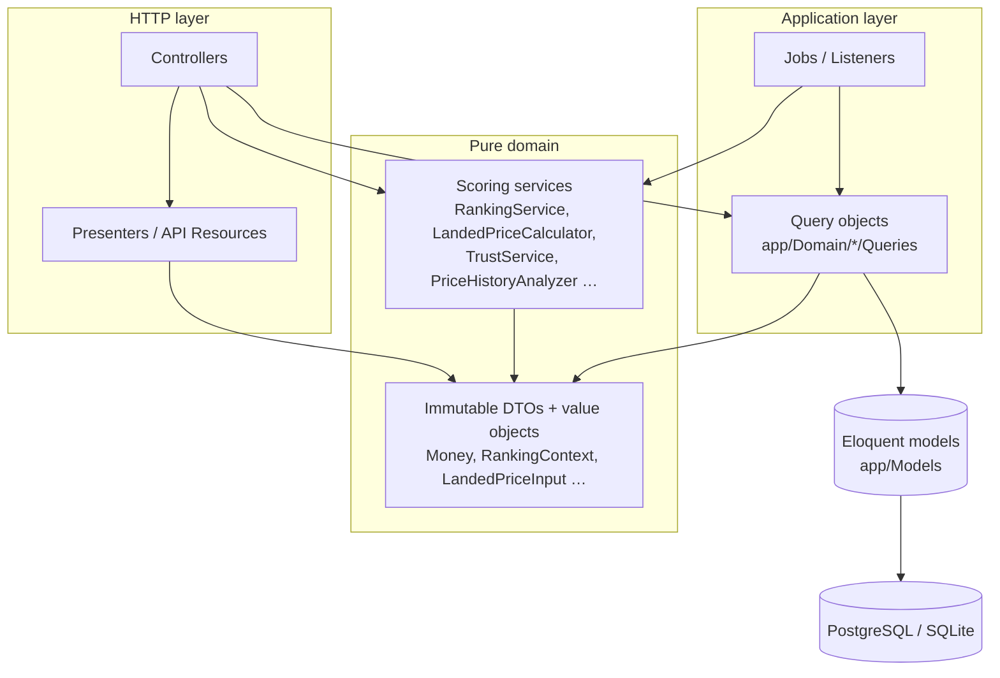

# Target Laravel architecture

Status: target architecture for the Laravel 13 modular monolith, as decided on 2026-09-25.
Decisions and their rationale are in [../adr/](../adr/README.md). Phasing is in
[migration-roadmap.md](migration-roadmap.md).

Legend used below: **exists** = verified file in the repository; **planned** = decided, no code yet.

---

## 1. Bounded contexts

| Context | Owns (tables) | Responsibilities | Code today |
|---|---|---|---|
| **Shared** | — | `Money`, `JsMath` (parity-only numeric helpers) | exists: `app/Domain/Shared` |
| **Platform** | `countries`, `currencies`, `exchange_rates`, `audit_logs` | Geography reference data, market resolution, cache keys, demo import, append-only guard, audit log, correlation ids, feature flags | exists: `app/Domain/Platform/{Markets,Cache,PrototypeImport,Exceptions}`, `app/Models/Concerns/AppendOnly.php`, `app/Http/Middleware/{AssignCorrelationId,ResolveMarket}.php` |
| **Accounts** | `users`, `passkeys`, `personal_access_tokens`, spatie permission tables | Authentication (Fortify), staff permissions and role bundles, API tokens | exists: `app/Domain/Accounts/Authorization/{Permission,StaffRole}.php` |
| **Catalog** | `brands`, `categories`, `ingredients`, `products`, `product_variants`, `ingredient_product` | Canonical products, merges, completeness | exists: `app/Domain/Catalog` |
| **Merchants** | `merchants`, `merchant_user`, `merchant_shipping_zones`, `merchant_trust_signals`, `merchant_risk_events` | Merchant lifecycle, membership, shipping zones, Trust Score, internal risk | exists: `app/Domain/Merchants/{Trust,Risk,Queries}` |
| **Offers** | `merchant_products`, `offers`, `ranking_versions`, `ranking_weights` | Listing ↔ product link, current offer terms, offer comparison, ComparoRank | exists: `app/Domain/Offers/{Ranking,Queries}` |
| **Pricing** | `coupons`, `coupon_country`, `price_snapshots`, `market_price_stats` | Landed price, market baselines, price history stats, price confidence, anomalies, currency conversion | exists: `app/Domain/Pricing/{LandedPrice,MarketStats,History,Confidence,Currency,Queries}` |
| **Compliance** | `product_compliance_rules` | Status per product × market, serialization policy, review queue | exists: `app/Domain/Compliance` (status, decision, `Queries/ComplianceResolver`); review queue planned |
| Feeds | `feed_sources`, `feed_runs`, `feed_items` | Feed ingestion and normalisation | planned (Phase 2) |
| Matching | `match_candidates`, `match_decisions`, `product_identifiers` | Listing → product resolution | planned (Phase 2) |
| Search | Meilisearch indexes, `search_queries` | Indexing, suggest, zero-result log | planned (Phase 3) |
| Reviews | `reviews`, `review_replies`, `review_votes`, `purchase_proofs`, `orders` | Reviews, verification, credibility weighting | planned (Phase 4) |
| Affiliate | `affiliate_programs`, `affiliate_clicks`, `affiliate_conversions` | `/go` redirect, click buffer, conversion ingest, reconciliation | planned (Phase 5) |
| Engagement | `lists`, `follows`, `alerts`, `alert_triggers`, `notifications` | Saves, alerts, notifications | planned (Phase 6) |
| Community | forum, guides, reputation tables | Community, reputation, juries | planned (Phase 9) |
| Commercial | plans, subscriptions, invoices, campaigns, API products | Billing (ADR-0006), sponsored placements, API plans | planned (Phase 10) |
| Growth | prospects, opportunities, tasks, experiments | Derived growth opportunities | planned (Phase 11) |
| Content | pages, SEO registry, sitemaps | Content engine, programmatic SEO | planned (Phase 12) |

Ownership rule: only the owning context writes its tables. Other contexts read through the owner's query
objects or react to its events.

---

## 2. Directory layout

```
app/
  Domain/{Context}/                 domain logic, no HTTP
    {Capability}/                   e.g. Pricing/LandedPrice, Offers/Ranking
      *Service.php | *Calculator.php | *Analyzer.php   pure; readonly DTO in, typed result out
      *Input.php | *Context.php | *Signals.php          immutable input DTOs
      *Result.php | value objects                       immutable outputs with toArray()
    Queries/                        load data, build DTO contexts (exists for Compliance, Merchants,
                                    Offers, Pricing); merchant-scoped variants planned (Phase 7)
    Events/, Listeners/, Jobs/      (planned) per context
    *.php                           context enums (ProductStatus, ComplianceStatus, …)
  Domain/Platform/Markets/          MarketResolver, MarketContext
  Domain/Platform/Cache/            CacheKeys (single key builder), CatalogCacheVersion
  Domain/Platform/PrototypeImport/  PrototypeSnapshotImporter, TimeShift, DemoEnvironment
  Models/                           thin Eloquent models, casts, relations, scopes; no scoring
  Models/Concerns/AppendOnly.php    model guard for append-only tables
  Http/Controllers/                 thin controllers (Catalog/*, Api/PublicV1/*, MarketController)
  Http/Presenters/                  camelCase Inertia props (Product, OfferComparison, PriceHistory,
                                    Seo, Money, Market presenters)
  Http/Resources/                   (planned) snake_case API resources
  Http/Middleware/                  AssignCorrelationId, ResolveMarket, HandleInertiaRequests, HandleAppearance
database/seeders/                   RolesAndPermissionsSeeder, Demo*Seeder (demo environments only)
database/
  migrations/2026_09_25_1*.php      Phase 1 schema
  data/prototype/seed-snapshot.json materialised prototype seed (demo import source)
tests/
  Unit/Parity/                      prototype parity tests
  Fixtures/PrototypeParity/         golden fixtures (generated)
  Support/PrototypeFixtures.php     fixture → DTO helpers
  Architecture/                     PureServicesTest, RankingPurityTest, AppendOnlyHistoryTest
tools/prototype-parity/export-fixtures.mjs
resources/js/                       React 19 + TypeScript (Inertia pages, components, Wayfinder output)
```

---

## 3. Layering rules



| Rule | Enforced by |
|---|---|
| Pure services never use Eloquent, facades, `DB`, `Cache`, `config()`, `now()` or the container | `tests/Architecture/PureServicesTest.php`, review |
| Time is an argument (`DateTimeImmutable $now` / `$evaluatedAt`) | Service signatures (exists) |
| Inputs are `final readonly` DTOs; results are immutable with `toArray()` | Code convention (exists) |
| Query objects are the only place that turns rows into DTOs | Review; merchant variants take the merchant id in the constructor |
| Controllers contain no business rules; presenters decide the prop shape | Review |
| Inertia props camelCase; public API snake_case; money as integer minor units + currency | Presenter/resource tests |
| `RankingContext` has no commercial field; Ranking does not import Commercial/Affiliate/Billing | `tests/Architecture/RankingPurityTest.php` |
| Compliance decision is applied before a presenter serializes offers | Feature tests per status × surface |
| Prototype files at the repo root are never read by runtime code | Only `tools/prototype-parity` reads them |

---

## 4. Request flow: product page

`GET /products/{slug}?market=XX`. The classes below exist (`app/Http/Controllers/Catalog/ProductController.php`,
`app/Http/Presenters/OfferComparisonPresenter.php`, `app/Domain/Offers/Queries/ProductOfferComparison.php`);
route `products.show` (`routes/web.php`) and the page `resources/js/pages/catalog/products/show.tsx` exist.

```mermaid
sequenceDiagram
    autonumber
    participant B as Browser / crawler
    participant MW as Middleware
    participant C as ProductController::show
    participant P as OfferComparisonPresenter
    participant Q as ProductOfferComparison
    participant CR as ComplianceResolver
    participant LP as LandedPriceCalculator
    participant MS as MarketStatsCalculator
    participant R as RankingService
    participant SSR as Inertia SSR

    B->>MW: request
    MW->>MW: AssignCorrelationId; ResolveMarket (?market → cookie → default) → MarketContext
    MW->>C: slug, MarketContext
    C->>C: merged product → 301 to survivor; non-active → 404
    C->>P: forPage(product, market, now)
    P->>P: cache lookup offers:{product}:{market}:{currency}:{rankingVersion}:{productVersion}:page
    P->>Q: compare(product, market, now) on miss
    Q->>CR: decide(product, market) — missing rule = unknown
    alt prescription_only / not_allowed
        CR-->>Q: offers not visible → comparison without offers
    else allowed / restricted / unknown
        Q->>MS: MarketListing[] (raw price + zone shipping) → min/median total, shipping median
        Q->>LP: per shipping offer: LandedPriceInput, now
        Q->>R: per offer: RankingContext + active RankingWeights + evaluatedAt
        R-->>Q: RankingResult (score, parts, penalties, withheld count, version)
        Q-->>P: OfferComparison (publishable offers sorted, best value only if recommendable, validUntil)
    end
    P->>P: purchaseUrl only if compliance isPurchasable(); camelCase props
    P-->>C: props (cached until validUntil)
    C->>SSR: Inertia::render('catalog/products/show', seo, product, compliance, offers, offerSummary, priceHistory)
    SSR-->>B: HTML (server-rendered head + body), then hydration
```

| Step | Class | Input | Output |
|---|---|---|---|
| Market resolution | `MarketResolver`, `ResolveMarket` | query, cookie, config | `MarketContext` |
| Compliance | `ComplianceResolver` | product id, market | `ComplianceDecision` |
| Market baseline | `MarketStatsCalculator` | all offers of the product with a zone in the market | `MarketStats` |
| Landed price | `LandedPriceCalculator` | offer price, zone shipping, threshold, coupons, market, now | `LandedPrice` |
| Trust, risk | `MerchantScores` → `TrustService`, `RiskService` | merchant signals | `TrustScore`, `RiskAssessment` |
| Price context | `ProductPriceHistory`, `PriceHistoryAnalyzer`, `PriceConfidenceService` | daily lows, offer facts | median, confidence |
| Rank | `RankingService` via `ActiveRankingWeights` | `RankingContext`, weights, evaluatedAt | `RankingResult` |
| Presentation | `OfferComparisonPresenter`, `ProductPresenter`, `PriceHistoryPresenter`, `SeoPresenter` | DTOs | Inertia props |

Sort order (`ProductOfferComparison`): `score` descending, then `total` ascending, then offer id ascending.
Offers that are not publishable (e.g. flagged) are withheld and counted.

---

## 5. Data model

### 5.1 Phase 1 (migrations exist: `database/migrations/2026_09_25_*`)

| Area | Tables | Notes |
|---|---|---|
| Auth/permissions | `users`, `passkeys`, `personal_access_tokens`, `roles`, `permissions`, pivots | Starter kit + Sanctum + spatie |
| Geography | `currencies` (`minor_unit`), `countries` (`currency_id`, `default_locale`, `is_eu`, `minimum_age`), `exchange_rates` | Rates are dated rows with `source` |
| Catalogue | `brands`, `categories` (tree), `ingredients`, `products`, `product_variants`, `ingredient_product` | Products: `status` active/merged/retired, `merged_into_id`; ratings summary columns added by `…100210_add_rating_summaries` |
| Merchants | `merchants`, `merchant_user`, `merchant_shipping_zones`, `merchant_trust_signals`, `merchant_risk_events` | Trust signals are measured rows (`measured_at`) |
| Offers | `merchant_products`, `offers`, `coupons`, `coupon_country` | Partial index `offers_product_active_index` on active offers |
| Compliance | `product_compliance_rules` | `unique(product_id, country_id)` |
| Price history | `price_snapshots` (append-only), `market_price_stats` | ADR-0003 |
| Ranking | `ranking_versions`, `ranking_weights` | Single active version; `prototype-v1` seeded by migration |
| Audit | `audit_logs` (append-only) | Triggers + `AppendOnly` |
| Framework | `cache`, `cache_locks`, `jobs`, `job_batches`, `failed_jobs`, `sessions`, `password_reset_tokens` | Database fallbacks |

### 5.2 Planned tables per phase

| Phase | Context | Tables (planned) |
|---|---|---|
| 2 | Feeds / Matching | `feed_sources`, `feed_runs`, `feed_items`, `product_identifiers`, `match_candidates`, `match_decisions`, `offer_stock_events` |
| 3 | Search | `search_queries` (zero-result log), `search_synonyms` |
| 4 | Reviews / verification / orders | `orders`, `purchase_proofs`, `reviews`, `review_replies`, `review_sub_ratings`, `review_votes`, `review_signals`, `disputes`, `offer_reports`, `coupon_reports` |
| 5 | Affiliate | `affiliate_programs`, `affiliate_clicks` (partitioned by month), `affiliate_conversions`, `affiliate_reconciliations` |
| 6 | Engagement | `lists`, `list_items`, `follows`, `alerts`, `alert_triggers`, `notifications`, `user_preferences` |
| 7 | Merchant portal | `merchant_api_keys`, `merchant_invitations`, `merchant_benchmarks` (derived) |
| 8 | Staff consoles | `moderation_cases`, `compliance_review_queue`, `merchant_verifications` |
| 9 | Community / reputation | `forum_categories`, `forum_threads`, `forum_replies`, `guides`, `badges`, `reputation_events`, `jury_cases`, `jury_seats`, `jury_votes` |
| 10 | Commercial | `plans`, `plan_versions`, `feature_entitlements`, `billing_profiles`, `subscriptions`, `subscription_changes`, `invoices`, `invoice_items`, `payments`, `credit_notes`, `sponsored_campaigns`, `campaign_creatives`, `placement_inventory`, `api_products`, `api_usage`, `webhook_endpoints` |
| 11 | Growth | `merchant_prospects`, `creators`, `referrals`, `growth_opportunities`, `growth_tasks`, `experiments` |
| 12 | Content / SEO | `pages`, `page_metadata`, `content_items`, `newsletters`, `research_stories`, `languages`, `market_storefronts`, `redirects` |
| 13 | Platform | `feature_flags`, `data_exports`, `erasure_requests`, retention/purge bookkeeping |

Field-level detail for the prototype entities is in [entity-inventory.md](entity-inventory.md).

---

## 6. Queue topology

All queues run under Horizon on Redis in production. Today `config/horizon.php` defines one supervisor
for `default`; the supervisors below are the target.

| Queue | Typical jobs | Timeout | Tries | Backoff | Uniqueness | Notes |
|---|---|---|---|---|---|---|
| `critical` | compliance rule change fan-out, account security mail | 30 s | 5 | 1, 5, 15 s | per product × market | Own supervisor, never starved |
| `feed-import` | `ImportFeed`, `ParseFeed`, `NormaliseFeedItems` | 900 s | 3 | 60, 300, 900 s | `ShouldBeUnique` per `feed_source_id` | Long-running; memory limit raised |
| `matching` | `MatchFeedItems`, `ClusterUnmatched` | 300 s | 3 | 30, 120, 600 s | per `feed_run_id` | Batches of items |
| `pricing` | `RecordPriceSnapshots`, `AggregateMarketPriceStats`, `DetectAnomalies`, `RecalculateRanks` | 300 s | 3 | 30, 120, 600 s | per product × market (rank), per date (stats) | Idempotent writes |
| `search` | Scout `MakeSearchable`, `RemoveFromSearch` | 120 s | 5 | 10, 60, 300 s | per model id | `SCOUT_QUEUE=true` |
| `notifications` | alert evaluation, digests, mail | 120 s | 3 | 60, 300, 900 s | per user × alert | Rate-limited mailers |
| `affiliate` | `FlushClickBuffer`, conversion webhooks, reconciliation | 60 s | 5 | 5, 30, 120 s | per network × day (reconcile) | Click flush every 10 s |
| `analytics` | aggregates, growth metrics | 600 s | 2 | 300 s | per metric × day | Low priority |
| `seo` | `GenerateSitemaps`, structured-data refresh | 900 s | 2 | 600 s | per sitemap | Nightly |
| `default` | everything else | 60 s | 3 | 10, 60, 300 s | — | |

Rules:

- Every job is idempotent; retries never double-write (upserts or natural keys).
- Jobs that touch compliance-sensitive output re-check compliance when they run, not only when dispatched.
- `failed_jobs` is monitored; a job that exhausts retries logs with its correlation id.
- Chains use `Bus::chain()`; a failing link stops the chain and marks the owning run failed.

---

## 7. Cache key catalogue

All keys are built by `App\Domain\Platform\Cache\CacheKeys` (the single key builder; exists). Keys marked
planned are reserved formats.

| Key | Value | TTL | Invalidated by | Status |
|---|---|---|---|---|
| `offers:{product}:{market}:{currency}:{rankingVersion}:{productVersion}:{format}` | Presented, compliance-filtered offer comparison (`format` = page or api) | until the comparison's `validUntil` (≤ 600 s; earlier if a coupon/offer boundary is closer) | New `rankingVersion` (key changes); `CatalogCacheVersion::bumpProduct()` on offer, coupon or compliance change; `bumpMerchant()` on coupon, shipping-zone or trust-input change | exists |
| `catalog:product-version:{product}` | Version token (ULID) for the product | forever | Replaced on bump | exists |
| `trust:{merchant}:{signalsVersion}` | `TrustScore` | 24 h | New signals row (key changes) | key defined, not yet used |
| `priceStats:{product}:{market}` | `PriceHistoryStats` + badge/timing/trend | 6 h | `PriceChanged`, nightly aggregation | key defined, not yet used |
| `markets:active` | Active markets list | 600 s | `MarketResolver::forget()` | exists |
| `rank:{offer}:{market}:{rankingVersion}` | `RankingResult` array (only if ranks are precomputed outside the comparison) | 1 h | Any offer change of the **same product** (market min and shipping median move), trust/risk change, version activation | planned |
| `search:{market}:{locale}:{hash(query,filters)}` | Search result page | 5 min | Index updates (short TTL instead of tags) | planned |
| `suggest:{market}:{locale}:{prefix}` | Suggest list | 5 min | Index updates | planned |
| `sitemap:{type}:{page}` | Sitemap XML chunk | 24 h | Nightly regeneration | planned |

Rules:

- **Market is part of every compliance-sensitive key.** A cached offer list without its market is a defect.
- Invalidation uses version tokens instead of tags, so it works on every cache store (database, Redis).
  Listeners bump tokens after commit; TTLs are a safety net, not the mechanism.
- Ranks are computed inside the offer comparison because an offer's rank depends on all offers of the
  product in the market; a per-offer rank cache is only valid with product-level invalidation.

---

## 8. Events

| Event | Emitted by | Typical listeners |
|---|---|---|
| `OfferUpdated`, `PriceChanged` | Offers / Pricing | snapshot writer, rank recompute, cache purge, alerts, search |
| `ProductMatched`, `ProductsMerged` | Matching / Catalog | offer publication, redirects, search |
| `FeedImported`, `FeedFailed` | Feeds | matching, merchant notification, trust signals |
| `ComplianceRuleChanged` | Compliance | cache purge (product × market), search, sitemaps |
| `RankingVersionActivated` | Offers | full rank cache purge, audit |
| `MerchantRiskChanged`, `MerchantVerified`, `MerchantTrustChanged` | Merchants | rank recompute, cache purge |
| `ReviewCreated`, `ReviewApproved`, `PurchaseProofDecided` | Reviews | credibility weighting, rating aggregates, trust |
| `DealExpired`, `CouponReported` | Pricing | coupon state, cache purge |
| `AlertTriggered` | Engagement | notifications |
| `MerchantSubscribed`, `PlanChanged`, `InvoiceIssued`, `InvoicePaid` | Commercial | entitlements, mail |
| `CampaignActivated`, `CampaignCompleted`, `RenewalApproaching` | Commercial | placement assembly, sales tasks |
| `AffiliateCommissionApproved`, `ApiUsageLimitReached` | Affiliate / Commercial | reporting, throttling |

**afterCommit rule:** every domain event is dispatched after the surrounding transaction commits
(`ShouldDispatchAfterCommit` on events, `afterCommit()` on queued listeners/jobs). A listener must never
observe state that was rolled back. Listeners recompute derived state; controllers never recompute inline.

---

## 9. Security baseline

| Area | Baseline |
|---|---|
| Web auth | Fortify sessions; email verification; 2FA; passkeys; `SESSION_ENCRYPT=true` |
| API auth | Sanctum personal access tokens with abilities; per-token rate limits |
| Staff authorization | spatie permissions, checks by permission (ADR-0005) |
| Merchant isolation | Membership + policies + merchant-scoped queries + negative tests (ADR-0005) |
| Compliance | Evaluated before serialization (ADR-0007) |
| Ranking | No commercial inputs; architecture tests (ADR-0004) |
| Input | Form Requests at every boundary; feed payloads validated before persistence |
| Output | API resources whitelist fields; risk/fraud/commercial terms never leave staff surfaces |
| Headers | `X-Correlation-ID` accepted only as a UUID; CSP, HSTS, `X-Frame-Options` (planned middleware) |
| Files | Receipts in private S3 bucket, signed temporary URLs only |
| Webhooks | HMAC signature verification, replay window, idempotency keys |
| Secrets | Environment only; `.env` never committed |
| Audit | `audit_logs` append-only for staff and merchant write actions |
| Privacy | No health profile; verification emails parsed then discarded; GDPR export/erase (Phase 13) |

---

## 10. Observability

| Signal | Mechanism | Status |
|---|---|---|
| Correlation id | `AssignCorrelationId` middleware: accepts a UUID `X-Correlation-ID` or generates UUIDv7, stores it in Laravel `Context` (propagates to logs and queued jobs), echoes it on the response | exists; prepended globally in `bootstrap/app.php` |
| Market in logs | `ResolveMarket` adds `market` to Laravel `Context` | class exists |
| Structured logs | JSON log channel in production (`.env.example` note), `correlation_id` from Context on every record | planned channel |
| Queue metrics | Horizon (`/staff/horizon`, gate `staff.horizon.view`) | exists (`HorizonServiceProvider` gate checks `Permission::ViewHorizon`) |
| Health | `/up` (framework health route) | exists |

Metrics to emit (planned):

| Metric | Type |
|---|---|
| HTTP latency by route name, p50/p95/p99 | histogram |
| Offers cache hit ratio by key family | counter |
| `/go` redirect latency and click-buffer depth | histogram / gauge |
| Feed run duration, rows, rejects, match buckets | histogram / counter |
| Queue wait time and failures per queue | gauge / counter |
| Rank recompute duration per product × market | histogram |
| Compliance `unknown` count per market (review queue size) | gauge |
| Parity check status in CI | pass/fail |

---

## 11. API layout

| Prefix | Audience | Auth | Case | Status |
|---|---|---|---|---|
| Web routes (Inertia) | Browsers | session | camelCase props | starter kit routes exist; catalogue controllers exist (`Catalog/{Home,Product,Brand,Category,Shop}Controller`), routes registered in `routes/web.php`; `ResolveMarket` appended to the web and api groups |
| `/api/public/v1/*` | API customers | today: unauthenticated, `throttle:public-api` (60/min per IP); target: Sanctum token + plan entitlement | snake_case | `GET /api/public/v1/products/{slug}/offers` exists (`Api/PublicV1/ProductOffersController`, `OfferComparisonPresenter::forApi`); API keys, scopes and metering Phase 10 |
| `/api/merchant/v1/*` | Merchant integrations | Sanctum token bound to one merchant | snake_case | planned (Phase 7) |
| `/api/admin/v1/*` | Internal tooling | Sanctum token + staff permission | snake_case | planned |
| `/webhooks/{provider}` | Affiliate networks, billing provider | HMAC signature | provider-defined | planned (Phases 5, 10) |
| `/go/{merchant}/{product}` | Outbound clicks | none | — | planned (Phase 5) |

`/go/{merchant}/{product}`:

1. Resolve market; check compliance. Blocked or `unknown` → no redirect to the merchant (informational page).
2. Build the destination from the merchant's tracking template.
3. Push the click record to a Redis list (no database write on the request path).
4. Return `302`. Target < 50 ms p95.
5. `FlushClickBuffer` (queue `affiliate`, every 10 s) batch-inserts into `affiliate_clicks`.

Public API responses never include risk scores, fraud signals, commercial terms or personal data.

---

## 12. SSR and SEO

| Concern | Strategy |
|---|---|
| Rendering | Inertia SSR (`config/inertia.php` `ssr.enabled = true`; `npm run build:ssr`) |
| Head on first load | Controllers pass a `seo` prop (title, description, canonical, robots, hreflang, JSON-LD). `resources/views/app.blade.php` renders these tags server-side inside `<x-inertia::head>` so crawlers receive them without JavaScript |
| Head on client navigation | React `<Head>` renders the same `seo` prop; tags carry `head-key` (rendered as the `data-inertia` attribute, matching the Blade keys) so Inertia replaces rather than duplicates the server-rendered ones |
| Structured data | `Product` + `Offer` + `AggregateRating` on product pages, `Organization` on shop pages, `BreadcrumbList` everywhere; offers in JSON-LD obey the same compliance policy (no `Offer` for blocked or `unknown`) |
| Canonical | One canonical per entity, independent of market cookie; `?market=` variants are `noindex` or canonicalised to the default market (D-24) |
| Sitemaps | Nightly `seo` job, chunked at 50 000 URLs, cached `sitemap:*` |
| Merged products | 301 to the survivor |

Status: `App\Http\Presenters\SeoPresenter` (`page()`, `product()`: title, description, canonical, robots,
alternates, Open Graph, JSON-LD) exists and catalogue controllers pass its output as the `seo` prop; merged
products 301 in `ProductController::show`. `resources/views/app.blade.php` renders the `seo` prop server-side inside
`<x-inertia::head>` (title, description, robots, canonical, alternates, Open Graph, JSON-LD) with `data-inertia` keys so the client head manager replaces rather than duplicates them; pages without a `seo` prop get `noindex,nofollow`.

---

## 13. Internationalisation

| Concern | Strategy |
|---|---|
| UI strings | Laravel lang files (`lang/`), passed to React via shared props; `APP_LOCALE=en` default |
| Locale vs market | Independent (ADR-0008) |
| URLs | `/{locale}` prefix reserved; only enabled locales emit hreflang (C-33) |
| Content | Product data stays in source language until D-02 decides translation scope |
| Formatting | Money/date formatting on the client with `Intl`, from integer minor units; never assert formatted strings in parity tests |

---

## 14. Performance targets

| Path | Target | Source |
|---|---|---|
| Product offers (`/products/{slug}` data, `/api/public/v1/products/{slug}/offers`) | < 120 ms p95 server time | BACKEND-MIGRATION.md |
| Search suggest | < 80 ms p95 | BACKEND-MIGRATION.md |
| `/go/{merchant}/{product}` redirect | < 50 ms p95, no synchronous DB write | BACKEND-MIGRATION.md, API-ENDPOINTS.md §10 |
| Feed import, 10 000 rows | < 60 s | BACKEND-MIGRATION.md |
| Nightly full rank recompute | < 15 min | BACKEND-MIGRATION.md |
| Perceived search response | < 100 ms | PERFORMANCE.md |
| Core Web Vitals (product page, mobile) | LCP < 2.5 s, INP < 200 ms, CLS < 0.1 | web.dev "good" thresholds |
